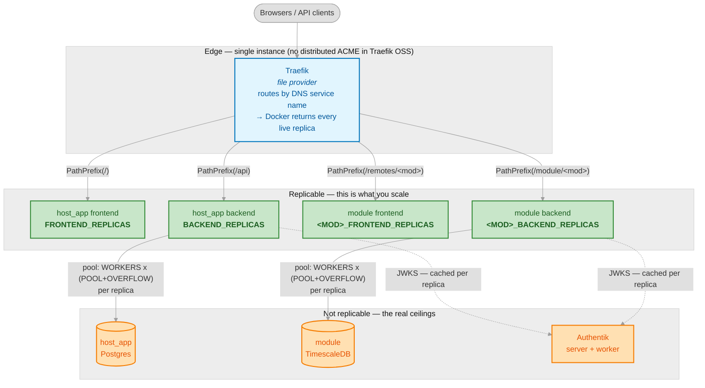

# Ideable

Ideable is a modular micro-frontend platform built around a host module (`host_app`) and dynamically integrated remote modules.

The platform combines:
- Module Federation 2.0 for runtime frontend composition,
- a shared authentication/authorization model (Authentik + host_app RBAC),
- containerized deployment with per-module compose files and a merged runtime compose.

## Repositories

### Main Ideable repository

The Ideable repository is the **Ideable Framework maintainer codebase**. It contains:

- **`modules/host_app/`** — the MF 2.0 host module with full specifications, source code, and tests. Its purpose is to define, maintain, and evolve the Ideable Framework as a whole: shell, authentication, authorization, routing, and the integration contract for remote modules.
- **`modules/module_template/`** — the MF 2.0 remote module reference implementation with full specifications, source code, and tests. Its purpose is to define, maintain, and evolve the canonical blueprint for Ideable-compatible remote modules.

This repo is used exclusively by Ideable maintainers. It is **not** the starting point for external module developers.

### Ideable-ModuleTemplate repository

[`Ideable-ModuleTemplate`](https://github.com/vlombardi/Ideable-ModuleTemplate) is a **separate GitHub template repository** derived from this one. Its purpose is to offer external developers an initial blueprint for creating MF 2.0 remote modules that are compatible with Ideable host_app.

Key structural differences from the main repo:
- `modules/host_app/` is present **only in its deployable version** to allow host_app execution and customization. No SPECS, sub-modules definition, or TESTS for host_app are included.
- `modules/module_template/` contains the full module source (SPECS, SOURCES, TESTS) as the starting point for customization.
- The `modules/enabled.md` file controls which modules participate in the build and deployment process.

### Relationship between repositories

Maintainers keep `Ideable-ModuleTemplate` in sync with the main repo using:

```bash
./scripts/master_only/push-updates-to-module_template-repo.sh
```

This script copies the relevant files (module sources, shared scripts, rules, tooling configuration) from the main repo to the template repo and force-pushes to its `main` branch.
It exports the maintainer-repo root documentation as `IDEABLE-README.md` and the module_template documentation as `MODULE-README.md` in the exported template repo, then leaves placeholder `README.md` files in the repo root and module root for template users to customize.

External developers who started a module from the template can pull the latest framework updates (e.g., updated base specs, compatibility scripts) without losing their customizations:

```bash
./scripts/module_only/sync-template-updates.sh
```

This script only updates files that are not meant to be customized by developers — such as the shared framework specs under `SPECS/ideable-framework-specs/` and shared framework scripts. Files outside that folder but still under `SPECS/` are treated as module-specific specs. For env files, it syncs `.env.example` files and backfills only missing keys into the matching `.env` files; existing `.env` values are preserved.

### Maintaining this document

`IDEABLE-README.md` is the framework's **primary, authoritative reference** for both Ideable maintainers and every module maintainer (`AGENTS.md` points here for the whole-system picture; `rules/general-guidelines.md` holds the mandatory hard constraints).

**When to update it:** in the **same change set** as any framework-level change — architecture, the create-a-module workflow, integration/menu/auth contracts, the shared `reusable.ui`/`@ideable/ui` widget library, the sync/deploy flow, or project structure — keeping it consistent with `rules/`, the framework SPECS, and the scripts it describes.

**How it reaches every remote module:** it is **framework-owned** — edit it only in the main Ideable repo. It then propagates via the two scripts above: `push-updates-to-module_template-repo.sh` exports it into the `Ideable-ModuleTemplate` repo, and a module maintainer's `sync-template-updates.sh` pulls it in (it is matched by that script's `is_infrastructure` allowlist and listed in `SPECS/ideable-framework-specs/infrastructure-file-list.md`). Never edit it in a remote module project (see `rules/general-guidelines.md` § sync-ownership rule). When you add a new framework-owned doc or folder, add it to **both** scripts' allowlists and to the infrastructure manifest in the same change.

## Architecture

### host_app (host module)

`host_app` is responsible for:
- authentication and authorization APIs,
- shared UI shell and navigation,
- internationalization,
- loading enabled remote modules from `public/module-registry.json` (manifest + `remoteEntry` URLs),
- exposing Authentik-backed admin/control surfaces and validating JWTs against Authentik JWKS.

### Remote modules

Remote modules:
- expose a frontend manifest through Module Federation,
- publish backend APIs under `/module/<slug>/*`,
- validate JWTs via Authentik JWKS,
- resolve permissions directly from Authentik JWT claims.

`module_template` is the reference remote implementation and the basis of the `Ideable-ModuleTemplate` template repo. Its framework contract lives in `modules/module_template/SPECS/ideable-framework-specs/`.

## UI Composition Model (Module Federation 2.0)

The UI is composed at runtime by combining two layers:

1. **Host layer (`host_app`)**
   - Owns shell layout (header, navigation, content area, shared route guards).
   - Loads remote module manifests from `module-registry.json`.
   - Mounts remote routes under each module base path.
   - Keeps host routes available even when a remote module is unavailable.

2. **Remote layer (additional modules)**
   - Exposes `./moduleManifest` through MF 2.0.
   - Contributes menu entries, route descriptors, and permissions.
   - Renders only module content pages (not host shell elements).
   - Uses host_app auth context and authorization model.

### UI and L&F compatibility principles

- **`reusable.ui` / `@ideable/ui` is the single source of truth** for UI, L&F, and widget definitions. host_app is the shell *authority* (routing/menu/auth), but not the owner of UI/CSS — it consumes `@ideable/ui` like every remote and never carries redundant local widget/palette definitions.
- Remotes use their own CSS prefix (`<slug>:`, Tailwind v4) for their own markup; shared widgets use the neutral `ideable:` prefix.
- Default L&F is shared automatically because all consumers use the same `@ideable/ui` tokens (`reusable.ui/styles/base-tokens.css`, the one canonical palette).
- Module-specific L&F is allowed only via module-scoped token *value* overrides — never class-name redefinitions or global-selector edits.
- L&F can be changed **without accessing the host_app repo**: build-time via `data-lf="module"` tokens, or runtime via `config/theme-override.css` in the deployed folder (no rebuild — see *Runtime Look & Feel override* below).
- Remote code must never mutate host-global selectors (`html`, `body`, `*`).

### Runtime integration flow

At startup/runtime:

1. host_app fetches `/config/module-registry.json`.
2. For each enabled module, host_app loads `/remotes/<slug>/mf-manifest.json` (registry `entry`).
3. host_app uses the manifest to locate `/remotes/<slug>/remoteEntry.js` (registry `remoteEntry`, falling back to `entry`) and resolves `./moduleManifest` from the remote.
4. host_app merges remote menu/routes into the shell.
5. User navigation enters remote pages inside host_app content area.

## Shared UI Widget Library (`reusable.ui` / `@ideable/ui`)

`reusable.ui/` is a **top-level folder** (sibling of `modules/` and `deployment_root/`) that packages **`@ideable/ui`**, the framework's **single shared UI widget library**: server-side data tables, association (M2M) grids, popups, an audit-trail viewer, a time-series chart, dialogs, and the full set of accessible Radix primitives, plus shared hooks, design tokens, and i18n. **host_app, module_template, and every remote module generated from it all consume the same widgets from here** — there is one implementation, not a copy per module.

**Why it exists**
- Build UI faster — a production-grade table/popup/chart/dialog is one import away; modules don't reimplement or maintain them.
- Consistent L&F — all consumers (host_app included) resolve the same canonical `@ideable/ui` design tokens, so a remote looks native inside the host with no styling work.
- Accessibility — interactive primitives are Radix-based (focus management, keyboard nav, ARIA).
- Upstream improvements reach every module through the normal template sync.

**How it is styled (important)**
- Module-owned pages/components use the **module's own** Tailwind prefix (`hostapp:`, `template:`, `${APP_SLUG}:`). Shared widgets use the neutral **`ideable:`** prefix.
- Tailwind v4 honors only one prefix per build, so the shared `ideable:` layer is shipped as **precompiled plain CSS** (`reusable.ui/styles/compiled.css`, a tracked artifact). Consumers `@import "@ideable/ui/styles"`, which keeps their own prefix layer intact and adds the `ideable:` classes + tokens.
- **Canonical tokens live once** in `reusable.ui/styles/base-tokens.css` (`:root` + `.dark`). host_app and modules consume them via the import above and must not redefine the values; all prefixes resolve `hsl(var(--token))` to this one palette.
- **Branding** = override token *values*, never class names (`.ideable-scope[data-lf='hostapp']` uses the canonical tokens; `[data-lf='module']` allows module overrides).

**Runtime Look & Feel override (no rebuild)**
- Each frontend's `index.html` appends `config/theme-override.css` at runtime — an unlayered stylesheet loaded after the compiled bundle and served `Cache-Control: no-store`. Editing that file in the deployed folder (`deployment_root/modules/<slug>/config/`) redefines the `:root`/`.dark` token values and recolors chrome + all `@ideable/ui` widgets **live**, without rebuilding the image or touching host_app sources.
- Logos, favicon, login background, and `home.html` are swapped the same way — replace the file in the deployed `config/` folder. (Adding brand-new utility classes or swapping bundled icon glyphs still needs a rebuild.)
- One-time only: the `index.html`/nginx hooks that load the override ship in the image, so a single frontend build is required to activate the mechanism; thereafter L&F edits are fully runtime.
- **Propagation to existing modules:** `scripts/module_only/sync-template-updates.sh` idempotently injects the hook (the `index.html` `<script>`, the nginx `no-store` rule) and drops the `config/theme-override.css` scaffold when missing — without overwriting developer customizations — so modules generated before this feature gain runtime theming on their next sync (then one frontend rebuild to bake the hooks in).
- **Full how-to (build time vs deploy time, by role):** `modules/module_template/frontend/SPECS/ideable-framework-specs/look-and-feel-branding.md`.

**How a module consumes it**
- The frontend declares `"@ideable/ui": "file:../../../../reusable.ui"`, imports the shared styles once, and puts `class="ideable-scope" data-lf="hostapp"` on `<body>` (so Radix portals resolve tokens). A module generated from `Ideable-ModuleTemplate` is pre-wired for all of this.
- Docker image builds stage `reusable.ui` into the frontend build context via each frontend's `SPECS/build.sh` (a repo-root sibling is otherwise outside the SOURCES-rooted context) and install it with `npm ci --install-links` from the **committed `package-lock.json`** — so a rebuild of a commit resolves the same versions. The dev-only Widget Examples gallery is gated by the `WIDGET_EXAMPLES` build arg (`false` on publish → gallery + heavy deps tree-shaken out).

**Guidance & examples**
- The **`ideable-ui` skill** (`.agents/skills/ideable-ui/`, invoke with `/ideable-ui`) maps needs → widgets, indexes each widget → source + live example + spec, and encodes the mandatory UI rules. It references only `reusable.ui/` and `module_template/`, so it works fully inside a remote project.
- A live gallery of every widget ships in `modules/module_template/frontend/SOURCES/src/pages/WidgetGallery.tsx` (reachable in dev under **Template → UI Examples**).
- **Developer guide:** `reusable.ui/README.md` — benefits + step-by-step for receiving updates and adopting the widgets.

**Ownership & propagation**
- `reusable.ui/` is **framework-owned** (like `scripts/`, `rules/`, `.agents/`). Remote modules consume it read-only; changes are made in the main Ideable repo and propagate via the standard sync flow (see *Relationship between repositories* and *Post-Deployment: Sync with Template Updates*). When a widget/primitive changes an `ideable:` class, regenerate the precompiled CSS with `npm run build:css` in `reusable.ui/` and commit `styles/compiled.css`.

## host_app and Module - Integration logic

host_app and each remote module are integrated through a two-file menu contract:

- host_app defines **where and how** module menu nodes are positioned using `modules/host_app/config/modules_menu_mapping.json`.
- Each remote module defines **what menu tree it exposes** using `modules/<RemoteModule>/config/menu_definition.json`.
- Each remote module may optionally propose **its own host placement** by providing `modules/<RemoteModule>/config/modules_menu_mapping.json`.

**Menu mapping production at deploy time:**

1. If `modules/host_app/config/modules_menu_mapping.json` exists, it is used **directly** as the explicit composition map.
2. If the host_app file does **not** exist, `create-merged-configuration.sh` auto-merges all enabled modules' `config/modules_menu_mapping.json` files into a single `deployment_root/modules/host_app/config/modules_menu_mapping.json`.

Logical relation:

```text
┌──────────────────────────────────────────────────────────────────┐
│ host_app                                                         │
│                                                                  │
│  config/modules_menu_mapping.json                                │
│  - selects module: <slug>                                        │
│  - points to module_menu_item_code_path                          │
│  - can override label/icon                                       │
└───────────────┬──────────────────────────────────────────────────┘
                │ resolves path against remote menu_definition
                ▼
┌──────────────────────────────────────────────────────────────────┐
│ Generic Remote Module (blueprint = module_template)              │
│                                                                  │
│  config/menu_definition.json                                     │
│  - authoritative module menu tree                                │
│  - menu_item_code hierarchy                                      │
│  - routing fragments per node                                    │
└───────────────┬──────────────────────────────────────────────────┘
                │ combined with MF ./moduleManifest (basePath/routes)
                ▼
        host_app sidebar + integrated routes at runtime
```

File purposes:

- `modules/host_app/config/modules_menu_mapping.json` — explicit host-side composition map for remote menu injection; when present, overrides any module-proposed mappings.
- `modules/<RemoteModule>/config/modules_menu_mapping.json` — optional module-proposed host placement; merged into the deployed host_app config when no explicit host_app mapping exists.
- `modules/<RemoteModule>/config/menu_definition.json` — remote-side canonical menu definition used by host mapping resolution; copied/adapted by new modules created from `module_template`.

host_app menu mapping now also supports prefix-based nesting under an existing host_app menu code.

- Example: `ADMIN.MYMENU` renders the module node `MYMENU` under the built-in host_app `Admin` branch.
- Nested mapped trees are rendered up to four levels deep total.

When using this form, the first path segment must match the host_app parent menu code.

## host_app and Module - Inter-module dependencies

A module declares the other modules it depends on in its own `module.json`, so cross-module
coupling (needing another module's API, CSS classes, UI widgets, or startup ordering) is
explicit and machine-checked instead of hand-wired.

```jsonc
{
  "provides": { "css": true, "api": true, "widgets": [],       // capabilities offered (optional)
                "gates": [ { "service": "database", "condition": "service_healthy" } ] },
  "dependsOn": [ { "module": "report_generator", "kinds": ["api"], "optional": false,
                   "reason": "renders PDFs" } ]                 // typed prerequisites
}
```

- `kinds` ∈ `runtime` | `api` | `data` | `css` | `widgets`. **`host_app` is an implicit
  universal dependency** — never declared.
- A declared dependency is a **prerequisite**: if the target is not enabled the build fails
  (mark `"optional": true` to degrade to a warning). The resolver
  (`scripts/common/module_deps.py`) validates the enabled set (target enabled, capability
  provided, **acyclic**) and orders modules **providers-first** (host_app first) for build.
- **Container startup:** at deploy time `scripts/common/compose_deps.py` emits an *additive*
  `docker-compose.cross-module-deps.yml` that makes a dependent's entry services wait on the
  provider's declared `provides.gates` — for `runtime`/`api`/`data` edges only (`css`/
  `widgets` are runtime-frontend). It never rewrites the hand-authored composes.
- Runtime `css`/`widgets` wiring (injecting a provider's stylesheet / registering its remote)
  is **Phase 2**, folded into the CSS-loading work.

Canonical contract: `modules/module_template/SPECS/ideable-framework-specs/module-integration-specs.md`
§5.1. Validate locally with `scripts/common/validate_modules.sh` — besides resolving the
graph it runs warn-only **lints**: `provides.api`/`provides.widgets` must match reality (a
declared backend/exposed widget actually exists), and a **drift lint** flags using another
module's `<slug>:` classes or `loadRemote('<slug>/…')` without the matching `dependsOn` edge
(and edges declared but unused). Inspect the resolved graph at any time — including at a
deployed site — with **`./status.sh --deps`**.

## host_app and Module - Development process

For host_app + Remote compatibility, the relevant `SPECS/` files must be the source of truth before implementation.

`modules/host_app/SPECS/` must include at least:
- integration contract (canonical copy in `modules/module_template/SPECS/ideable-framework-specs/module-integration-specs.md`),
- auth and base specs aligned with runtime composition.

`modules/<RemoteModule>/SPECS/` is split into:
- the framework-owned `ideable-framework-specs/` folders that must stay aligned across host_app, module_template, and derived remotes,
- the remaining `SPECS/` files for module-specific specifications and implementation contracts.

Framework-owned contracts live in the `ideable-framework-specs/` folders under `SPECS/`, `backend/SPECS/`, `database/SPECS/`, and `frontend/SPECS/`; those files are the shared baseline and must be kept in sync across the ecosystem.

After a correct full process (`SPECS` → `SOURCES` → build/deploy), deployment artifacts must include:
- `deployment_root/modules/host_app/config/modules_menu_mapping.json`
- `deployment_root/modules/<RemoteModule>/config/menu_definition.json`

## host_app and Module - Runtime configuration

At runtime, operators customize the deployed project from `deployment_root/`.

Main editable runtime files:

- `deployment_root/.env.config`
- `deployment_root/.env.secrets`
- `deployment_root/modules/host_app/config/modules_menu_mapping.json`
- `deployment_root/modules/host_app/config/favicon.png`
- `deployment_root/modules/host_app/config/login_bg.png`
- `deployment_root/modules/<RemoteModule>/config/menu_definition.json`

All configuration files under each module's `config/` folder are mounted as Docker read-only volumes (`:ro`) so they can be changed without rebuilding images. The `config/` folder is copied verbatim from `modules/<MODULE>/config/` to `deployment_root/modules/<MODULE>/config/` during the deployment step.

## Logging

Per-module log levels are derived automatically by the deploy script based on each module's mode in `modules/enabled.md`.

- **`local`** (build from local source) → `<SLUG>_LOG_LEVEL=DEBUG`
- **`remote`** (pre-built images) → `<SLUG>_LOG_LEVEL=INFO`

The variable name is derived from the module's `slug` (uppercased) + `_LOG_LEVEL`:
- host_app (slug `hostapp`) → `HOSTAPP_LOG_LEVEL`
- module_template (slug `template`) → `TEMPLATE_LOG_LEVEL`

Each backend service's `docker-compose.yml` maps its own slugged variable to the standard `LOG_LEVEL`:
```yaml
environment:
  - LOG_LEVEL=${HOSTAPP_LOG_LEVEL:-INFO}
```

Backend `main.py` reads the generic `LOG_LEVEL` at import time and re-applies it in a startup event handler so application loggers respect the configured level regardless of uvicorn's default `INFO` configuration.

The full framework logging contract is defined in `modules/module_template/SPECS/ideable-framework-specs/module-integration-specs.md` §13.

## AI Development Environments

Ideable supports multiple AI coding assistants. Compatibility is maintained through a single canonical configuration that all supported tools read.

### Supported environments

| Environment | Entry point read | Skills location |
|---|---|---|
| **Claude Code** (Anthropic) | `CLAUDE.md` → `@AGENTS.md` | `.claude/skills/` (symlink) |
| **GitHub Copilot** | `.github/copilot-instructions.md` (symlink) | n/a |
| **OpenAI Codex CLI** | `AGENTS.md` (walks root → CWD) | n/a |
| **Cursor** | `.cursor/rules/*.mdc` (always + path-scoped) + `AGENTS.md` (fallback) | n/a |
| **Devin** | `AGENTS.md` (auto-read) + `.devin/global_rules.md` | `.agents/skills/` (read directly — its recommended path) + `.devin/workflows/` |
| **Kiro (Amazon Q)** | plugin-based, no repo file | `.kiro/skills/` (symlink) |

### How compatibility is kept

**Single source of truth — `AGENTS.md`**

All supported tools read `AGENTS.md` as their primary instruction source, either natively or via a dedicated alias:

- `CLAUDE.md` (one line: `@AGENTS.md`) — makes Claude Code read `AGENTS.md` through its native `@import` mechanism, independently of any harness bridging.
- `.github/copilot-instructions.md` — symlink to `AGENTS.md`; gives GitHub Copilot a dedicated entry point at the path it prioritizes.
- Windsurf, Devin, and Codex CLI all auto-read `AGENTS.md` natively — no extra file needed.

`AGENTS.md` is intentionally compact. It contains only the stable, universal rules and a "Reference files" section pointing agents to the right SPECS on demand. This keeps the always-loaded context prefix small and cache-stable across sessions.

**Cursor — path-scoped rules via `.cursor/rules/`**

Cursor is configured with a first-class `.cursor/rules/` directory instead of relying solely on `AGENTS.md`. This gives Cursor automatic, glob-based context injection without requiring the agent to read and follow the reference prose in `AGENTS.md`:

| File | Scope |
|---|---|
| `ideable.mdc` | `alwaysApply: true` — core rules, always active |
| `hostapp.mdc` | `globs: ["modules/host_app/**"]` — host_app spec pointers |
| `moduletemplate.mdc` | `globs: ["modules/module_template/**"]` — framework spec pointers |
| `testing.mdc` | `globs: ["**/TESTS/**"]` — testing constraints |
| `version-control.mdc` | `globs: [".github/**", "*.md"]` — commit format rule |

Cursor still falls back to `AGENTS.md` for any context not covered by the `.mdc` files.

**Single source of truth — `.agents/skills/`**

All per-tool skill directories are symlinks to `.agents/skills/`:

```
.agents/skills/          ← canonical source, and the ONLY copy (edit here)
.claude/skills/          → symlink → ../.agents/skills
.kiro/skills/            → symlink → ../.agents/skills
.devin/workflows/        → generated from Ideable-specific skills
```

Devin has no skills entry because it needs none: `.agents/skills/<name>/SKILL.md` is the first
and recommended path in its [documented skill search](https://docs.devin.ai/product-guides/skills),
so it reads the canonical files directly. There was a `.devin/skills/` copy until 2026-08-31,
justified as "Devin requires real files, not symlinks" — true, and already satisfied by
`.agents/skills/`. The copy was measured stale in two skills when it was removed.

Editing a skill in `.agents/skills/` takes effect immediately for all supported environments. No manual sync is needed.

**Maintaining the symlinks**

If symlinks are lost after a fresh clone or accidental copy:

```bash
python3 scripts/common/update_skills.py
```

This verifies and restores all symlinks, regenerates `.devin/workflows/`, and fails if a second copy of the skills has reappeared at `.devin/skills/`. Use `--dry-run` to preview changes without applying them. The script is idempotent — safe to run at any time.

**Adding a new AI environment**

When a new AI coding environment gains enough adoption to merit support:

1. Identify the file or directory path it auto-loads at session start.
2. If it reads `AGENTS.md` natively → no change needed, it already works.
3. If it requires a different entry point file → create a symlink from that path to `AGENTS.md`.
4. If it requires a skill directory → create a symlink from its skill directory to `.agents/skills/`, add the tool dir name to `TOOL_DIRS` in `scripts/common/update_skills.py`.
5. If it supports path-scoped rules (like Cursor's `.mdc`) → create a `.<tool>/rules/` directory with the appropriate rule files mirroring the `.cursor/rules/` pattern.
6. Add the environment to the table above.
7. Add its config directory/files to the `is_infrastructure` function in `scripts/module_only/sync-template-updates.sh` and to the infrastructure copy list in `scripts/master_only/push-updates-to-module_template-repo.sh`.
8. Run `push-updates-to-module_template-repo.sh` to propagate all changes to the template repo.

**Scope of per-tool directories**

- `.claude/`, `.kiro/` — each holds only the `skills/` symlink. Tool-specific settings or per-session configuration that do not belong in shared version control (e.g. `.claude/settings.local.json`) are gitignored.
- `.devin/` — holds `global_rules.md` (Devin's always-on rules file; a bare `rules.md` is **not** a path Devin reads), `wiki.json` (steers DeepWiki generation), and `workflows/` (generated from Ideable-specific skills). No `skills/` — Devin reads `.agents/skills/` directly.
- `.cursor/` — holds only the `rules/` directory with the `.mdc` rule files above. No other Cursor-specific state belongs here.
- `.github/` — holds only `copilot-instructions.md` (symlink to `AGENTS.md`). CI/CD workflows, if added later, go here too.

## Extending the framework — Rules, Specs, and Skills

When you (maintainer or module maintainer) need to add or change a **rule**, a **spec**, or a **skill** — or document a *way of working* — Ideable defines exactly which layer it belongs to and where it lives. This keeps guidance consistent, discoverable, and cheap to load for AI agents.

The full, normative version is `rules/authoring-guidelines.md` (also loaded on demand by coding agents). In brief:

| Layer | It is… | Lives in | Binding |
|---|---|---|---|
| **Rule** | a hard, mandatory constraint honored on (nearly) every task, or a project‑wide convention | `rules/` (repo root) | Mandatory — overrides skills |
| **Spec** | the authoritative **contract / source of truth** that SOURCES are generated from | `modules/<M>/[<SUB>/]SPECS/…` | Normative — SPECS→SOURCES; precedence‑layered |
| **Skill** | an advisory **method / on‑ramp** for a class of task, that *points at* the specs | `.agents/skills/<name>/` | Advisory — rules win |

**How to choose (first "yes" wins):**
1. A hard constraint honored on essentially every task, or a project‑wide convention? → **Rule**.
2. The authoritative definition of *what* the system/module must be, from which code is generated? → **Spec**.
3. A repeatable *method / decision‑guide / anti‑pattern checklist* for a class of task, that can reference the specs? → **Skill** (added sparingly).

**Guiding invariant: _specs hold the truth; rules bind; skills index._** Skills and specs are **complementary, not alternatives** — a skill references the authoritative specs rather than restating them (e.g. the `ideable-ui` skill points at the shared UI specs; `auth-implementation-patterns` pairs with the auth specs). **Do not migrate specs into skills** — a skill cannot be a code‑generating, precedence‑layered, per‑module contract, and every skill adds always‑loaded description text, so skills stay few.

**Ownership:**
- **Framework guidance** (framework rules, framework‑shared specs under `ideable-framework-specs/`, and skills) is authored **only in the main Ideable repo** and propagates to every remote via the sync flow (§ *Relationship between repositories*).
- **Module maintainers** author **module‑specific specs** (e.g. `module-ui-specs.md`, `module-bl-specs.md`, `database/SPECS/seed.sql`) in their own module; they never edit framework‑owned guidance.

## Development cycle orchestration (skills as a graph)

The workflow skills form a **graph**: the **nodes** are dev-cycle states, the **arcs** are the
Ideable skills that move between them, and the shared **state** is the implementation plan.

```
Implementing ──▶ Building & Deploying ──▶ Testing ──pass──▶ Documenting ──▶ Committing ──▶ Done ──▶ Merged
     ▲                    ▲                   │
     │                    └───── Fixing ◀──fail┘
  (specs)         Blocked (human decision) ⟂ any node
```

- **Nodes / state.** Each node maps to a skill: `Implementing` (`ideable-implement-specs`),
  `Building & Deploying` (`ideable-build-and-deploy` / `redeploy.sh`), `Testing`
  (`ideable-test-and-fix`), `Fixing` (`ideable-test-and-fix` fix phase or
  `ideable-bugfixing-and-changes`), `Documenting` (`ideable-align-docs`), `Committing`
  (`ideable-commit-changes`). The current node is
  recorded — and rendered as a highlighted Mermaid graph — in the plan's **Overall view**
  (`rules/implementation-plan.md`), so a reader sees at a glance where the run stands.
- **Documentation is a step, not an afterthought.** `Documenting` sits between a green `Testing`
  and `Committing`: the specs and docs governing what changed are brought into line with what is
  now true — present tense only, nothing removed still named as if it were live — so the doc
  changes are committed alongside the code they describe. It records a `Docs` cell per thing and
  ends on a green docs gate. It **reconciles, it does not legislate**: a change that would require
  deciding something the plan never decided goes to `Blocked`.
- **`Done` and `Merged` are different claims.** `Done` is green, documented and committed on the
  plan's own branch — nothing has landed, and that is a finished state. `Merged` is reached by
  `scripts/dev-cycle.sh deliver`. The message is the plan's abstract either way (purpose, every
  sub-set and thing, the ⏭️/⛔ decisions, and measured evidence). `deliver --pr` opens a **pull
  request** — opt-in, when the maintainer wants review — leaving the target untouched and the branch alive
  until GitHub squashes it at merge. Plain `deliver` squashes onto the target as **one commit**
  itself and then deletes the plan branch. See `rules/version-control.md` § *Delivering a plan*.
- **The gate / oracle is tests, not the LLM.** A thing/spec is `Done` only when its contract
  tests pass — never because "the skill finished". `scripts/common/run_enabled_tests.sh` is the
  single deterministic gate.
- **One safe-edit discipline for every edit.** Every code/config change — whether it originates
  from `Implementing` or from `Fixing` — routes through the atomic **`ideable-spec-driven-edit`**
  skill (look-first in bug-avoiders/specs, edit only on the codebase, no fallbacks/hardcoding,
  propose-don't-edit specs + stop-and-ask, record the fix back). This closes the "quick patch
  from the test loop bypasses the spec discipline" gap by construction.
- **Incremental by default.** `ideable-implement-specs` uses `scripts/common/spec_workset.py`
  (spec reference graph rebuilt each run, git as change oracle, `changed ∪ transitive-dependents`)
  to (re)implement only what needs it; `--force` gives a full self-healing pass.
- **Thin deterministic router.** `scripts/dev-cycle.sh` reads the active plan, shows the current
  node and the recommended next transition, recolours the plan graph (`set <NODE>`), and can run
  the deterministic transitions itself (`run` → tests / redeploy). LLM nodes are **performed
  automatically** via a headless agent CLI by default, and `--deterministic` opts out — the router
  then suggests the skill and stops, which is the decision-authority escape hatch. A run started
  *by* an agent never spawns a second one onto the same plan. This is deterministic scaffolding
  around non-deterministic steps, the same pattern the test runner already uses.

## Tech Stack

- Frontend: React 19, TypeScript, Rsbuild, Module Federation 2.0, Tailwind CSS
- Backend: FastAPI, SQLAlchemy, Pydantic
- Auth: Authentik (OIDC/OAuth2 + JWKS)
- Edge routing: Traefik
- Database: PostgreSQL / TimescaleDB
- Runtime: Docker + Docker Compose

## Project Structure

### Main Ideable repository

```
Ideable/                              ← main maintainer repo
├── AGENTS.md                         ← cross-tool agent instructions (all envs read this)
├── CLAUDE.md                         ← one line: @AGENTS.md (Claude Code entry point)
├── .github/
│   └── copilot-instructions.md       ← symlink → ../AGENTS.md (Copilot entry point)
├── .agents/
│   └── skills/                       ← canonical skill definitions (edit here)
├── .claude/
│   └── skills/                       ← symlink → ../.agents/skills
├── .kiro/
│   └── skills/                       ← symlink → ../.agents/skills
├── .cursor/
│   └── rules/
│       ├── ideable.mdc               ← always-on: core rules pointer (alwaysApply: true)
│       ├── hostapp.mdc               ← auto-loaded for modules/host_app/**
│       ├── moduletemplate.mdc        ← auto-loaded for modules/module_template/**
│       ├── testing.mdc               ← auto-loaded for **/TESTS/**
│       └── version-control.mdc       ← auto-loaded for .github/**, *.md
├── modules/
│   ├── enabled.md                    ← controls build/deploy scope
│   ├── dependencies.md               ← inter-module dependency graph
│   ├── host_app/                      ← full host_app codebase
│   │   ├── CLAUDE.md                 ← 1-line module scoping hint
│   │   ├── module.json
│   │   ├── docker-compose.yml
│   │   ├── config/                   ← runtime-mounted customization files
│   │   ├── SPECS/
│   │   ├── TESTS/
│   │   ├── frontend/
│   │   ├── backend/
│   │   ├── database/
│   │   ├── authentik/
│   │   └── traefik/
│   └── module_template/               ← full module_template codebase
│       ├── CLAUDE.md                 ← 1-line module scoping hint
│       ├── module.json
│       ├── docker-compose.yml
│       ├── config/                   ← runtime-mounted customization files
│       ├── SPECS/
│       ├── TESTS/
│       ├── frontend/
│       ├── backend/
│       └── database/
├── reusable.ui/                        ← shared @ideable/ui widget library (framework-owned; widgets, primitives, styles, hooks)
├── scripts/
│   ├── master_only/                  ← maintainer-only scripts
│   │   ├── build_and_deploy.py
│   │   └── push-updates-to-module_template-repo.sh
│   ├── module_only/                  ← scripts shared with module repos
│   │   └── sync-template-updates.sh
│   ├── common/                       ← scripts shared across all repos
│   └── runtime/                      ← deployment runtime scripts
├── rules/
│   ├── general-guidelines.md         ← universal rules (loaded every session)
│   ├── testing-guidelines.md         ← loaded on demand: test step only
│   └── version-control.md            ← loaded on demand: git/commit/PR tasks
└── deployment_root/
```

### Ideable-ModuleTemplate repository (external developer starting point)

```
Ideable-ModuleTemplate/               ← GitHub template repo for external devs
├── modules/
│   ├── enabled.md
│   ├── host_app/
│   │   ├── module.json               ← host_app metadata (read-only reference)
│   │   └── config/                   ← host_app customization files only
│   └── <YourModule>/                 ← rename from module_template
│       ├── module.json
│       ├── docker-compose.yml
│       ├── config/
│       ├── SPECS/
│       ├── TESTS/
│       ├── frontend/
│       ├── backend/
│       └── database/
├── reusable.ui/                        ← shared @ideable/ui widget library (synced from framework)
├── scripts/
│   ├── module_only/
│   │   └── sync-template-updates.sh  ← pull framework updates from template
│   ├── common/
│   └── runtime/
├── rules/
│   └── general-guidelines.md
└── deployment_root/
```

## Development Workflow: Creating a Compatible Module

This chapter describes the complete process for creating a new host_app-compatible module from scratch. It fuses the development workflow with module creation into a single cohesive guide.

### Step 1: Create Repository from Template

**For external developers:**
1. Go to `https://github.com/vlombardi/Ideable-ModuleTemplate`
2. Click "Use this template" → "Create a new repository"
3. Name it `Ideable-<YourModuleName>`
4. Clone your new repo locally

**For internal maintainers:** You can skip this step and work directly in the `Ideable/` main repository.

---

### Step 2: Initialize the Module

Run the initialization script to transform the template into your module:

```bash
./scripts/module_only/module-init.sh <NewModuleName>
```

**What this script does (auto-handled, verify only):**

| Task | Status | Details |
|------|--------|---------|
| Copy `modules/module_template/` → `modules/<NewModuleName>/` | ✅ Automatic | Physical rename |
| Update `module.json` | ✅ Automatic | `name`, `slug`, `displayName`, `cssPrefix` |
| Update `docker-compose.yml` | ✅ Automatic | Service names, container names |
| Update frontend MF config | ✅ Automatic | `rsbuild.config.ts`, `moduleManifest.ts`, `tailwind.config.js` |
| Update backend auth | ✅ Automatic | JWT validation, permission namespace |
| Sync `.env.config.example`/`.env.secrets.example` and backfill `.env.config`/`.env.secrets` | ✅ Automatic | Missing keys from `.env.config.example`/`.env.secrets.example` are appended to the matching `.env.config`/`.env.secrets` without overwriting existing values |
| Create `project.env.config` + `project.env.secrets` | ✅ Automatic | Copied from repo-root `project.env.config.example`/`project.env.secrets.example` if missing, then normalized for the current repo path |
| Add to `modules/enabled.md` | ✅ Automatic | Enables module for build/deploy |

**Review points:**
- Verify `module.json` ports don't conflict with other modules
- Check that slug/prefix are coherent (e.g., `inventory`, `inventory-`)

---

### Step 3: Configure Environment

Edit `project.env.config`, `project.env.secrets`, and `modules/<NewModuleName>/.env.config` + `.env.secrets`:

- **Project-wide identity** — `APP_SLUG`, `APP_NAME` in `project.env.config`
- **Module-local identity** — `MODULE_SLUG` inside each module's `.env.config` for module-specific naming and runtime isolation
- **Project-wide paths** — `PROJECT_ROOT`, `DATA_FOLDER` are auto-filled by `module-init` but can be reviewed if needed
- **Module ports** — only if defaults conflict (`*_BACKEND_PORT`, `*_FRONTEND_PORT`)
- **URLs** — defaults point to local host_app/Authentik
- **Database targets** — if using split entities/auth databases

**Templates:** Copy `project.env.config.example` → `project.env.config`, `project.env.secrets.example` → `project.env.secrets`, `modules/<NewModuleName>/.env.config.example` → `.env.config`, and `modules/<NewModuleName>/.env.secrets.example` → `.env.secrets`. Treat each module's `.env.secrets.example` as the canonical list of secret-like variables that module expects; when creating a deployable bundle the example is kept so consumers can bootstrap real secrets.

**Defaults work out of the box for local development.** Only change what you need.

---

### Step 4: Define Module Specifications

This is the **critical creative step**. Specifications are the source of truth — the AI coding agent implements from them.

#### Database Specifications (`database/SPECS/`)

**⚠️ Do NOT edit `base-specs.md`** — it will be automatically updated by framework sync.

**Create/edit these files:**

| File | Purpose | AI Agent Role |
|------|---------|---------------|
| `backend/SOURCES/app/models.py` | Entity schema, relationships, constraints — **the one authored definition** | Can write from your prompts |
| `seed.sql` (optional) | Bootstrap seed data for application entities only | Can write from your prompts |

**The model is the schema, and only Alembic writes it.** Tables are declared once, in `models.py`;
`scripts/dev/schema.sh` generates the migration that applies them and regenerates
`database/SPECS/schema.sql` as a rendering to read. Do not author DDL in an init script — the
bootstrap runs `SOURCES/initdb/` **once** per database and skips it forever after, so a table added
there never reaches a database that already exists. The full procedure, and the two incidents that
produced this rule, are in `database/SPECS/ideable-framework-specs/schema-workflow.md` — **read it
before changing any table**.

**Execution order:** init files run in lexicographic order. Use naming like:
- `03_seed.sql` — Seed data

#### Frontend Specifications (`frontend/SPECS/`)

**⚠️ Do NOT edit these files** — they will be automatically updated by framework sync:
- `base_specs.md`
- `shared-ui-specs.md`
- `shared-ui-widgets-specs.md`

**Focus on: `module-ui-specs.md`** — this is where you define:
- Your entities and their UI behavior
- Routes and menu items (use `/${APP_SLUG}/your-entity` — placeholder works automatically)
- Page layouts and widget configurations
- Module-specific business logic

**Normative precedence:** `module-ui-specs.md` > `base_specs.md` > `shared-ui-specs.md` > `shared-ui-widgets-specs.md`

Rules in earlier files override rules in later files.

#### Backend Specifications (`backend/SPECS/`)

**⚠️ Do NOT edit `base-specs.md`** — it will be automatically updated by framework sync.

**Create: `module-bl-specs.md`** — define:
- API endpoints for your entities
- Business logic rules
- Permission namespaces: `${APP_SLUG}.your_entity.read`

**Normative precedence:** `module-bl-specs.md` > `base-specs.md`

#### Module-Level Specifications (`SPECS/`)

Define:
- Module dependencies (`dependencies.md`)
- Integration contracts
- Deployment requirements
- Module-specific Authentik authorization config (`authorization.yaml`)

Authorization bootstrap is split by scope:

- `modules/host_app/config/authorization.yaml` contains the initial host_app authorization data needed to start the app.
- `modules/<ModuleName>/config/authorization.yaml` contains module-specific authorization data.
- When host_app gains new app-wide authorization needs, update host_app's authorization config.
- When a module needs additional authorization data, update that module's own authorization config.


### Step 5: Configure Menu and host_app Integration

#### Menu

Two coordinated files define how your module integrates with host_app:

**Your module side:** `config/menu_definition.json`
- Defines your module's menu tree hierarchy
- Menu item codes, names, icons, routing fragments

**host_app side:** `modules/host_app/config/modules_menu_mapping.json`
- References your module via `module: "<your-slug>"`
- Maps `module_menu_item_code_path` to position your menu nodes in host_app's sidebar
- Can override labels and icons

**Integration flow:**
```
host_app menu_mapping.json ──► resolves path ──► Your module menu_definition.json
                                                        │
                                                        ▼
                                        Combined with MF moduleManifest
                                                        │
                                                        ▼
                                        host_app sidebar + integrated routes
```

**Branding customization:**
- `modules/host_app/config/favicon.png` — browser tab icon
- `modules/host_app/config/login_bg.png` — login page background

These are runtime-mounted via Docker volumes (`:ro`), so you can change them without rebuilding images.

---

### Step 6: Implement with `@[/ImplementSpecs]`

Run the agent workflow to generate SOURCES from SPECS:

```
@[/ImplementSpecs]
```

**What happens:**
1. Agent reads all SPECS files in dependency order
2. Resolves `${APP_SLUG}` from `module.json`
3. Generates/updates SOURCES for frontend, backend, and database
4. Verifies test coverage exists

**If something needs fixing:**

**Option A (Recommended):** Update the specifications, then re-run:
```
# Edit the relevant SPECS file
@[/ImplementSpecs]
```

**Option B (Direct changes):** Tell the agent to directly modify SOURCES, but **remember to sync SPECS afterward**:
```
# Ask agent: "Fix X in the backend"
# After verification works:
# Update (or ask agent to update) the relevant SPECS file
```

**Never let SPECS and SOURCES diverge** — SPECS must always be the source of truth.

---

### Step 7: Build and Deploy with `@[/Build&Deploy]`

Compile SOURCES → DIST → deployment_root:

```
@[/Build&Deploy]
```

**What happens:**
1. Builds Docker images from SOURCES/ for the current build environment
2. Creates DIST/ folders for each sub-module
3. Copies to `deployment_root/modules/<YourModule>/`
4. Generates merged compose file

**Publishing Docker images:**
- `@[/Build&Deploy]` only prepares the local images and deployment artifacts.
- To publish images to a registry, run `./scripts/common/push_module_images_to_registry.sh` **after** the build step.
- Choose the exact modules to publish and the tag to apply, for example:
  ```bash
  ./scripts/common/push_module_images_to_registry.sh -a -t v1.2.3
  ./scripts/common/push_module_images_to_registry.sh host_app module_template -t v1.2.3
  ```
- The push script is the only step that tags and pushes images to the registry; it does not rebuild them.
- **A partial publish is a failed publish.** After pushing, the script asks the registry — `docker manifest inspect` — whether every ref it owed actually resolves, and fails the run naming the ones that do not. Its last line reads `Published: 5/5 — complete` or `Published: FAILED — 2/5`. Read that line: a non-zero exit code alone was not enough, because the failure that mattered was a run whose result nobody checked, leaving three of the five `hostapp.*` tags absent and a fresh machine unable to bring the stack up at all (`authentik-bootstrap` provisions the identity plane; `traefik` routes to the modules).
- **Whoever consumes these images addresses them by the tag you publish, declared in their own `module.json`.** A project that runs a module as `remote` sets `"consumedImageTag": "v1.2.3"` there — see `module-integration-specs.md` §4.1. So publishing under a new tag is only half a release: the consuming project's declaration has to name it. Publishing under a moving tag (`latest`) resolves but leaves "which build is running?" with no answer, and a partial publish under one leaves the *previous* build's images still serving.

**If build fails:**
- Check that all files referenced by Dockerfiles exist in SOURCES/
- Verify environment variables are documented in `.env.example`
- Update SPECS if the issue is architectural, then re-run `@[/ImplementSpecs]`

---

### Step 8: Test with `@[/Tests&Fix]`

Run all enabled module tests:

```
@[/Tests&Fix]
```

**Includes:**
- Unit and integration tests for your module
- L&F parity validation (`check_module_template_lf_parity.sh`)
- Cross-module contract tests

**If tests fail:**

**Option A (Recommended):** Update SPECS to fix the underlying issue, then:
```
@[/ImplementSpecs]
@[/Build&Deploy]
@[/Tests&Fix]
```

**Option B (Direct fixes):** Ask agent to fix SOURCES directly, then sync SPECS:
```
# "Fix the failing test X"
# After it works: "Update SPECS to reflect the fix we made"
```

---

### Step 9: Deploy with `redeploy.sh`

Final deployment to create and populate `deployment_root/`:

```bash
./redeploy.sh
```

**Interactive prompts:**
- Wipe volumes? (default: **no**)
- Start containers? (default: **yes**)

**What `redeploy.sh` does:**
1. Loads project-wide config first from `project.env.config` + `project.env.secrets`
2. Loads module `.env.config` + `.env.secrets` files for module-scoped build/runtime variables
3. Prompts to optionally wipe volumes (default: **no**)
4. Prompts to optionally start containers after deploy (default: **yes**)
5. Runs `@[/Build&Deploy]` (builds Docker images locally, creates DIST/, populates `deployment_root/`)
6. Regenerates the merged `deployment_root/.env.config` + `deployment_root/.env.secrets` and `deployment_root/docker-compose.yml` by executing `deployment_root/scripts/create-merged-configuration.sh`
7. If you want to publish registry images, run `./scripts/common/push_module_images_to_registry.sh` separately with the modules and tag you want
8. Optionally executes `deployment_root/start.sh` to start the stack using the project namespace

**Secret bootstrap:** In a fresh clone or deployable bundle, real `.env.secrets` files are absent. Run `./scripts/runtime/config/change_secrets.sh` (or `deployment_root/scripts/change_secrets.sh` after deploy) to create them from the bundled `.env.secrets.example` files and set real values interactively. `create-merged-configuration.sh` also creates missing per-module `.env.secrets` from `.env.secrets.example` when it regenerates the merged files.

**Prerequisites:** You must run `@[/ImplementSpecs]` **before** `redeploy.sh` to ensure SOURCES are up to date with SPECS.

**`deployment_root/` contents:**
```
deployment_root/
├── docker-compose.yml          ← merged from all enabled modules (project-namespaced)
├── .env.config                 ← merged project + module configuration
├── .env.secrets                ← merged project + module secrets
├── .env.secrets.example        ← merged example secrets; safe to commit in deployable bundles
├── start.sh / stop.sh          ← runtime control scripts
├── scripts/
│   ├── change_secrets.sh       ← interactive secret editor; bootstraps .env.secrets from .env.secrets.example
│   └── create-merged-configuration.sh  ← regenerates merged .env.config/.env.secrets and docker-compose.yml
└── modules/
    ├── host_app/
    │   ├── config/
    │   │   ├── modules_menu_mapping.json  ← mount:ro
    │   │   ├── module-registry.json       ← generated, mount:ro
    │   │   ├── favicon.png                ← mount:ro
    │   │   └── login_bg.png               ← mount:ro
    └── <YourModule>/
        ├── docker-compose.yml
        ├── .env.config
        ├── .env.secrets
        ├── .env.secrets.example    ← example secrets for this module; safe to commit in deployable bundles
        ├── config/
        │   └── menu_definition.json       ← mount:ro
        ├── frontend/
        ├── backend/
        └── database/
```

**"Docker image first" logic:**
- Services with `image:` references use pre-built images
- No `build:` sections in production compose files (per general guidelines)
- Images are built during `@[/Build&Deploy]` and stored locally for the build machine
- Registry publication is explicit and happens only through `push_module_images_to_registry.sh`

---

### Step 10: Customize Runtime Deployment

After `redeploy.sh`, customize via runtime-mounted files (no rebuild needed):

| File | Purpose | Change Effect |
|------|---------|-------------|
| `deployment_root/.env` | Global environment | Restart containers |
| `deployment_root/modules/host_app/config/authorization.yaml` | host_app auth bootstrap contract | Re-run deployment/bootstrap |
| `deployment_root/modules/<YourModule>/config/authorization.yaml` | Module auth bootstrap contract | Re-run deployment/bootstrap |
| `deployment_root/modules/host_app/config/modules_menu_mapping.json` | Host menu structure | Immediate (host_app detects changes) |
| `deployment_root/modules/host_app/config/module-registry.json` | Remote module registry | Restart host_app frontend |
| `deployment_root/modules/host_app/config/home.html` | host_app landing page content | Immediate after refresh |
| `deployment_root/modules/host_app/config/favicon.png` | Browser icon | Hard refresh |
| `deployment_root/modules/host_app/config/login_bg.png` | Login background | Hard refresh |
| `deployment_root/modules/<YourModule>/config/menu_definition.json` | Module menu tree | Immediate (host_app re-resolves) |
| `deployment_root/modules/<YourModule>/database/initdb/` | Seed SQL (if not in image) | Wipe volume, restart |

**Important:** These are `:ro` (read-only) volume mounts into containers. Edit them in `deployment_root/`, not in the source repository (which gets overwritten on next deploy).

---

### Post-Deployment: Sync with Template Updates

When module_template evolves, pull updates:

```bash
# Check what's new
./scripts/module_only/sync-template-updates.sh --list-changes

# Sync specific file
./scripts/module_only/sync-template-updates.sh --file frontend/SPECS/shared-ui-specs.md

# Sync all framework files (auto-handled SPECS + scripts)
./scripts/module_only/sync-template-updates.sh
```

**What gets synced:**
- `base_specs.md`, `shared-ui-*.md` — framework-level specs (safe, generic placeholders)
- `scripts/` — build and utility scripts
- `AGENTS.md` — agent guidance used by the repository
- `rules/` — shared rules and workflow guidance
- Test framework files
- `modules/host_app/docker-compose.yml` and `modules/host_app/.env.example` — host_app structural compose and defaults
- `reusable.ui/` — the shared `@ideable/ui` widget library (widgets, primitives, precompiled `styles/compiled.css`, hooks, i18n)
- Repo-root runtime helpers (`start.sh`, `stop.sh`, `status.sh`, `redeploy.sh`, `update_backend.sh`, `update_frontend.sh`) when present in the template export

**What you keep:**
- Your `module-ui-specs.md`, `module-bl-specs.md` — your business logic
- Your `models.py`, migrations and seed data — your domain
- Your `SOURCES/` — unless you want to adopt new patterns

---

### Quick Reference: Commands

| Task | Command |
|------|---------|
| Initialize module | `./scripts/module_only/module-init.sh MyModule` |
| Implement specs | `@[/ImplementSpecs]` |
| Build & deploy | `@[/Build&Deploy]` |
| Run tests | `@[/Tests&Fix]` |
| Full deploy | `./redeploy.sh` |
| Start services (repo root wrapper) | `./start.sh` |
| Stop services (repo root wrapper) | `./stop.sh` |
| Show status (repo root wrapper) | `./status.sh` |
| Update backend only | `./update_backend.sh` |
| Update frontend only | `./update_frontend.sh` |
| Check template updates | `./scripts/module_only/sync-template-updates.sh --list-changes` |
| Sync updates | `./scripts/module_only/sync-template-updates.sh` |

## Module Federation Integration

- Host runtime fetches registry from `/config/module-registry.json` at runtime.
- Registry is generated at deploy time by `build_and_deploy.py` and written to `deployment_root/modules/host_app/config/module-registry.json` (mounted `:ro` into the frontend container).
- Registry entries point to remote manifests at `/remotes/<slug>/mf-manifest.json` and declare `/remotes/<slug>/remoteEntry.js` so the runtime can hydrate the container without guessing file names.
- host_app mounts remote routes and sidebar menu sections dynamically.
- Remote load failures are handled gracefully (host static routes keep working).

### Auto-registration of newly pulled modules

When pulling a new module deployable using `pull-module-deployable-from-git.sh`, the `create-merged-configuration.sh` script automatically:
- Scans `module.json` files in module directories
- Registers missing modules in `module-registry.json` (deriving entries from `module.json` metadata)
- Generates Traefik routes in `dynamic.yml.template` for `/remotes/<slug>` and `/module/<slug>` paths

This eliminates the need for manual configuration after pulling module deployables. Existing registry entries are preserved and not overwritten.

## Module Metadata (`module.json`)

Every module has a `module.json` at its root that serves as the source of truth for module registry generation, compose naming/packaging, host vs remote behavior, and edge route derivation.

**Required fields:**

| Field | Description |
|---|---|
| `name` | Module name (e.g. `host_app`, `module_template`) |
| `slug` | Unique lowercase slug (e.g. `hostapp`, `template`) |
| `displayName` | UI-friendly name |
| `role` | `host`, `remote`, or `side` |
| `cssPrefix` | Tailwind prefix for that module (must end with `-`) |

**Optional fields:**

| Field | Description |
|---|---|
| `frontendPort` | Module frontend runtime port (omit if no frontend) |
| `backendPort` | Module backend runtime port (omit if no backend) |
| `routes[]` | Exception edge routes for sub-remotes or external origins not covered by the standard `/remotes/<slug>` and `/module/<slug>` auto-derivation (see §Module Edge Routing below) |

## Module Edge Routing

Edge routing directs external HTTP traffic to the correct module frontend or backend service. The framework generates all routes at deploy time from `module.json` metadata — host_app never hardcodes per-module routes.

### Standard routes (auto-derived)

For every enabled remote module, the framework auto-generates two edge routes:

| Route | Target | Priority | Strip prefix |
|---|---|---|---|
| `/remotes/<slug>/*` | `<slug>-frontend:80` | 130 | `/remotes/<slug>` |
| `/module/<slug>/*` | `<slug>-backend:<backendPort>` | 110 | `/module/<slug>` |

A self-contained MF 2.0 remote module needs nothing extra in `module.json` beyond the standard fields.

### Exception routes (`module.json` `routes[]`)

When a module requires edge routes beyond the standard pattern — chiefly for sub-remotes served by an external origin — it declares them via the optional `routes[]` array:

```jsonc
{
  "routes": [
    {
      "prefix": "/ext-api",
      "upstream": "${EXTERNAL_API_ORIGIN}",
      "stripPrefix": true,
      "options": { "sse": true }
    }
  ]
}
```

Each entry has the following fields:

| Field | Type | Required | Description |
|---|---|---|---|
| `prefix` | string (starts with `/`) | yes | Edge route path prefix. Must not collide with reserved namespaces or other module prefixes. |
| `upstream` | string (env var ref or URL) | yes\* | External origin URL. Env vars are resolved from the merged `.env.config` at deploy time. |
| `service` | string | yes\* | Internal service name. Alternative to `upstream`. |
| `port` | integer | no | Port for `service` targets. Default: 80. |
| `stripPrefix` | boolean | no | Strip prefix before forwarding. Default: `false`. |
| `priority` | integer | no | Route priority. Must be > 10 (above catch-all). Default: 120. |
| `options` | object | no | Adapter-interpreted hints (see below). |

\* Exactly one of `upstream` or `service` must be specified per entry.

### `options` — adapter-interpreted hints

`options` expresses **intent**, not mechanism. Each adapter (Traefik today, K8s Gateway tomorrow) implements the intent idiomatically. Supported options:

- `sse`: disable response buffering; long read timeout
- `websocket`: upgrade support
- `forwardHeaders`: pass specific headers through

### Reserved namespaces

The following path prefixes are reserved for host_app and Authentik. No module `routes[]` entry may claim them:

- `/` (catch-all), `/api` (host_app backend), `/auth/callback` (OIDC callback), `/health` (host_app health)
- Authentik paths: `/if`, `/flows`, `/application`, `/static`, `/media`, `/api/v3`, `/ws`, `/outpost.goauthentik.io`

### Fail-closed validation

The deploy pipeline (`validate_modules.sh`) aborts if any `routes[]` entry:
1. has a prefix that collides with another module's prefix or a reserved namespace,
2. is malformed (prefix doesn't start with `/`, both `upstream` and `service` specified or neither, priority ≤ 10).

### Contract/renderer split

The routing architecture separates the portable contract (`module.json` + `module-registry.json` → RouteTable) from the adapter that renders it. The current adapter is the Traefik file provider, which generates `dynamic.yml.template` at deploy time. A future Kubernetes Gateway API adapter will render the same RouteTable into HTTPRoute resources — no module change needed when switching adapters.

### Sub-remote MF runtime registration

A bridge remote that composes sub-remotes must declare them in its own `mf-manifest.json` `remotes[]` field. MF 2.0's runtime resolves sub-remotes from the parent manifest automatically. The edge route (provided by `routes[]`) makes the sub-remote's manifest reachable; MF 2.0 handles the rest.

## Authentication and Authorization

- Frontend performs OIDC login against Authentik.
- Backend services validate Bearer JWT via Authentik JWKS.
- host_app authorization decisions are based on Authentik JWT claims.
- Permission naming convention: `<module_slug>.<resource>.<action>`.

### Authorization system overview (host_app + modules)

1. **Specs as the authorization config.** Every module ships an `authorization.yaml` authorization config that declares profiles, roles, permissions, and associations using canonical `resource:action` names. Menu visibility is encoded through dedicated `:menu_access` permissions (e.g., `users:menu_access`).
2. **Bootstrap execution.** `modules/host_app/authentik/SOURCES/bootstrap_authentik.py` ingests the enabled modules' `authorization.yaml` files, ensures Authentik profiles/roles/users exist, and reconciles the `Ideable Permissions Claims` property mapping.
   - During this step bootstrap also materializes the registry groups `app:available-permissions-registry` and `app:roles-to-profile-registry`.
   - `app:permissions-to-role-registry` no longer exists. The role→permission matrix is host_app's own `role_permissions` table, which is what the authorization decision reads.
4. **JWT emission (identity only).** The `Ideable Permissions Claims` mapping emits:
   - nothing. The mapping returns an empty dict.

   Tenant scope was the last authorization value to leave. It now arrives with the permissions, on
   the same `/api/me` call, from `users.tenant_fk` — the column that was always the source of truth.

   Permissions, roles, profiles and the active profile are **not** in the token. host_app resolves
   them per request from its own tables (`authz_resolver`), and a module asks host_app's `/api/me`
   rather than reading claims. A doc or docstring stating that a permission must be "in the token"
   is describing the pre-thin-token design; the mapping's own source in Authentik is the authority.
   - host_app APIs read the `app:roles-to-profile-registry` group to display every role linked to a profile.

**Company / active profile model.** host_app treats company membership and active profile as Authentik-backed user data, not as role data or local DB authorization state.
- The canonical source in host_app is the user’s `company_fk` reference to the local Companies table.
- When host_app creates or updates a user, it mirrors that association into Authentik user attributes under `hostapp.company_ids` using the `CompanyName(ID)` format.
- Startup plan sync backfills the same attribute for users defined in the auth plan, and the JWT scope mapping emits the attribute so downstream UI/API code can read it after login.
- The scope mapping also accepts legacy attribute names (`user_companies` and `company_ids`) for existing users during migration.
- The active profile lives in `users.active_profile_fk` and is served by `/api/me`. It is not a token claim: nothing about authorization is, so a profile switch takes effect on the next request rather than on the next token.

#### Example: `authorization.yaml` → JWT claims

**template_module/authorization.yaml**
```yaml

users:
  - username: template_admin
    email: template_admin@ideable.tech
    full_name: Template Admin
    profiles:
      - template_admin
  - ext_user: sadmin   # NOTE: The ext_user keyword indicates that the user referenced here is defined in another Module (in this case, in host_app).
                       #       This is a special way to associate profiles defined here to a user that is defined esternally.
                       #       Do not define here other users pecific data like full_name, email, etc. (they whould be ignored to avoid conflicts/overwritings)
                       #       The external Module that defines the user must be declared in the module's dependencies.
    profiles:
      - template_admin
profiles:
  - ext_profile: admin # NOTE: The ext_profile keyword indicates that the profile referenced here is defined in another Module (in this case, in host_app).
                       #       This is a special way to associate roles defined here to a profile that is defined esternally.
                       #       Do not define here other profiles pecific data like description, etc. (they whould be ignored to avoid conflicts/overwritings)
                       #       The external Module that defines the profile must be declared in the module's dependencies.
    roles:
      - template_items_manager
  - profile: template_admin
    description: module_template administrators
    roles:
      - template_items_manager
  - profile: template_reader
    description: module_template read-only users
    roles:
      - template_items_reader
roles:

  - ext_role: guest # NOTE: The ext_role keyword indicates that the role referenced here is defined in another Module (in this case, in host_app).
                    #       This is a special way to associate permissions defined here to a role that is defined esternally.
                    #       Do not define here other roles pecific data like description, etc. (they whould be ignored to avoid conflicts/overwritings)
                    #       The external Module that defines the role must be declared in the module's dependencies.
    permissions:
      - items:view
      - items:menu_access

  - role: template_items_manager
    description: CRUD access to Template Items
    permissions:
      - items:view
      - items:edit
      - items:menu_access
  - role: template_items_reader
    description: Read access to Template Items
    permissions:
      - items:view
      - items:menu_access
permissions:
  - name: items:view
    description: View template items
  - name: items:edit
    description: Edit template items
  - name: items:menu_access
    description: Access items menu

```
**modules/host_app/config/authorization.yaml**
```yaml
# host_app bootstrap authorization config

users:
  - username: sadmin
    email: sadmin@ideable.tech
    full_name: Super Admin
    profiles:
      - admin
      - security_officer
      - reader
    superadmin: true
  - username: guest
    email: guest@ideable.tech
    full_name: Guest User
    profiles:
      - reader
    superadmin: false
profiles:
  - profile: admin
    description: Administrators
    roles:
      - authorization_full_editor
  - profile: security_officer
    description: Security officers
    roles:
      - user_profiler
      - authorization_viewer    
  - profile: reader
    description: Read-only users
    roles:
      - authorization_viewer    
roles:
  - role: authorization_full_editor
    description: Full host_app administration access
    permissions:
      - access_logs:menu_access
      - access_logs:view
      - companies:view
      - companies:edit
      - companies:menu_access
      - home:menu_access
      - permission_to_role_assignments:edit
      - permission_to_role_assignments:view
      - permissions:menu_access
      - permissions:edit
      - profiles:menu_access
      - permissions:view
      - profile_to_user_assignments:edit
      - profile_to_user_assignments:view
      - profiles:edit
      - profiles:view
      - role_to_profile_assignments:edit
      - role_to_profile_assignments:view
      - roles:edit
      - roles:menu_access
      - roles:view
      - users:edit
      - users:menu_access
      - users:password_change
      - users:view
      - users_and_permissions:menu_access    
  - role: authorization_viewer
    description: Read-only host_app visibility access
    permissions:
      - access_logs:menu_access
      - access_logs:view
      - companies:menu_access
      - companies:view
      - home:menu_access
      - permission_to_role_assignments:view
      - permissions:menu_access
      - permissions:view
      - profile_to_user_assignments:view
      - profiles:menu_access
      - profiles:view
      - roles:menu_access
      - roles:view
      - role_to_profile_assignments:view
      - users_and_permissions:menu_access
      - users:menu_access
      - users:view
  - role: user_profiler
    description: Security officer access to host_app administration areas
    permissions:
      - access_logs:menu_access
      - access_logs:view
      - companies:menu_access
      - companies:view
      - home:menu_access
      - permission_to_role_assignments:view
      - permissions:menu_access
      - permissions:view
      - profile_to_user_assignments:edit
      - profile_to_user_assignments:view
      - profiles:menu_access
      - profiles:view
      - role_to_profile_assignments:view
      - roles:menu_access
      - roles:view
      - users_and_permissions:menu_access
      - users:menu_access
      - users:password_change  
      - users:view
  - role: guest
    description: host_app login, no access to administration areas
    permissions:
      - home:menu_access
permissions:
  - name: users:view
    description: View users (read-only)
  - name: users:edit
    description: Edit users (create, update, delete)
  - name: profiles:view
    description: View profiles (read-only)
  - name: profiles:edit
    description: Edit profiles (create, update, delete)
  - name: roles:view  
    description: View roles (read-only)
  - name: roles:edit
    description: Edit roles (create, update, delete)
  - name: permissions:edit
    description: Edit permissions (create, update, delete)
  - name: permissions:view
    description: View permissions (read-only)
  - name: profile_to_user_assignments:view
    description: View profile to user assignments (read-only)
  - name: profile_to_user_assignments:edit
    description: Assign-unassign profile to user
  - name: role_to_profile_assignments:view
    description: View role to profile assignments (read-only)
  - name: role_to_profile_assignments:edit
    description: Assign-unassign role to profile
  - name: permission_to_role_assignments:view
    description: View permission to role assignments (read-only)
  - name: permission_to_role_assignments:edit
    description: Assign-unassign permission to role
  - name: access_logs:view
    description: View access logs
  - name: users:password_change
    description: Change user password
  - name: home:menu_access
    description: Access home menu
  - name: users_and_permissions:menu_access
    description: Access users and permissions menu
  - name: users:menu_access
    description: Access users menu
  - name: profiles:menu_access
    description: Access profiles menu
  - name: roles:menu_access
    description: Access roles menu
  - name: permissions:menu_access
    description: Access permissions menu
  - name: companies:view
    description: View companies (read-only)
  - name: companies:edit
    description: Edit companies (create, update, delete)
  - name: companies:menu_access
    description: Access companies menu
  - name: access_logs:menu_access
    description: Access access logs menu
  - name: template_items:view
    description: View template items (read-only)
  - name: template_items:edit
    description: Edit template items (create, update, delete)
  - name: template_items:menu_access
    description: Access template items menu

```


Once `bootstrap_authentik.py` processes this spec the resulting JWT (trimmed for clarity) contains:

```json
{
  "iss": "https://myhost.com/application/o/ideable/",
  "sub": "sadmin",
  "aud": "ideable-client",
  "exp": 1780041739,
  "iat": 1780041439,
  "auth_time": 1780041437,
  "acr": "goauthentik.io/providers/oauth2/default",
  "amr": [
    "pwd"
  ],
  "sid": "5868879d4070ef8b8fdf7f0588cfaafb4383b8bc22f48c4ab6d78175543469a7",
  "email": "sadmin@localhost",
  "email_verified": false,
  "hostapp.permissions": [
    "access_logs:menu_access",
    "access_logs:view",
    "companies:edit",
    "companies:menu_access",
    "companies:view",
    "home:menu_access",
    "permission_to_role_assignments:edit",
    "permission_to_role_assignments:view",
    "permissions:edit",
    "permissions:menu_access",
    "permissions:view",
    "profile_to_user_assignments:edit",
    "profile_to_user_assignments:view",
    "profiles:edit",
    "profiles:menu_access",
    "profiles:view",
    "role_to_profile_assignments:edit",
    "role_to_profile_assignments:view",
    "roles:edit",
    "roles:menu_access",
    "roles:view",
    "template_items:menu_access",
    "users:edit",
    "users:menu_access",
    "users:password_change",
    "users:view",
    "users_and_permissions:menu_access"
  ],
  "template.permissions": [
    "items:menu_access",
    "items:view",
    "items:edit"
  ],
  "active_profile": "admin",
  "name": "Super Admin",
  "given_name": "Super Admin",
  "preferred_username": "sadmin",
  "nickname": "sadmin",
  "groups": [
    "admin",
    "security_officer",
    "reader"
  ],
  "azp": "ideable-client",
  "uid": "VJa3H9SPCibmAsTiBFEzPCIEvTBW6YM0xdgVS6Rw",
  "scope": "email openid profile hostapp offline_access"
}
```

### Where to find Ideable authorization elements in Authentik UI

- **Users**: `https://<your-authentik-domain>:9443/if/admin/#/identity/users`
- **Ideable Profiles (Authentik Groups)**: `https://<your-authentik-domain>:9443/if/admin/#/identity/`
- **Roles**: `https://<your-authentik-domain>:9443/if/admin/#/identity/roles`
- **Permissions**: `https://<your-authentik-domain>:9443/if/admin/#/core/property-mappings`

Permissions are defined as Property Mappings in Authentik. The naming convention is `<module_slug>.<resource>.<action>`.
**Notes about Permissions**
- Source of truth remains the Modules' YAML files.
`modules/host_app/config/authorization.yaml` defines every logical permission, role, and profile. 

- Bootstrap reads this and builds a JSON “plan”. No Authentik “object/global permissions” row is ever created.

- Claims are generated via a `Property Mapping` (not RBAC permissions), as a single Scope property mapping named “Ideable Permissions Claims”. This mapping emits the runtime claims needed by host_app, including `hostapp.permissions` and `hostapp.company_ids`, so every JWT contains the authoritative state at mint time.


## Remote Module Auth/Authz Implementation Specification

This section is the **quick contract** for AI coding agents and humans building a remote module. The rule is simple: **Authentik mints the JWT, and the JWT is the only runtime source of truth for authorization**.

#### What a remote module must do

1. **Use Authentik as the only identity provider.**
   - Do not create your own users, roles, or permissions.
   - Do not keep a local RBAC system for runtime authorization.

2. **Trust the bearer token for all authorization decisions.**
   - Validate the JWT with Authentik JWKS.
   - Read permissions and menu access from `GET /api/me` only — never from the token, which carries none.
   - Do not query host_app or a local database to decide whether a user can act.

3. **Use the standard claim layout.**
   - `<module_slug>.permissions` controls actions like `read`, `create`, `update`, `delete`, and `menu_access`.
   - `hostapp.company_ids` is used for company scoping and comes from Authentik user attributes.

4. **Map claims to UI behavior.**
   - Hide menu entries when the matching `<resource>:menu_access` permission is missing from `*.permissions`.
   - Hide or disable buttons when the matching `*.permissions` claim is missing.
   - Use the same claims for table action icons and edit/view toggles.

5. **Treat profile switching as token switching.**
   - When the active profile changes, the next token must reflect the new claims.
   - Your module should simply re-read the token-derived auth state; it should not compute permissions itself.

6. **Handle `401` and `403` correctly.**
   - `401` means the token is missing or expired.
   - `403` means the token is valid but does not contain the required claim.

7. **Keep module authorization declarative.**
   - Define permissions in `authorization.yaml`.
   - Let the bootstrap pipeline convert those declarations into Authentik claims.
   - Do not hardcode authorization rules in the frontend or backend beyond checking claims.

#### Minimal checklist

- **Backend**: validate JWT with Authentik JWKS.
- **Backend**: protect endpoints with claim checks on `<module_slug>.permissions`.
- **Frontend**: read claims from the current token before showing menus or action buttons.
- **Frontend**: never use local RBAC tables or host_app DB state for runtime access control.
- **Companies**: read `hostapp.company_ids` from the token; keep the raw company association in Authentik user attributes.


**Important rules:**
- Permission names in `authorization.yaml` use the short form (`resource:action`). 
- `menu_access` permissions (`action == "menu_access"`) are emitted as `<resource>:menu_access` into `<module_slug>.permissions`.
- Users listed here are created/reconciled idempotently on every bootstrap. Password source precedence: `password_env` → `password` → `AUTHENTIK_DEFAULT_USER_PASSWORD`.

---

### F. Menu Visibility Integration

Menu items declared in `config/menu_definition.json` are shown or hidden based on explicit `<resource>:menu_access` permissions inside `<module_slug>.permissions`.

```json
{
  "menu_items": [
    {
      "menu_item_code": "items",
      "name": "Items",
      "icon": "Package",
      "route": "/items",
      "authorization_resource": "items"
    }
  ]
}
```

host_app shows the menu entry when the exact permission `"items:menu_access"` is present in the `<module_slug>.permissions` array of the JWT.

---

### G. Company Filtering (if applicable)

If your module stores entities scoped to a company:

- Read `hostapp.company_ids` from the JWT. Each entry is `"CompanyName(ID)"`. Extract the numeric ID with a regex: `\((\d+)\)$`.
- Filter queries to only return records whose `company_fk` is in the user's company ID set.
- Superadmin users (have `"superadmin"` in `hostapp.permissions`) see all companies.

```python
import re

def get_company_ids_from_claims(claims: dict) -> list[int]:
    raw: list[str] = claims.get("hostapp.company_ids", [])
    ids = []
    for entry in raw:
        m = re.search(r"\((\d+)\)$", entry)
        if m:
            ids.append(int(m.group(1)))
    return ids
```

---

### H. Full Environment Variable Reference for a Remote Module Backend

| Variable | Source | Description |
|---|---|---|
| `MODULE_SLUG` | module `.env.config` | Your module's slug (e.g. `inventory`). Must match `module.json`. |
| `AUTHENTIK_JWKS_URL` | project `.env.config` / module `.env.config` | JWKS endpoint. Use internal Docker URL in production: `http://authentik-server:9000/application/o/<APP_SLUG>/jwks/`. |
| `AUTHENTIK_ISSUER` | project `.env.config` | Optional. If set, must equal the `iss` claim exactly: `https://<host>/application/o/<APP_SLUG>/`. |
| `AUTHENTIK_API_URL` | project `.env.config` | Authentik REST API base (needed only if your module calls Authentik directly). |
| `AUTHENTIK_API_TOKEN` | project `.env.secrets` | Bootstrap token reused as API token. Equal to `AUTHENTIK_BOOTSTRAP_TOKEN`. |
| `EXTERNAL_BASE_HOST` | project `.env.config` | Public hostname. Used to construct OIDC/JWKS URLs. |
| `APP_SLUG` | project `.env.config` | Authentik application slug (`hostapp`). Used in JWKS and OIDC paths. |

---

### I. Common Mistakes

| Mistake | Correct approach |
|---|---|
| A module keeping its own RBAC tables | Ask host_app: `GET /api/me` returns `<module_slug>.<resource>:<action>` strings |
| Running OIDC login in the remote module | Let host_app own the session; return `401` |
| Checking `hostapp.permissions` for module permissions | Check `<module_slug>.permissions` for your module's perms |
| Hardcoding the full permission name in `authorization.yaml` | Write short form `resource:action`; bootstrap adds the prefix |
| Using `allowed_roles` lists for menu visibility | Use `authorization_claim` in `menu_definition.json` with `<resource>:menu_access` matched against `<module_slug>.permissions` |
| Connecting to host_app DB | Remote modules have no access to host_app DB; all auth state is in the JWT |
| Validating JWT against a self-managed key | Always validate against Authentik JWKS; never generate or cache your own signing keys |

---

## Deployment Model

- Each module ships its own compose file (`docker-compose.yml` or supported naming variant).
- `scripts/common/build_and_deploy.py` deploys per-module compose/env files to `deployment_root/`.
- A merged `deployment_root/docker-compose.yml` is generated for enabled modules.
- Start/stop scripts are generated under `deployment_root/`.

## Scaling Ideable

### Overview

An Ideable system scales by **replicating the request handlers and refusing to replicate anything that
holds state**. Every component is deliberately on one side of that line, and the line is what makes the
scaling predictable rather than hopeful.

The unit of scale is a **compose service**, and there are two independent axes:

- **Per tier** — a module's backend and its frontend scale separately. A CPU-bound API and a static
  nginx serving a JS bundle have nothing in common except a hostname.
- **Per module** — each module owns its backend, frontend and database, so a heavily used module scales
  without paying for the others. `host_app` is just another module in this respect.

**The ingress needs no reconfiguration when you scale.** Traefik is configured with the *file* provider
and addresses each service by its compose **DNS name** (`http://template-backend:8002`). Docker's
embedded DNS resolves that name to every live replica, so load balancing appears the moment a replica
does, and a replica that stops is dropped from the answer — which is why killing one under load produces
no client-visible error.

Four earlier properties are what make replication safe rather than merely possible:

- **No session state.** Authorization is resolved per request from host_app's tables, so any replica can
  answer any request. A per-process cache is allowed only where each replica can derive the same value
  independently (the JWKS keys); anything that must be *identical* everywhere lives in the database
  (`module_runtime_meta.system_epoch`).
- **Schema changes are a one-shot job.** Migrations run once, before any replica serves traffic. N
  replicas each running DDL at startup is a race by construction.
- **Readiness is distinct from liveness.** `/ready` fails when a dependency is unreachable, so a replica
  that cannot serve is taken out of rotation instead of answering with errors.
- **Tenant scoping is enforced per request**, so adding replicas cannot widen what a caller sees.

What is **not** replicated, and why it is a deliberate ceiling rather than an omission:

| Component | Why it stays single |
|---|---|
| Module databases | Stateful. Scale vertically, or add read replicas — a separate design, not a replica count |
| Authentik server + worker | The identity plane has its own HA and isolation story |
| Traefik | Traefik OSS has no distributed ACME store, so instances cannot share Let's Encrypt state |
| Bootstrap / migrations / seed jobs | One-shot by definition; they keep fixed container names because the deploy waits on them |

### Scaling architecture



**Reading the diagram:** each green box is one `*_REPLICAS` variable. Scaling it adds request capacity
for the tier that box serves, and Traefik picks the new replicas up with no configuration change. Each
orange box is a component the green boxes *depend on* — so scaling green eventually presses on orange,
and the two labelled edges (`pool` and `JWKS`) are where that pressure lands first.

### The knobs

Everything below is an environment variable in a module's `.env.config` (deployed to
`deployment_root/.env.config`). They are grouped by **what you are trying to achieve**, because the
mistake is almost never picking the wrong value — it is turning the wrong knob.

#### 1. Add request capacity — replication

| Knob | Default | What it changes | Reach for it when |
|---|---|---|---|
| `BACKEND_REPLICAS` | `1` | Containers serving host_app's API | host_app API is CPU-saturated |
| `FRONTEND_REPLICAS` | `1` | Containers serving host_app's SPA | asset serving is the bottleneck, backend is idle |
| `TEMPLATE_BACKEND_REPLICAS` | `1` | Containers serving a module's API (one per module, `<MOD>_BACKEND_REPLICAS`) | that module's API is CPU-saturated |
| `TEMPLATE_FRONTEND_REPLICAS` | `1` | Containers serving a module's remote bundle | that module's assets are the bottleneck |

**Always paired with the matching `*_PUBLISH`**, or the extra replicas cannot start:

| Knob | Default | What it changes | Notes |
|---|---|---|---|
| `BACKEND_PUBLISH` | `8001:8001` | The whole compose port spec for host_app's API | Widen to `8001-8003:8001` for 3 replicas |
| `FRONTEND_PUBLISH` | `3000:80` | Same, host_app SPA | |
| `TEMPLATE_BACKEND_PUBLISH` | `8002:8002` | Same, module API | |
| `TEMPLATE_FRONTEND_PUBLISH` | `3001:80` | Same, module bundle | |

> **Why one variable and not a base + a max.** A *range* does not guarantee which port gets bound.
> Measured: with `8001-8003` and a single replica, Compose bound **8003** and left the documented
> `8001` dead — every test and dev URL pointing at it broke silently while the stack reported healthy.
> The default is therefore an exact fixed port, and widening it is a deliberate act. Once widened,
> **anything pinned to the base port must go through Traefik.**

#### 2. Add concurrency inside a replica — before adding replicas

| Knob | Default | What it changes | Reach for it when |
|---|---|---|---|
| `BACKEND_WORKERS` | `2` | uvicorn worker **processes** per container | The container has spare CPU (`*_CPU_LIMIT` > 1) but one worker is pinned. Cheaper than a replica: no extra image, no extra port. Note it **multiplies the connection budget** — see §3 |

Rule of thumb: raise `BACKEND_WORKERS` up to the container's CPU limit, then add replicas. A single
worker on a 2-CPU limit wastes half the container; four workers on a 1-CPU limit just context-switch.

#### 3. Stay inside the database connection budget — the constraint that bites first

| Knob | Default | What it changes | Reach for it when |
|---|---|---|---|
| `DB_POOL_SIZE` | `10` | Connections held open per worker process | **Lower it** when adding replicas, to stay under `max_connections` |
| `DB_MAX_OVERFLOW` | `10` | Extra connections a worker may open under burst | Lower with the pool; each one counts against the same ceiling |
| `DB_POOL_TIMEOUT` | `10` | Seconds a request waits for a free connection before failing | Raise only to trade latency for fewer errors; a rising value here means the pool is undersized *or* the queries are too slow |
| `DB_POOL_RECYCLE` | `1800` | Seconds before a connection is recycled | Lower behind a proxy/firewall that kills idle connections |
| `DB_CONNECT_TIMEOUT` | — | Seconds to establish a connection | Raise on a slow or remote database |
| `DB_STATEMENT_TIMEOUT_MS` | — | Server-side statement timeout | Lower to stop one pathological query holding a connection hostage |

The budget is arithmetic, and every replica multiplies it:

```
replicas × BACKEND_WORKERS × (DB_POOL_SIZE + DB_MAX_OVERFLOW)  ≤  max_connections − reserve
```

With the shipped defaults that is **40 connections per replica** against a Postgres
`max_connections` of **100**: two replicas fit, three are over-committed at 120 and work only because
the pools are never all saturated at once. Do not rely on that.

> **`max_connections` is not a knob today.** No compose service passes it, so it is the Postgres image
> default (100). Raising it means adding a `command: ["postgres", "-c", "max_connections=200"]` to the
> database service — a framework change, not a deployment setting. The alternative that needs no code
> change is lowering `DB_POOL_SIZE`.

#### 4. Give the containers room — the resource envelope

Per service, per module: `*_CPU_LIMIT`, `*_MEM_LIMIT`, `*_MEM_RESERVATION`, for
`BACKEND_`, `FRONTEND_`, `DATABASE_`, `TEMPLATE_BACKEND_`, `TEMPLATE_FRONTEND_`,
`TEMPLATE_DATABASE_`, `AUTHENTIK_SERVER_`, `AUTHENTIK_WORKER_`, `TRAEFIK_`.

| Knob | Default (backend) | What it changes | Reach for it when |
|---|---|---|---|
| `*_CPU_LIMIT` | `1` | CPU ceiling per **container** | Vertical scale, or to make room for more `BACKEND_WORKERS` |
| `*_MEM_LIMIT` | `1g` | Memory ceiling per container | OOM kills; **this is what caps replica count on a small host** — N replicas × limit must fit |
| `*_MEM_RESERVATION` | `256m` | Soft reservation | Under memory pressure, protect the important service |

**Scale the database vertically, never by replica count.** `DATABASE_CPU_LIMIT` and
`TEMPLATE_DATABASE_MEM_LIMIT` are the only lever for a saturated database here; more backend replicas
against a saturated database makes throughput *worse*, not better.

#### 5. Reduce the cost of each request — often better than more capacity

| Knob | Default | Where | What it changes |
|---|---|---|---|
| `RATE_LIMIT_WRITES_PER_MINUTE` | in `.env.config` | backend | Caps write rate per client; protects the shared audit-write path |
| `AUTHENTIK_JWKS_TTL_SECONDS` | `600` | backend | How long signing keys stay cached. Each replica caches independently, so N replicas mean N refreshes — raise it when scaling wide |
| `AUDIT_CHUNK_INTERVAL` | `7 days` | migration | Audit hypertable chunk size |
| `AUDIT_COMPRESS_AFTER` / `AUDIT_RETAIN_FOR` | `.env.config` | runtime | Compression and retention windows. Applied at deploy, not by a migration — keeping the audit tables bounded is what keeps write latency flat |
| `MAX_PAGE_SIZE` | `200` | **code default, not in `.env.config`** | Largest page a client may request. Add the key to tune it |
| `EXACT_COUNT_THRESHOLD` | `50000` | **code default, not in `.env.config`** | Above this many matches, `COUNT(*)` is replaced by a planner estimate. Add the key to tune it |

#### 6. Point components at other machines — the multi-host enablers

Already parameterised, and the reason the next section is possible at all:

| Knob | What it changes |
|---|---|
| `TEMPLATE_ENTITIES_DB_HOST` / `_PORT` | Which database a module's backend connects to — it does **not** have to be a local container |
| `HOSTAPP_DB_HOST` / `_PORT`, `POSTGRES_HOST` / `_PORT` | Same for host_app |
| `AUTHENTIK_JWKS_URL`, `AUTHENTIK_API_URL`, `AUTHENTIK_INTERNAL_URL` | Where the identity plane lives |
| `HOSTAPP_API_URL` | Where a module backend reaches host_app's API |
| `EXTERNAL_BASE_HOST` | The public hostname clients and Traefik routers use |
| `APP_SLUG` | Names every container, volume and network — the reason two stacks can share a host |
| `IDEABLE_EXECUTION_MODE` | `dev` / `prod`; hardens the admin account rather than affecting capacity |

### How to

**1. Decide which box is actually saturated.** Scaling the wrong tier costs memory and buys nothing.
`/metrics` and the correlated logs answer this: a CPU-bound backend at p95 well above its single-request
latency wants replicas; a slow query wants an index; a saturated database wants vertical scale, not more
clients competing for the same connections.

**2. Raise the replica count and widen the published-port spec together**, per service:

```
TEMPLATE_BACKEND_REPLICAS=3
TEMPLATE_BACKEND_PUBLISH=8002-8004:8002     # at least as wide as the replica count
```

The port spec is one variable on purpose. Its default is a single fixed port (`8002:8002`) because a
*range* does not guarantee which port gets bound — measured: with `8001-8003` and one replica, Compose
bound **8003** and left the documented `8001` dead while the stack reported healthy. Once you widen it,
**anything pinned to the base port must go through Traefik instead.**

**3. Check the connection ceiling before converging.** This is the constraint that bites first, and it
is arithmetic, not guesswork:

```
replicas × BACKEND_WORKERS × (DB_POOL_SIZE + DB_MAX_OVERFLOW)  ≤  max_connections − reserve
```

With the shipped defaults — `BACKEND_WORKERS=2`, `DB_POOL_SIZE=10`, `DB_MAX_OVERFLOW=10`,
`max_connections=100` — that is **40 connections per replica**: two replicas fit comfortably, and three
are over-committed at 120. Three replicas work in practice only because the pools are never all
saturated at once; do not rely on that. Past two replicas, either lower `DB_POOL_SIZE` or raise
`max_connections`, and leave a reserve (~10) for migrations, `psql` and the superuser.

**4. Converge, without touching anything else:**

```
cd deployment_root
docker compose --project-directory . --project-name "$APP_SLUG" up -d --no-deps template-backend
```

**5. Verify rather than assume.** `docker compose ps` should show N healthy replicas; a load run should
show requests served by all of them.

```
scripts/dev/loadtest.py "https://$EXTERNAL_BASE_HOST/module/template/api/items?limit=10" \
    --seconds 20 --concurrency 30 --header "Authorization: Bearer $TOKEN"
```

**6. Deploy without downtime from then on** — a replicated service can be rolled one replica at a time:

```
scripts/runtime/config/rolling-deploy.sh template-backend --dir deployment_root --project "$APP_SLUG"
```

`replicas: 1` is also the standing rollback for anything that misbehaves under replication: it is a
config change, not a code revert.

#### What the improvement actually looks like

Measured on `/api/items` (JWT validation plus a tenant-scoped indexed query) at constant total
concurrency, on a 12-CPU / 8 GB Docker host with `cpus: 1` per replica:

| Scenario | Throughput | p95 | Note |
|---|---|---|---|
| 1 replica (baseline) | 240 rps | 291 ms | |
| 2 replicas | ~460 rps (**≈1.9×**) | ~150 ms | extrapolated at the measured per-replica efficiency |
| **3 replicas (measured)** | **682 rps (2.84×)** | **~107 ms** | 95% of linear; zero errors |
| 4+ replicas | diminishing | — | CPU and RAM contention, then the connection ceiling |

Three properties of that table are worth internalising:

- **Scaling is near-linear while nothing shared is saturated.** 95% efficiency at 3× is the payoff of the
  query and audit work done earlier: the database was not the bottleneck, so the replicas did not queue
  behind it. On a system with an unindexed hot query, the same change buys almost nothing — more replicas
  contending for the same slow scan.
- **Latency improves at fixed concurrency, and that is arithmetic, not magic.** The same 50 in-flight
  requests spread over three replicas means each queues behind a third as much work: p95 fell from 291 ms
  to ~107 ms. Under *rising* load the throughput number is the one that matters.
- **The ceiling is the host, and it arrives sooner via RAM than CPU here.** At `cpus: 1` and 1 GB per
  replica against a 12-CPU / 8 GB Docker VM shared with two databases, Authentik and Traefik, budget
  roughly 4–5 backend replicas *in total across all modules* before contention shows up. Beyond that the
  answer is another host — which is where Compose stops and the orchestrator question in
  `docs/RUNBOOK.md` § *Why not Swarm or Kubernetes* becomes live.

Typical scenarios, as a starting point rather than a promise:

| Situation | Do this | Expect |
|---|---|---|
| API latency rising under concurrent users, CPU high | backend replicas 1 → 2 | ~1.9× throughput, p95 roughly halved |
| Same, and headroom confirmed | 2 → 3, after fixing the pool arithmetic | ~2.8× total |
| Slow page loads, backend idle | frontend replicas 1 → 2 | more concurrent asset serving; no API effect |
| One module hot, others idle | scale that module only | its capacity rises; nothing else changes cost |
| Database CPU-bound or lock-bound | **do not add replicas** | vertical scale, indexes, or read replicas |
| Deploys causing brief errors | keep ≥2 replicas and use `rolling-deploy.sh` | zero non-2xx, measured over 14,025 requests |

### Scaling out to more hosts

**Yes — your reading is exactly right.** `*_REPLICAS` sets the number of **containers on the one
Docker host that runs `docker compose up`**. Compose has no multi-host scheduling: it talks to a single
Docker daemon, and every replica lands on that daemon's host. So replicas scale *up* a host, and the
host's CPU and memory are a hard ceiling — on the reference machine (12 CPUs, 8 GB to Docker, 1 GB per
replica) that ceiling arrives at roughly 4–5 backend replicas in total.

To use **other** hosts, one of three things has to change. None is configured today; the first is the
only one that needs no orchestrator.

#### Option A — several single-host stacks behind an external load balancer

The backends are stateless and every dependency address is already a variable, so this works without
new technology:

1. **Externalise the state.** Run Postgres (and Authentik) on one host, or as managed services, and
   point the other hosts at them with `TEMPLATE_ENTITIES_DB_HOST` / `HOSTAPP_DB_HOST` /
   `AUTHENTIK_*_URL`. Postgres must accept remote connections and the app role needs host-based auth
   for the new sources.
2. **Raise `max_connections` first.** Hosts multiply into the same budget: the §3 arithmetic is now
   `hosts × replicas × workers × (pool + overflow)`.
3. **Run the stateless services on each host** with a distinct `APP_SLUG`.
4. **Put a real load balancer in front** (or DNS round-robin) across the hosts, and terminate TLS
   there — which also solves the single-Traefik limit, since certificates stop being Traefik's job.

What is genuinely missing, and would need framework work:

- **No way to bring up a backend without its database.** Each module's compose bundles backend,
  database and one-shot jobs, wired with `depends_on`. A second host would stand up a second, useless
  database. This needs compose **profiles** (or a slimmed stateless-only compose) — the single most
  useful change for multi-host today.
- **The one-shot jobs must run exactly once**, not once per host. Migrations and seeds are idempotent,
  so a second host is survivable rather than correct — but two hosts starting simultaneously race on
  `alembic upgrade head`. The migrations job belongs to one designated host.
- **Deploy tooling is single-host.** `redeploy.sh` and `build_and_deploy.py` target the local daemon;
  a second host means running them there, with an image registry
  (`scripts/common/push_module_images_to_registry.sh`) instead of local builds.

#### Option B — Docker Swarm

The smallest step to real multi-host scheduling: `docker stack deploy`, an overlay network so
`http://template-backend:8002` resolves across hosts (which is what makes Traefik's existing file
provider keep working unchanged), and `deploy.replicas` becomes cluster-wide with rolling updates
built in. The cost is the deploy pipeline: `redeploy.sh`, `build_and_deploy.py`, `compose_merge.py`
and the start/stop/status scripts all assume `docker compose`, and Swarm reads `.env` differently.

#### Option C — Kubernetes

The right answer at real multi-host scale, and the platform is deliberately kept ready for it:
service-to-service traffic already uses DNS-style names, module boundaries are explicit, health
endpoints exist for probes, and edge routing is a contract/renderer split — `module.json` `routes[]`
states portable route intent that a Gateway API adapter can render instead of the Traefik file
provider, with no module change. The cost is replacing the whole deploy pipeline and operating a
control plane.

**The decision and its triggers live in `docs/RUNBOOK.md` § *Why not Swarm or Kubernetes*.** The first
trigger listed there is precisely this question: *more than one host is needed*. Until then, replicas
on one host are the supported path — and the measurements above show they are worth taking first.

## Enabled Modules and Remote Image Support

The `modules/enabled.md` file controls which modules participate in the build and deployment process. Each line follows the format:

```
<ModuleName>: <local|remote>
```

- A module that is neither `local` nor `remote` is considered disabled and should be commented out or removed from `modules/enabled.md`.
- `local` — the module's full source is present in the `modules/<MODULE>/` folder and will be built and deployed locally.
- `remote` — the module is not built locally. Only its Docker images are expected to be available in a Docker registry. The `image:` references in the module's `docker-compose.yml` must already include the registry prefix when images are hosted remotely (e.g. `ghcr.io/owner/app.module.backend:latest`). If no registry prefix is present, images are assumed to be available in the local Docker daemon (e.g., already pulled or restored from a previous `docker save`). In this case the `modules/<MODULE>/` folder contains only `module.json`, `config/`, and `.env` — no SPECS or sub-module source folders.

Example (`modules/enabled.md` in a module repo):

```
host_app: remote
MyModule: local
```

This means host_app is included via Docker images only, and MyModule is fully built from source.

## Pushing Module Images to a Registry

When a module has already been built locally, you can push its Docker images to a registry. Each module's `.env` file may declare `MODULE_DOCKER_REGISTRY_PREFIX` (e.g. `ghcr.io/OWNER/`). The push script reads this per-module value to determine the target registry, and compose services reference it via `${MODULE_DOCKER_REGISTRY_PREFIX}${MODULE_SLUG}.<submodule>:latest`. You can also use the optional `--registry` argument as a fallback for modules that do not define `MODULE_DOCKER_REGISTRY_PREFIX`.

Use one of the following commands:

```bash
./scripts/common/push_module_images_to_registry.sh -a
./scripts/common/push_module_images_to_registry.sh -a -t 1.1.0
./scripts/common/push_module_images_to_registry.sh host_app module_template
./scripts/common/push_module_images_to_registry.sh -a -t 1.1.0 --platform linux/amd64,linux/arm64
./scripts/common/push_module_images_to_registry.sh -a --single-arch
```

- `-a` / `--all` pushes every enabled module that is declared as `local` in `modules/enabled.md`.
- Explicit module names let you push a subset of enabled modules.
- Module names are case-sensitive and must match the names in `modules/enabled.md` exactly (for example `host_app`, not `hostapp`).
- Modules marked as `remote` are skipped, because their registry push must be done from the owning project.
- The script checks that each selected module exists, has the required module files, and has local images already built before pushing.
- By default the script uses `docker buildx build --push` to publish a multi-architecture manifest.
- `--single-arch` opts out of multi-arch and pushes the existing local single-arch image instead.
- `--platform` sets the comma-separated platform list for multi-arch builds and defaults to `linux/amd64,linux/arm64`.
- Multi-arch pushes require a `docker-container` buildx builder; the script will create and bootstrap `ideable-multiarch-builder` automatically when possible.

When `MODULE_DOCKER_REGISTRY_PREFIX` (or `--registry`) is just `ghcr.io`, the script expands it with the repository owner before tagging and pushing.

## Quick Start

1. Copy `project.env.config.example` to `project.env.config` and `project.env.secrets.example` to `project.env.secrets` if needed, then configure project identity there.
2. Configure enabled modules in `modules/enabled.md`.
3. Check module settings in `modules/<Module>/.env.config` and `.env.secrets`.
4. Build/deploy enabled modules:

```bash
python3 scripts/common/build_and_deploy.py
```

5. Start services:

```bash
./deployment_root/start.sh
```

6. Stop services:

```bash
./deployment_root/stop.sh
```

## Kubernetes Readiness Notes

The platform is designed to stay Kubernetes-friendly:
- service-to-service communication uses DNS-style service names,
- module boundaries remain explicit (frontend/backend/database per module),
- host-path assumptions are minimized,
- health endpoints are available for orchestrator probes,
- edge routing uses a contract/renderer split: `module.json` `routes[]` defines portable route intent; the Traefik file provider renders it today, a Kubernetes Gateway API adapter will render the same RouteTable tomorrow — no module change needed when switching adapters.

## License

This project is licensed under AGPL 3.0. See `LICENSE` for details.

