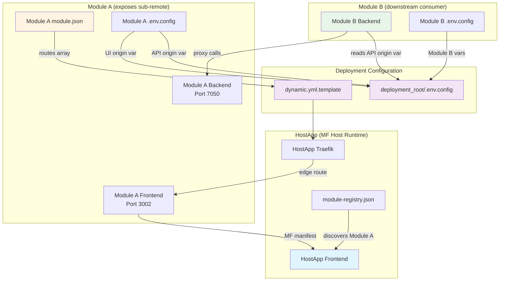

# module_template Module Integration Specs

This document is the canonical integration contract for remote modules in Ideable.
host_app and downstream remote module repositories should treat this file as the primary reference for Module Federation integration, menu mapping, permission-based visibility, runtime composition, and deployment validation.

## 1) Architecture Overview

> **Standard MF 2.0 vs Ideable Framework:** host_app acting as an MF host runtime, remote modules exposing manifests, and host_app dynamically loading those manifests are standard Module Federation 2.0 capabilities. The integration with Authentik for identity/authorization and the specific route/menu mounting behavior are Ideable Framework conventions.

- host_app is the MF host runtime.
- Remote modules expose their manifest through Module Federation.
- host_app dynamically loads remote manifests and mounts routes/menu items.
- Authentik is the central identity and authorization provider.
- host_app is the UI/admin/control surface.
- Remote modules consume claims issued by Authentik and authorize directly from validated JWTs.

Distribution model:
- host_app is distributed externally as pre-built Docker images (no source-code distribution contract).
- module_template is the source-distributed blueprint for module developers.
- In maintainer repos where host_app and module_template coexist, module_template must remain independently exportable with:
  - `git subtree split --prefix modules/module_template`
  - curated maintainer export flow: `scripts/master_only/push-updates-to-module_template-repo.sh`

Validation model:
- The canonical validation entry point is `scripts/common/validate_modules.sh`.
- `validate_modules.sh` must accept no arguments to validate all enabled modules from `modules/enabled.md`.
- `validate_modules.sh` must accept a module list as positional arguments to validate only those modules.
- The validation scope is limited to each module's `.env.config`, `.env.secrets`, `docker-compose.yml`, and every file in `config/`.
- The build and deploy flow must run validation immediately before the deploy step.

## 2) Remote Module Contract

> **Standard MF 2.0 vs Ideable Framework:** Exposing a named module (e.g., `./moduleManifest`) from a remote build is standard Module Federation 2.0. The required contract shape (`name`, `slug`, `menuItems[]`, `routes[]`, `permissions[]`), the standalone `menu_definition.json` format, and the validation rules are Ideable Framework conventions.

Remote frontend modules must expose `./moduleManifest` that matches host_app contract expectations.

Each remote module `config/` folder must include a `menu_definition.json` file representing the menu hierarchy used when the module runs as a standalone app.

Minimum contract fields:
- `name`
- `slug`
- `menuItems[]`
- `routes[]`
- `permissions[]` (optional but recommended)

`menuItems[]` entries must provide:
- `name`
- `href`
- `icon`
- optional `order`

`routes[]` entries must provide:
- `path`
- lazy `component` loader

Path convention:
- host_app owns URL namespacing via `basePath` from module registry.
- Remote `routes[].path` values must be module-local paths and must not duplicate `basePath`.
- Example for `basePath: "/template"`: use `"/dashboard"`, not `"/template/dashboard"`.

Validation rules for remote module root files:
- Each enabled module must include a module-root `.env.config` file.
- Each enabled module must include a module-root `.env.secrets` file.
- Each enabled module must include a module-root `.env.config.example` file.
- Each enabled module must include a module-root `.env.secrets.example` file.
- Each enabled module must include a module-root `docker-compose.yml` file.
- Each enabled module must include a `config/` folder containing the runtime configuration files used by the module.
- Each enabled remote module must include `config/menu_definition.json` defining its standalone menu structure.
- Each enabled remote module must include `config/modules_menu_mapping.json` defining how its menu integrates into host_app.
- The validator must fail when any required file is missing.
- The validator must fail when `docker-compose.yml` is not syntactically valid.
- The validator must fail when `.env.config` or `.env.secrets` contains malformed key/value entries.
- The validator must fail when `.env.config`, `.env.secrets`, `.env.config.example`, or `.env.secrets.example` defines the project-level keys `APP_SLUG` or `APP_NAME`.
- The validator must fail when files in `config/` are missing, unreadable, or malformed according to the file type they represent.
- The deployment script (`create-merged-configuration.sh`) must emit a warning when a remote module has `menu_definition.json` but is missing `modules_menu_mapping.json`.

Standalone menu definition contract (`menu_definition.json`):
- Top-level key: `menu_definition` (array)
- Each item in `menu_definition` must contain:
  - `menu_item_code` (internal reference, for example `SECOND_BUILDING`, `FIRST_FLOOR`, `THIRD_ROOM`)
  - `menu_item_name`
  - `icon`
  - optional `routing` (reference to related content page; omitted for container-only nodes)
  - optional `is_collapsible` (boolean, default `false`): when `true`, the menu item is collapsible, hiding all its sub-menu items; when `false` or absent, the item is not collapsible and all sub-items are always visible
  - optional `authorization_claim` (string): when absent, the menu item is visible by all users; when defined, only users whose validated Authentik JWT includes the exact permission string in `<module_slug>.permissions` can see the menu item and its entire sub-tree. For menu visibility, the permission must use the `<resource>:menu_access` format (e.g. `BuildingFirstFloor:menu_access`). Users without that exact permission will not see the item (it is not added to the UI).
  - `sub_items` array with the same recursive item structure

Example (`modules/<ModuleName>/config/menu_definition.json`):

```json
{
  "menu_definition": [
    {
      "menu_item_code": "SECOND_BUILDING",
      "menu_item_name": "Second Building",
      "icon": "Building2",
      "sub_items": [
        {
          "menu_item_code": "FIRST_FLOOR",
          "menu_item_name": "First Floor",
          "icon": "Layers",
          "is_collapsible": true,
          "authorization_claim": "BuildingFirstFloor:menu_access",
          "sub_items": [
            {
              "menu_item_code": "THIRD_ROOM",
              "menu_item_name": "Third Room",
              "icon": "DoorOpen",
              "routing": "/rooms/third",
              "sub_items": []
            }
          ]
        }
      ]
    }
  ]
}
```

## 3) Module Registry Format

> **Ideable Framework:** The `module-registry.json` format, registry endpoint, and verification URLs are Ideable Framework conventions; Module Federation 2.0 does not prescribe a registry file format.

host_app uses `public/module-registry.json` with this structure:

```json
{
  "modules": [
    {
      "name": "template",
      "entry": "/remotes/template/mf-manifest.json",
      "remoteEntry": "/remotes/template/remoteEntry.js",
      "displayName": "Module Template",
      "basePath": "/template"
    }
  ]
}
```

Rules:
- One entry per enabled remote module.
- `entry` must point to that module's MF manifest endpoint.
- `remoteEntry` must point to the remote container JS bundle (`remoteEntry.js`). When omitted, host_app falls back to `entry` for backwards compatibility, but remotes should define it explicitly.
- `basePath` must match the module routing prefix.

Verification URLs for remote exposition (example: `template`):
- `https://<host>/module-registry.json`
  - Must contain module entry `name: "template"` with `entry: "/remotes/template/mf-manifest.json"` and `remoteEntry: "/remotes/template/remoteEntry.js"`.
- `https://<host>/remotes/template/mf-manifest.json`
  - Must be reachable through Traefik and must include exposed module `./moduleManifest`.

Generic pattern for any module slug `<slug>`:
- Registry endpoint: `https://<host>/module-registry.json`
- Remote MF manifest endpoint: `https://<host>/remotes/<slug>/mf-manifest.json`
- Remote entry bundle endpoint: `https://<host>/remotes/<slug>/remoteEntry.js`

### 3.1) Auto-registration of newly pulled modules

When pulling a new module deployable using `pull-module-deployable-from-git.sh`, the `create-merged-configuration.sh` script automatically:
- Scans `module.json` files in module directories under `deployment_root/modules/`
- Registers missing modules in `module-registry.json` by deriving entries from `module.json` metadata:
  - `name` from `module.json.slug`
  - `entry` as `/remotes/<slug>/mf-manifest.json`
  - `remoteEntry` as `/remotes/<slug>/remoteEntry.js`
  - `displayName` from `module.json.displayName`
  - `basePath` as `/<slug>`
- Generates Traefik routes in `dynamic.yml.template` for `/remotes/<slug>` and `/module/<slug>` paths

This eliminates the need for manual configuration after pulling module deployables. Existing registry entries are preserved and not overwritten.

## 3.2) host_app Modules Menu Mapping Contract

> **Ideable Framework:** The `modules_menu_mapping.json` contract, nesting rules, and rendering depth are Ideable Framework conventions.

The canonical host_app menu mapping file lives at `deployment_root/modules/host_app/config/modules_menu_mapping.json` and is mounted by the host_app runtime.

There are two ways this file is produced at deployment time:

1. **Explicit host_app mapping** — If `modules/host_app/config/modules_menu_mapping.json` exists, it is used directly and copied into `deployment_root/modules/host_app/config/`. When an explicit file is present, the framework does **not** auto-merge remote module menus. Therefore, the explicit file must contain **every top-level menu from every enabled module**, including remote modules. The explicit file is the complete merged menu, not just host_app menus. Maintainers are responsible for keeping it in sync when modules are added or removed.
2. **Auto-merged from modules** — If the host_app file does not exist, the deployment process (`create-merged-configuration.sh`) merges all enabled modules' `config/modules_menu_mapping.json` files into a single `modules_menu_mapping.json` placed in `deployment_root/modules/host_app/config/`.

Each remote module must provide `config/modules_menu_mapping.json` to define how its menu integrates into the host_app sidebar. When auto-merging, the deployment script concatenates the `menu_mapping` arrays from every enabled module (excluding host_app) that provides this file.

**All-fields preservation**: The merge logic (both explicit-copy and auto-merge) preserves **all** fields from each `modules_menu_mapping.json` entry, including but not limited to `is_collapsible`, `icon`, `routing`, `authorization_claim`, `module`, and `module_menu_item_code_path`. No fields are dropped, renamed, or defaulted during the merge. This ensures that fields like `is_collapsible` (which controls whether the host_app renders a collapsible button with visible sub-items) are faithfully propagated to the deployed configuration.

`modules_menu_mapping.json` must contain a top-level `menu_mapping` array.

Each `menu_mapping` item must contain:
- optional `menu_item_code` (host_app internal reference; if omitted, use module `menu_item_code`)
- optional `menu_item_name` (host_app display label; if omitted, use module `menu_item_name`)
- optional `icon` (if omitted, use module item icon)
- optional `is_collapsible` (boolean, default `false`): when `true`, the host_app renders a collapsible button with visible sub-items; when `false` or absent, the item is not collapsible and all sub-items are always visible
- optional `authorization_claim` (string): when present, only users whose validated JWT includes the exact permission string in the corresponding `<module_slug>.permissions` claim can see the menu item and its sub-tree
- optional `routing` (string): URL path for the menu item's target page
- `module` (module name, for example `template`)
- `module_menu_item_code_path` (dot-separated path in remote `menu_definition`)
- `sub_items` array with the same recursive `menu_mapping` structure

Nesting under an existing host_app menu item is expressed by making the first path segment match that host_app menu code.

Examples:
- `TEMPLATE.ITEMS` renders the module item `ITEMS` under the module branch `TEMPLATE`
- `ADMIN.MYMENU` renders the module item `MYMENU` under the existing host_app `Admin` menu branch

When a mapping path starts with a host_app menu code such as `ADMIN`, host_app treats that first segment as the parent branch and renders the mapped module subtree beneath it.

Mapped menu trees are rendered up to four levels deep total.

Example (`modules/host_app/config/modules_menu_mapping.json`):

```json
{
  "menu_mapping": [
    {
      "menu_item_code": "MYMENU",
      "menu_item_name": "My Menu",
      "icon": "Shield",
      "module": "template",
      "module_menu_item_code_path": "ADMIN.MYMENU",
      "sub_items": [
        {
          "menu_item_code": "SUBITEM",
          "menu_item_name": "Sub Item",
          "icon": "List",
          "module": "template",
          "module_menu_item_code_path": "ADMIN.MYMENU.SUBITEM",
          "sub_items": []
        }
      ]
    }
  ]
}
```

## 3.3) Container Naming Contract

> **Ideable Framework:** The dotted container naming pattern and deployment-time slug resolution are Ideable Framework deployment conventions.

All host_app and remote module compose files must use the dotted runtime naming pattern:

- `${APP_SLUG}.${MODULE_SLUG}.<container_name>`

Examples:
- `${APP_SLUG}.${MODULE_SLUG}.database`
- `${APP_SLUG}.${MODULE_SLUG}.backend`
- `${APP_SLUG}.${MODULE_SLUG}.frontend`
- `${APP_SLUG}.${MODULE_SLUG}.authentik-server`

Rules:
- `APP_SLUG` is the project-wide prefix defined in repo-root `project.env.config`.
- `MODULE_SLUG` is the module-local suffix defined in each module's `.env.config`.
- During deployment, `scripts/common/build_and_deploy.py` resolves the module slug for each deployed compose file before generating the merged compose output so the final runtime container names stay unique even though all module env files are merged into `deployment_root/.env.config` and `.env.secrets`.

## 3.4) Module Secrets Contract

> **Ideable Framework:** The split between project-level secrets, module-level secrets, and `.env.secrets.example` template files is an Ideable Framework deployment convention.

Every module must declare all secret-like variables it expects in its module-root `.env.secrets.example` file. This file is the canonical template for module secrets:

- Local development: copy `.env.secrets.example` → `.env.secrets` and fill in real values.
- Deployable bundles: `.env.secrets` is excluded from git, but `.env.secrets.example` is kept so the consumer knows which secrets are required.

At deployment time:

- `scripts/common/build_and_deploy.py` generates a merged `deployment_root/.env.secrets.example` with placeholder values derived from the merged secrets.
- `deployment_root/scripts/create-merged-configuration.sh` (run by `redeploy.sh` after the build step) regenerates the merged files and, during that run, copies each module's `.env.secrets.example` into `deployment_root/modules/<module>/` and regenerates `deployment_root/.env.secrets.example` from the actual project and per-module `.env.secrets.example` files.
- `deployment_root/scripts/create-merged-configuration.sh` also creates any missing per-module `.env.secrets` from `.env.secrets.example`.
- `deployment_root/scripts/change_secrets.sh` creates the root `.env.secrets` from `.env.secrets.example` if it is missing, then interactively updates secret values.

Rules:
- Project-level identity variables `APP_SLUG` and `APP_NAME` must be defined only in repo-root `project.env.config` / `project.env.secrets`, never in module `.env.config`, `.env.secrets`, or their `.example` files.
- Module `.env.secrets.example` files may reference project-level secret aliases (for example `${HOSTAPP_POSTGRES_PASSWORD}`) only if they also define those aliases with placeholder values so deployables without `project.env.secrets` can still resolve them.
- Secret-like keys end in `_PASSWORD`, `_TOKEN`, `_SECRET`, `_SECRET_KEY`, `_API_KEY`, or `_API_TOKEN` unless explicitly whitelisted.

## 4) Creating a New Remote Module

> **Standard MF 2.0 vs Ideable Framework:** Using Rsbuild with `@module-federation/rsbuild-plugin` and exposing a module from the remote are standard Module Federation 2.0 patterns (the specific build tool choice is Ideable-specific). The `./moduleManifest` contract, Authentik JWT validation, `config/authorization.yaml`, audit trail, and compose/registry wiring are Ideable Framework conventions.

1. Create module folder under `modules/<ModuleName>/` with `module.json`.
2. Set module metadata (`slug`, `displayName`, `role: remote`, `cssPrefix`).
3. Implement frontend remote with Rsbuild + `@module-federation/rsbuild-plugin`.
4. Expose `./moduleManifest` from remote frontend.
5. Implement backend API with JWT validation via Authentik JWKS.
6. Enforce permissions directly from Authentik JWT claims.
6a. Define module-specific authorization data in `modules/<ModuleName>/config/authorization.yaml` (e.g. entity roles, permissions, claim mappings). host_app already owns the initial app-wide authorization bootstrap.
6b. Include `audit_trail:view` in `authorization.yaml` and assign it to at least one role.
7. Implement audit trail for every main entity (see `audit-trail-specs.md` and §12 below).
8. Add `audit_trail:view` to `config/authorization.yaml` and assign it to at least one role.
9. Add module compose file (`docker-compose.yml` or supported naming variant).
10. Enable module in `modules/enabled.md`.
11. Re-run build/deploy to regenerate module registry and merged compose.

## 5) Shared Dependency Requirements

> **Standard MF 2.0 vs Ideable Framework:** Configuring shared dependencies as singletons is a standard Module Federation 2.0 requirement. The specific shared library list (`react-oidc-context`, `oidc-client-ts`, `@tanstack/react-query`) is an Ideable Framework choice.

MF shared dependencies must be configured as singletons for compatibility:
- `react`
- `react-dom`
- `react-router-dom`
- `react-oidc-context`
- `oidc-client-ts`
- `@tanstack/react-query`

## 6) CSS Prefix Convention

> **Ideable Framework:** The Tailwind prefix convention and modifier ordering are Ideable Framework isolation rules.

Each module must use a dedicated Tailwind prefix equal to its slug:
- host_app: `hostapp-`
- module_template: `template-`

Modifier ordering must preserve Tailwind syntax:
- `hover:hostapp-bg-accent`
- `md:template-grid-cols-2`

## 6.1) Canonical Reference Module

> **Ideable Framework:** The canonical reference module pattern and parity gate requirements are Ideable Framework conventions.

- `modules/module_template/` is the canonical, always-updated reference implementation for host_app-compatible remote modules.
- When host_app integration contracts change (routing, auth, widget behavior, or visual token usage), module_template specs and implementation must be updated in the same change cycle.
- New module developers should treat module_template as the first implementation reference before creating custom patterns.

## 6.2) Validation Discoverability Contract

> **Ideable Framework:** The validation discoverability contract, parity gates, and L&F compatibility model are Ideable Framework conventions.

Because host_app and remote modules can live in separate codebases, validation compatibility must be discoverable through versioned artifacts instead of implicit knowledge.

Mandatory discoverability artifacts:
- host_app module integration and validation contract in this file (`module-integration-specs.md`).
- module_template frontend specs as executable baseline reference (`modules/module_template/frontend/SPECS/ideable-framework-specs/shared-ui-specs.md`, `modules/module_template/frontend/SPECS/ideable-framework-specs/shared-ui-widgets-specs.md`, and `modules/module_template/frontend/SPECS/module-specs.md`).
- module_template frontend implementation (`modules/module_template/frontend/SOURCES/`) as copy-ready compatibility baseline.

Validation runner requirements:
- `scripts/common/validate_modules.sh` is the authoritative runner used by build/deploy orchestration.
- The runner must validate all enabled modules when called without arguments.
- The runner must validate only the listed modules when module names are passed positionally.
- The runner must be safe to call before deployment and must not mutate module source files.

L&F compatibility model for remotes:
- Default mode: inherit host_app visual tokens and interaction patterns.
- Override mode: apply module-specific visual overrides only inside module scope, without mutating host_app global CSS.

Mandatory parity gates before release:
- automated parity contract tests:
  - `modules/module_template/frontend/TESTS/test_template_items_table_contract.py`
  - `modules/module_template/frontend/TESTS/test_lf_parity_contract.py`
- visual snapshot parity tests:
  - `modules/module_template/frontend/TESTS/playwright/tests/lf-parity.spec.ts`
- runner:
  - `scripts/check_moduletemplate_lf_parity.sh`

## 7) Docker Compose Composition

> **Ideable Framework:** The two-level execution model, merge strategy, and per-module `.env`/compose rules are Ideable Framework deployment conventions (see `rules/general-guidelines.md`).

See `rules/general-guidelines.md` for complete deployment architecture specification:
- Two-level execution model (standalone vs composed)
- Path resolution in merged compose
- Environment variable strategy
- Per-module vs ecosystem-wide `.env` and `docker-compose.yml` files

### 7.1) Env Var Interpolation Rules

> **Ideable Framework:** The `--no-interpolate` merge rules and validation step ordering are Ideable Framework deployment pipeline conventions.

The build and deploy pipeline uses `docker compose config --no-interpolate` when merging compose files. Because `--no-interpolate` disables all variable expansion during merge-time validation, env var placeholders **must not appear in YAML dictionary keys** — they are only allowed in YAML values.

**Allowed in values (string fields):**
- `container_name: ${APP_SLUG}.${MODULE_SLUG}.backend`
- `image: ${MODULE_DOCKER_REGISTRY_PREFIX}/${MODULE_SLUG}.backend:latest`
- `ports: - "${BACKEND_PORT:-8001}:8001"`
- environment variable values, labels, commands, healthcheck tests

**Forbidden in keys (structural identifiers):**
- Service names under `services:` — must be static strings
- `depends_on:` keys — must reference actual service names
- Top-level `networks:` keys — must be static network names
- Top-level `volumes:` keys — must be static volume names

Example of correct usage:
```yaml
services:
  backend:
    image: ${MODULE_DOCKER_REGISTRY_PREFIX}/${MODULE_SLUG}.backend:latest
    container_name: ${APP_SLUG}.${MODULE_SLUG}.backend
    networks:
      - ideable_network
    depends_on:
      database:
        condition: service_healthy

networks:
  ideable_network:
    driver: bridge
```

Example of incorrect usage (will fail validation):
```yaml
services:
  ${APP_SLUG}.backend:         # WRONG: env var in service name key
    image: backend:latest
    depends_on:
      ${APP_SLUG}.database:    # WRONG: env var in depends_on key
        condition: service_healthy

networks:
  ${APP_SLUG}.network:          # WRONG: env var in networks key
    driver: bridge
```

Deployment validation step:
- `scripts/common/build_and_deploy.py` must invoke `scripts/common/validate_modules.sh` after build succeeds and immediately before any deployment copy or compose-generation step.
- Validation must run before any deployment-side file is written so invalid module files stop the pipeline early.

### 7.2) Sync-managed compose sections

> **Ideable Framework:** The sync-managed section markers and ownership model are Ideable Framework conventions.

`modules/module_template/docker-compose.yml` uses explicit sync-managed sections to define which compose areas are owned by the framework. The current ownership model is:

- `# SYNC-MANAGED-BEGIN: bootstrap-service` / `# SYNC-MANAGED-END: bootstrap-service`
- `# SYNC-MANAGED-BEGIN: database-service` / `# SYNC-MANAGED-END: database-service`
- `# SYNC-MANAGED-BEGIN: backend-service` / `# SYNC-MANAGED-END: backend-service`
- `# SYNC-MANAGED-BEGIN: frontend-service` / `# SYNC-MANAGED-END: frontend-service`
- `# SYNC-MANAGED-BEGIN: top-level-networks` / `# SYNC-MANAGED-END: top-level-networks`
- `# SYNC-MANAGED-BEGIN: top-level-volumes` / `# SYNC-MANAGED-END: top-level-volumes`

The sync script replaces only those marked sections in downstream remote modules. Remote module developers own any compose content outside the managed blocks, including remote-specific labels, service overrides, or additional services.

Volumes are framework-managed when they are part of the marked top-level volumes section, but their runtime paths remain configurable through env vars such as `DATA_FOLDER`-style settings, so deployers can still redirect persistent storage without editing the managed compose block.

When a remote module predates this marker layout, migrate it by adding the same markers around the framework-owned sections and then re-running the sync script. After migration, future syncs update only the marked sections and preserve remote-specific compose customizations outside them.

## 7.1) MF 2.0 Runtime Configuration via Volume Mounts

> **Standard MF 2.0 vs Ideable Framework:** Runtime module composition without rebuilding is enabled by Module Federation 2.0 dynamic remote loading. The specific volume-mount configuration (`modules/host_app/config/`), `module-registry.json`, and `modules_menu_mapping.json` runtime update mechanism are Ideable Framework conventions.

To enable runtime module composition changes without rebuilding containers, the deployed host_app stack must mount the full `modules/host_app/config/` folder from `deployment_root/` into the frontend container.

- `.env.config` and `.env.secrets` (used by compose services via `env_file`)
- `modules/host_app/config/` as a read-only volume mounted at `/usr/share/nginx/html/config`

The frontend must fetch runtime assets from `/config/` inside the container.

Because browsers may heuristically cache JSON responses (especially when no explicit `Cache-Control` header is present), every `fetch()` call for runtime JSON assets must append a cache-busting query parameter (e.g. `?t=${Date.now()}`) so that updated config files are never served from a stale browser cache across deployments.

The mounted `modules/host_app/config/` folder contains the canonical runtime assets for host_app, including:

- `modules_menu_mapping.json`
- `module-registry.json`
- `home.html`
- favicon file pointed to by `AUTHENTIK_LOGIN_FAVICON_FILE`
- `login_bg.png`

`.env.config` and `.env.secrets` are mandatory runtime configuration and must be wired from `deployment_root/.env.config` and `deployment_root/.env.secrets` through compose `env_file` entries.

**Deployment-root mount pattern (reference):**
```yaml
services:
  frontend:
    env_file:
      - .env.config
      - .env.secrets
    volumes:
      - ./modules/host_app/config:/usr/share/nginx/html/config:ro

  template-frontend:
    env_file:
      - .env.config
      - .env.secrets
    volumes:
      - ./modules/module_template/config/menu_definition.json:/usr/share/nginx/html/menu_definition.json:ro
```

**Key Principle**: These files are configuration that may change between deployments or require runtime adjustments. Mounting them as volumes allows operators to:
- Enable/disable modules by updating `modules_menu_mapping.json`
- Customize branding without rebuilding images
- Update menu structures without redeployment

All volume mounts use `:ro` (read-only) flag as these are configuration files, not runtime state.

## 8) Edge Routing

> **Ideable Framework:** The `/remotes/<slug>/*` and `/module/<slug>/*` routing prefixes, Traefik strip-prefix behavior, `module.json` `routes[]` exception mechanism, and the contract/renderer split are Ideable Framework deployment conventions.

### 8.1 Standard routes (auto-derived)

For every enabled remote module, the framework auto-generates two edge routes at deploy time from `module.json` metadata:

- Frontend static assets/manifests: `/remotes/<slug>/*`
- Backend surface: `/module/<slug>/*`

host_app routing pattern:
- host_app business APIs: `/api/*`
- host_app docs/OpenAPI: `/api/docs`, `/api/openapi.json`
- host_app health check: `/health`

Remote module operational/docs pattern:
- External (through the edge):
  - API root: `/module/<slug>/api`
  - API docs: `/module/<slug>/api/docs`
  - OpenAPI: `/module/<slug>/api/openapi.json`
  - Health: `/module/<slug>/health`
- Internal remote backend service remains module-local and routed behind strip-prefix:
  - API root: `/api`
  - API docs: `/api/docs`
  - OpenAPI: `/api/openapi.json`
  - Health: `/health`

host_app Traefik config must keep host and remote routes isolated. host_app must never hardcode per-module routes — all routes are derived from `module.json` at deploy time.

### 8.2 Exception routes (`module.json` `routes[]`)

When a module requires edge routes beyond the standard `/remotes/<slug>` and `/module/<slug>` pattern — chiefly for sub-remotes served by an external origin — it declares them via the optional `routes[]` array in `module.json`.

See `rules/general-guidelines.md` § Module Edge Routing for the full `routes[]` schema, reserved namespaces, and validation rules.

#### Dual UI/API origins

When a module exposes both a frontend sub-remote (UI) and a backend API surface that other modules need to call, the `routes[]` entry can specify both `upstream` (for the UI/static remote) and `apiUpstream` (for the backend API). The framework emits the `apiUpstream` env var placeholder into the merged `.env.config` so downstream modules can discover the API origin without hardcoding hostnames/ports.

Example:
```json
{
  "routes": [
    {
      "prefix": "/subremote",
      "upstream": "${MODULE_A_SUBREMOTE_ORIGIN}",
      "apiUpstream": "${MODULE_A_SUBREMOTE_API_ORIGIN}",
      "stripPrefix": true,
      "options": { "sse": true }
    }
  ]
}
```

In this example:
- `upstream` points to the frontend service (e.g., `http://${EXTERNAL_BASE_HOST}:3002`) for the sub-remote MF bundle
- `apiUpstream` points to the backend API service (e.g., `http://${EXTERNAL_BASE_HOST}:7050`) for proxy calls
- The deployment script emits both `MODULE_A_SUBREMOTE_ORIGIN` and `MODULE_A_SUBREMOTE_API_ORIGIN` into the merged `.env.config`
- Downstream modules reference `MODULE_A_SUBREMOTE_API_ORIGIN` in their backend proxy code

**Concrete example (DSEC_AILab pattern):**

For a real-world implementation, the DSEC_AILab module uses this pattern:
- Route prefix: `/aicomsec`
- UI origin: `DSEC_AILAB_AICOMSEC_ORIGIN` (frontend on port 3002)
- API origin: `DSEC_AILAB_AICOMSEC_API_ORIGIN` (backend on port 7050)
- Downstream SRA module references `DSEC_AILAB_AICOMSEC_API_ORIGIN` in its proxy code

#### Architecture diagram

The following diagram shows how HostApp, a module exposing a sub-remote (Module A), and a downstream module (Module B) interact using dual UI/API origins:



**Key configuration elements:**

| Element | Location | Purpose |
|---|---|---|
| UI origin env var (e.g., `MODULE_A_SUBREMOTE_ORIGIN`) | Module A `.env.config` | Frontend service URL for Traefik routing (e.g., `http://${EXTERNAL_BASE_HOST}:3002`) |
| API origin env var (e.g., `MODULE_A_SUBREMOTE_API_ORIGIN`) | Module A `.env.config` | Backend API URL for downstream proxy calls (e.g., `http://${EXTERNAL_BASE_HOST}:7050`) |
| `routes[].upstream` | Module A `module.json` | References the UI origin env var for edge route generation |
| `routes[].apiUpstream` | Module A `module.json` | References the API origin env var for env var validation and emission |
| API origin env var | Module B backend code | Used in proxy requests to Module A backend |

**Example (DSEC_AILab pattern):**

For a concrete example using the DSEC_AILab module:
- Module A = DSEC_AILab, Module B = SRA
- UI origin var = `DSEC_AILAB_AICOMSEC_ORIGIN` (points to frontend on port 3002)
- API origin var = `DSEC_AILAB_AICOMSEC_API_ORIGIN` (points to backend on port 7050)
- Route prefix = `/aicomsec`

### 8.3 Sub-remote MF runtime registration

A bridge remote that composes sub-remotes must declare them in its own `mf-manifest.json` `remotes[]` field. MF 2.0's runtime resolves sub-remotes from the parent manifest automatically. The edge route (provided by `routes[]`) makes the sub-remote's manifest reachable; MF 2.0 handles the rest.

### 8.4 Contract/renderer split

The routing architecture separates the portable contract (`module.json` + `module-registry.json` → RouteTable) from the adapter that renders it. The current adapter is the Traefik file provider. A future Kubernetes Gateway API adapter will render the same RouteTable into HTTPRoute resources. This makes Compose→K8s a renderer swap, not a contract change.

### 8.5 MF serving contract

MF remotes must serve `mf-manifest.json` and `remoteEntry.js` with `Cache-Control: no-store` (stable names, mutable content) and content-hashed chunks as immutable. The module's static layer owns this; never host_app's concern.

## 9) Authorization Integration

> **Ideable Framework:** While JWT validation and Bearer token usage are standard patterns, the claim namespace convention (`<module_slug>.permissions`), permission naming (`<resource>:<action>`), and menu visibility model are Ideable Framework conventions.

Remote modules must use the same access token received by the SPA:

1. Validate token signature using Authentik JWKS.
2. Read authorization claims from the token payload.
3. Enforce permission checks in module backend.

Permission naming convention:
- Bare `<resource>:<action>` strings are emitted inside the per-module JWT claim `<module_slug>.permissions`.
- Both frontend and backend check these raw claim values directly without prefixing.

Examples (as they appear inside `template.permissions`):
- `items:view`
- `items:edit`

Modules may define custom claims for:
- menu visibility
- route authorization
- tenant/company scoping
- feature flags

## 10) Kubernetes Readiness Notes

Remote modules must remain Kubernetes-ready:
- Use service DNS names in internal URLs.
- Avoid host-path assumptions.
- Keep module boundaries explicit (frontend, backend, database).
- Expose health endpoints for orchestrator probes.
- Edge routing uses a contract/renderer split: `module.json` `routes[]` defines portable route intent; the Traefik file provider renders it today, a Kubernetes Gateway API adapter will render the same RouteTable tomorrow. No module change is needed when switching adapters.

## 11) Environment Variable Ownership

> **Ideable Framework:** The `VITE_APP_TITLE` ownership rule and module-scoped build-arg restrictions are Ideable Framework conventions.

- `VITE_APP_TITLE` is owned by host_app frontend configuration.
- Remote module `.env` files must not define `VITE_APP_TITLE`.
- Remote module frontend build args must include only module-scoped variables (for example `VITE_TEMPLATE_API_URL`).

## 12) Audit Trail Implementation

> **Ideable Framework:** Audit trail implementation (SQLAlchemy-Continuum versioning, history endpoints, `audit_trail:view` permission, and frontend popup) is an Ideable Framework requirement with no Module Federation 2.0 standard equivalent.

Every remote module must implement audit trail for every main entity as defined in
`audit-trail-specs.md`. The following checklist maps the spec requirements to concrete
module_template files.

### 12.1 Backend checklist

1. **Entity model versioning** — every main entity must set `__versioned__ = {}`:
   - Example: `modules/module_template/backend/SOURCES/app/models.py`

2. **`app/audit.py` must not be simplified** — it must contain all reusable factories:
   - `set_current_user()`, `get_current_user()`, `clear_current_user()`
   - `set_system_startup_at()`, `get_system_startup_at()`
   - `ensure_utc()`, `normalize_actor_username()`
   - `build_transaction_map(db, version_rows)`
   - `make_synthetic_creation_row(schema_cls, entity, ...)`
   - `version_row_to_schema(version_row, schema_cls, tx_map, ...)`
   - `merge_and_sort_history(field_versions, association_rows, ...)`
   - `register_audit_listener(engine)` (legacy fallback)
   - `ActorPlugin` — a `sqlalchemy_continuum.plugins.Plugin` subclass whose `before_flush`
     sets `uow.current_transaction.meta['actor']` from the context-var set by `set_current_user()`.
     Must be passed to `make_versioned(plugins=[TransactionMetaPlugin(), ActorPlugin()])`.

3. **History endpoint** for each entity:
   - Route: `GET /<entity>/{entity_id}/history`
   - Guard: `require_permission('<module_slug>.audit_trail:view')`
   - Must use `build_transaction_map`, `version_row_to_schema`, and `merge_and_sort_history`
   - Must synthesise a creation row via `make_synthetic_creation_row` when no versions exist

4. **Response schema** for each entity:
   - Must inherit from `BaseVersion` (defined in `app/schemas.py`)
   - Only add business fields (e.g. `name`, `description`) to the subclass
   - Example: `class TemplateItemVersion(BaseVersion): ...`

5. **Actor injection** — every mutating endpoint must call `set_current_user(username)` before
the DB commit. The username must come from the validated JWT, never from a display name or email.
   The `ActorPlugin` (registered in `make_versioned`) copies the context-var actor into each
   Continuum transaction during `before_flush`, so the audit trail reports the correct user.

### 12.2 Frontend checklist

1. **Audit trail action icon** — every entity table or detail page must show a `History` icon
(from lucide-react) in the action column, gated by `audit_trail:view` in the JWT permissions.

2. **AuditTrailPopup** — clicking the icon opens the popup component that fetches and renders
`GET /<entity>/{entity_id}/history`. The popup must visually distinguish the five operation types
(`0`/`1`/`2`/`3`/`4`).

3. **No legacy toggle** — the old per-page "Show audit data" toggle is not allowed; visibility
is controlled exclusively by the permission-gated action icon.

### 12.3 Authorization checklist

1. **`config/authorization.yaml`** must declare `audit_trail:view` as a permission.
2. At least one role must grant `audit_trail:view` so users can view history.
3. The permission string passed to `require_permission()` must be the fully-qualified form
`<module_slug>.audit_trail:view`.

## 13) Logging and Observability

> **Ideable Framework:** The automatic `<SLUG>_LOG_LEVEL` derivation from `modules/enabled.md` mode and the backend startup logging contract are Ideable Framework conventions.

### 13.1 Automatic Log Level

The deploy script (`scripts/common/build_and_deploy.py`) derives a per-module `<SLUG>_LOG_LEVEL` environment variable for every enabled module based on its mode in `modules/enabled.md`:

- **`local`** (build from local source) → `<SLUG>_LOG_LEVEL=DEBUG`
  - Modules in development mode emit `DEBUG`, `INFO`, `WARNING`, and `ERROR` logs.
- **`remote`** (pre-built images) → `<SLUG>_LOG_LEVEL=INFO`
  - Modules in production mode emit `INFO`, `WARNING`, and `ERROR` logs only.

The variable name is derived from the module's `slug` field in `module.json`, uppercased, and suffixed with `_LOG_LEVEL`:

- host_app (slug `hostapp`) → `HOSTAPP_LOG_LEVEL`
- module_template (slug `template`) → `TEMPLATE_LOG_LEVEL`
- A custom module (slug `sra`) → `SRA_LOG_LEVEL`

This prefixed variable is injected into both:

- The merged `deployment_root/.env.config` and `deployment_root/.env.secrets` (used by composed execution)
- Each per-module `deployment_root/modules/<MODULE>/.env.config` and `.env.secrets` (used by standalone execution)

Each backend service's `docker-compose.yml` maps the module-specific variable to the standard `LOG_LEVEL` variable in its `environment:` block:

```yaml
# host_app backend
environment:
  - LOG_LEVEL=${HOSTAPP_LOG_LEVEL:-INFO}

# module_template backend
environment:
  - LOG_LEVEL=${TEMPLATE_LOG_LEVEL:-INFO}
```

Docker Compose resolves `${TEMPLATE_LOG_LEVEL}` from the merged `.env` and passes it to the container as `LOG_LEVEL`. Because each service maps only its own slugged variable, the correct per-module level is delivered to each backend even when multiple modules run together. Remote modules therefore remain at `INFO` while local build-mode modules emit `DEBUG`.

### 13.2 Backend Logging Contract

Every backend `main.py` reads the standard `LOG_LEVEL` variable — no module-specific code is required:

1. Read `LOG_LEVEL` at import time:
   ```python
   _log_level_str = os.getenv('LOG_LEVEL', 'INFO').upper()
   _app_log_level = getattr(logging, _log_level_str, logging.INFO)
   logging.getLogger().setLevel(_app_log_level)
   ```
2. Provide a startup event handler that re-applies the level after uvicorn configures its own logging:
   ```python
   @app.on_event('startup')
   async def _configure_logging():
       _level_str = os.getenv('LOG_LEVEL', 'INFO').upper()
       _level = getattr(logging, _level_str, logging.INFO)
       root = logging.getLogger()
       root.setLevel(_level)
       if not root.handlers:
           handler = logging.StreamHandler()
           handler.setLevel(_level)
           handler.setFormatter(logging.Formatter('%(levelname)s - %(name)s - %(message)s'))
           root.addHandler(handler)
   ```

This guarantees that application loggers respect the deploy-script-computed per-module level regardless of uvicorn's default `INFO` configuration, while keeping backend code completely generic.
