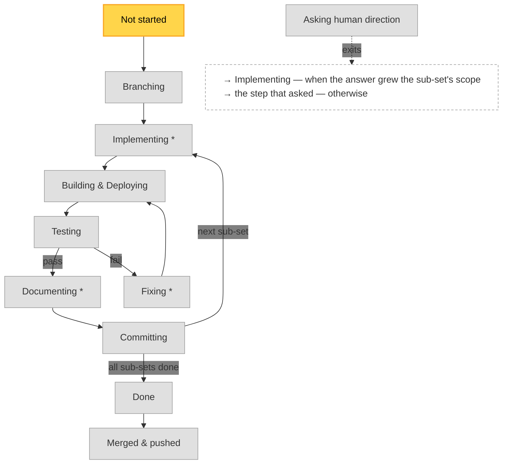

# Implementation Plan — format & lifecycle (canonical)

> Single source of truth for the **implementation plan** artifact that the workflow skills
> create and keep current: `ideable-implement-specs`, `ideable-test-and-fix`,
> `ideable-build-and-deploy`, `ideable-bugfixing-and-changes`, `ideable-commit-changes`.
> Those skills **reference** this file — they must not restate the format or the legend.
> (This is a project-wide workflow convention → a **rule**, per `rules/authoring-guidelines.md`.)

An implementation plan is a **human-readable status artifact**, not a source of truth for
correctness. Correctness is always established by tests (see `rules/testing-guidelines.md`);
the plan only communicates *where the work currently stands* to a human reader at a glance.

## Location & naming

- Plans live in **`implementation-plans/`** at the repo root (a working artifact, like
  `TEST_REPORTS/` and `kanban/`; not force-synced, not git-ignored by convention).
- One file per implementation run. Filename:

  ```
  <date> - <time> - <description> (<state>).md
  ```

  - `<date>` is `YYYY-MM-DD` and `<time>` is `HH-MM-SS` (colon-free, same digits as
    `TEST_REPORTS/`), separated by ` - ` — the timestamp of the **latest execution**, not of the
    plan's creation: e.g. `2026-08-10 - 16-42-05 - add-audit-column-filtering (BuildDeploy).md`
    is the plan as of the 16:42:05 step. At creation that is the creation time; from then on
    `scripts/dev/common/dev-cycle.sh` re-stamps it at every transition. The creation timestamp is **not**
    lost — it stays in the Overall view's `Created at` line (with `Last updated` matching the
    name), which is exactly why the name is free to carry the more useful "when did this last
    move" instead.
  - `<state>` is the plan's **current dev-cycle node**, so the filename always shows where the
    run stands. `scripts/dev/common/dev-cycle.sh` maintains both parts: on every transition it **renames**
    the plan file onto the new timestamp and state. A plan is created with `(NotStarted)`; one
    created without the suffix picks one up at the first transition.
    It is the node's **id**, which for one node is shorter than the name a person reads: a plan
    waiting on the maintainer is `… (Asking).md`, and `Current step` spells the same node out as
    `Asking human direction`.
  - **`(Paused)` is the one state that is not a node**, and the one case where the filename and
    the graph's highlight disagree on purpose. `Paused` says nobody is working the plan; *where*
    the work is stays in the highlight, which `pause` leaves untouched because it is the only
    record `resume` has to return to (§ *Git integration* below). Everywhere else the two agree,
    and `scripts/TESTS/test_plan_status_is_true.py` checks that they do — for a plan being driven,
    which is why its fixture skips a paused one.
  - `<description>` is chosen as follows:
    - a **short description of what to implement**, when the whole scope is clearly
      summarizable in a few words (e.g. `add-audit-column-filtering`);
    - otherwise, when only the **main thing** is summarizable but there is more,
      `<main-thing>-and-other` (e.g. `new-items-page-and-other`);
    - otherwise `various`.
  - Keep `<description>` filesystem-safe: lowercase, words joined by `-`, no `/` or `:`.
- **The active plan has a stable name, and that name is the register.** While a plan is in flight
  the router maintains `implementation-plans/ACTIVE PLAN - <description>.md`, a **symlink** to
  whichever file is current, repointed at every transition. Everything else about a plan's filename
  moves — the timestamp is re-stamped at each execution and the state is part of the name — which is
  deliberate and makes the plan impossible to cite. This is the one name that holds for the life of
  the run, so a skill, a rule, an editor tab or a shell alias can refer to it — and it is also what
  says which plan is being worked at all (§ *Active plan resolution*).
  - **`scripts/dev/common/dev-cycle.sh start <description>` creates it**, and creating it is what
    makes that plan the active one. `start` changes nothing else: no rename, no highlight move, no
    branch. It refuses a plan that is not at `NotStarted`, a parked plan (`resume` is that plan's
    verb), and a plan named while another is already in flight; a bare `start` lists the candidates
    and stops rather than picking the only one, because which plan is the work in hand is a
    decision. A plan past `NotStarted` whose link was genuinely lost is refused too, with the
    `ln -sfn` to recreate it printed — deliberate and manual, because guessing which file of a
    mid-flight plan is current is the guess this mechanism removes.
  - It is keyed on the **description**, the only part of a plan's name that does not change. The
    link's target is stored **relative**, so it survives the repository being checked out elsewhere.
  - **Resolution reads the description the link names, not the link's target.** An agent performing
    a node renames the plan itself — the state lives in the name — and does not repoint the link, so
    reading the target would hand back a file that no longer exists. Reading the description makes a
    broken link as good as an intact one; the target is for the human reader, which is why
    every transition still repoints it.
  - **Reaching `Merged` or `Paused` removes it.** Its absence is the signal that no plan is in
    flight; a link that survived delivery — or a pause — would claim one forever. The two states
    differ only in what happens next: a delivered plan is finished, a paused one is picked up
    again by `resume`, which restores the link. The real plan file — or every file, under
    `--keep-history` — is never touched by any of this.
  - It is **not** a plan. `plan_files()` — which selects among one plan's files, and is what every
    resolution goes through — excludes symlinks explicitly, because resolving the alias would make
    the router read and rewrite a plan through it and rename the target out from under the link on
    the first transition.
  - **Anything that scans `implementation-plans/` excludes it the same way, and excludes it before
    touching the filesystem** — `is_symlink()` (which is an `lstat`) filters the glob, and only the
    survivors are `stat`ed, read or sorted. Inside the dev tools container the bind mount
    answers `lstat` on that link and returns EINVAL for `stat`, so a scan that sorts or reads first
    raises `OSError` before it has selected anything: no verdict at all, wearing the shape of one.
    **The trigger is the repointing**, which is why it bites this link and no other: Docker
    Desktop's bind mount keeps serving the size it cached, and every transition points the link at a
    target of a different length, so from then on the length and the target disagree and `readlink`
    — which `stat` and git both go through — fails. The container reads symlinks perfectly well,
    and `lstat` still answering is the evidence that the path is one.
- **History mode — and the two modes mean two different things, not one thing in two sizes.**
  By default a run keeps **one** plan file, renamed onto the execution timestamp and current state
  at each transition (the previous name is removed). Running `scripts/dev/common/dev-cycle.sh` with
  `--keep-history` instead **keeps every transition's file** — same naming, so the files sort
  chronologically (a same-second collision gets a ` (<state> 2)` suffix). In both modes the plan is
  named by its one `ACTIVE PLAN` link and its **current file** is the most-recent of the files
  bearing that description — so a plan's history trail is one plan, however long it grows.
  - **With `--keep-history`, each file describes THE STEP IT BELONGS TO.** The file named
    `… (Testing).md` is the plan as the `Testing` node left it, and the whole execution can be
    followed file by file: what each node found, what it decided, what it handed on. The trail is
    the artifact; no single file has to carry it.
  - **Without it, the one file is the plan AS IT STANDS** — and that is the whole of its job:
    what is done, what remains, the decisions taken by agent and by maintainer, and **every memory
    a later node needs to execute correctly**. It is not a log of the run. A node that *appends* its
    account to the chapter the previous node wrote is building the `--keep-history` trail inside a
    file that was chosen for not being one, and the chapter stops answering the question it is
    titled with. See § *Status summary* and § *Detailed summary*, which each say what they hold and
    that a node **rewrites** them.
  - **Why the default is the one that must carry everything.** **Nothing may be assumed to pass
    between the agents that perform successive nodes.** Within one sub-set the router resumes the
    agent that performed the last node, so the same mind usually continues — but a resumed session
    is a convenience, never a guarantee: it is remembered on one machine, a session that cannot be
    resumed starts a fresh one, the router's session setting can be narrowed to a single node
    (`scripts/dev/common/dev-cycle.sh --help`), and **a new sub-set starts a fresh agent on
    purpose** — that boundary is where anything the previous agent believed and never wrote down
    gets caught. A node that finds no session begins with this file and nothing else. So the test
    of the default mode is not "can the run be reconstructed" but "can the next node act correctly
    having read only this" — and anything needed for that belongs in the plan whatever else is
    trimmed.

## The kanban card moves with the plan (mandatory)

A card in `kanban/` and the plan that implements it are the same piece of work seen from two sides:
the card says what should happen, the plan tracks it happening. They are linked by the
`<description>` slug — `kanban/<column>/<description>.md` alongside
`… - <description> (<state>).md` — so the pairing is visible in the filename and needs no index.

**When an implementation plan is created for a card, move that card `kanban/todo/` →
`kanban/doing/` in the same change.** Creating the plan *is* the start of the work; a card left in
`todo/` after that states the opposite of what is true, and the next person picking up work reads
the column, not the plan directory.

The rest of the lifecycle already exists: at delivery the card moves to `kanban/done/`, which
`rules/version-control.md` § *Delivering a plan* records in the bookkeeping commit as
`Kanban: kanban/done/<card>.md`.

**A paused plan gets a card of its own, in `kanban/paused/`, written by `pause` and removed by
`resume`.** It is a pointer, not a copy: the plan file, its `ACTIVE PLAN` link and every commit live
on `plan/<description>`, so on the delivery target — the branch a maintainer actually reads — a
parked plan otherwise leaves no trace at all, and `git branch --list 'plan/*'` is not a board. The
card names the branch that holds the plan, the node it resumes at, and the command that picks it up.
A card there with no matching `plan/*` branch means the branch was deleted under it.

Two things this rule does **not** say. A plan need not have a card — plenty of work starts from a
request rather than a card, and no card is invented for it. And a card need not have a plan — the
fast lane implements a card with no plan at all (`ideable-bugfixing-and-changes` § *First — plan or
fast lane?*), and moves it straight to `kanban/done/` when it lands.

Checked by `scripts/TESTS/test_kanban_card_follows_the_plan.py`: a card in `kanban/todo/` whose slug
matches a plan in `implementation-plans/` fails, because the plan's existence is the evidence that
the card is no longer *to do*. Per § *Enforced, not aspirational* below, that is the artifact this
process rule leaves behind — the card's own location.

## Active plan resolution (used by every skill that *updates* a plan)

- The **active plan** is the plan named by an `ACTIVE PLAN - <description>.md` **symlink** in
  `implementation-plans/` (§ *The active plan has a stable name*). The link answers **which plan**;
  which **file** of that plan is current is the newest file bearing that description. A plan file
  with **no** link does not resolve at all, and that is the point: a plan in the directory is work
  somebody wrote down, and only a *started* plan is work in hand.
  - `scripts/dev/common/dev-cycle.sh start <description>` is what creates the link, so becoming the
    active plan is an **act** and not the consequence of holding the newest timestamp. With no link
    at all the router answers *"No active implementation plan"* and names the plans waiting to be
    started (or the parked ones, when that is what there is).
  - **One plan is one plan however many files it has.** Counting links rather than files is what
    lets § *History mode* keep its promise — every transition's file preserved — while the
    in-flight guard below keeps its own.
  - Two kinds of file are excluded from a plan's own files, and both *by kind*, before anything
    sorts: the `ACTIVE PLAN - <description>.md` symlink itself, and every file whose filename state
    is **`(Paused)`**.
  - Excluding a paused plan is the second of the two things that make a pause *hold* — `pause` also
    drops the link. It is what holds in the one place a parked plan's file **is** in the working
    tree: standing on that plan's own `plan/<description>` branch.
- **Two plans in flight is refused, not resolved.** A sort always produces a winner, and a winner
  is indistinguishable from an answer, so when more than one started plan is still being worked the
  router names them all and stops instead of letting the newest timestamp decide.
  - **In flight** means a plan has a link and its current file's state is one of the nodes
    **before `Done`** — `NotStarted` … `Committing`, plus `Asking human direction`, which is work
    waiting on a decision. `Merged` is delivered and `deliver` has already removed its link. `Done` is excluded
    even though the work it still owes is real — `deliver` runs there — and the consequence is
    admitted rather than hidden: two plans *both* sitting at `Done` are not reported, and the newest
    still wins.
  - A file whose name carries **no** state is not counted — it cannot be judged, and refusing to
    work because an unrelated note was dropped in the directory is the worse failure.
  - `run` and `status` refuse, both with a **non-zero exit code**: a command that answers cleanly
    while its answer is a coin toss is a lying signal. `start` refuses as well, which is the same
    refusal moved to the one moment a person is present to settle it. `pause` and `deliver` are
    deliberately **not** refused — they are how the situation is settled, and blocking them would
    leave no way out of it.
  - Checked by `scripts/TESTS/test_exactly_one_plan_is_active.py`.
- Only `ideable-implement-specs` and `ideable-bugfixing-and-changes` may **create** a plan
  (implement-specs at its dedicated step; bugfixing-and-changes when the maintainer answers
  its plan-or-fast-lane gate with *plan*). Whether a change needs a plan is the
  maintainer's decision, never a skill's — a skill recommends and asks. The other skills
  only **update** the active plan.
- If a skill that only updates a plan finds **no** plan in `implementation-plans/`, it skips
  the plan update silently (do not invent one) and notes this in its report.

## Enforced, not aspirational

`scripts/TESTS/test_plan_branch_has_a_plan.py` fails when a `plan/*` branch exists with no plan in
`implementation-plans/`, and `scripts/TESTS/test_process_rules_are_checked.py` fails when a plan or
kanban task marked **Done** still carries blank `____` acceptance values.

Both exist because this rule was skipped seven times in one session on 2026-08-26 while thirty-plus
earlier branches had honoured it. Nothing objected. The rules that were *never* broken that day —
Dockerfile placement, no `build:` in compose, mount paths, `env_file` per compose kind — are exactly
the ones with tests. The difference was not importance; it was **checkability**. Rules about artifacts
live in the tree and had been turned into tests years ago. Rules about process left nothing to check,
so they eroded silently.

So: a process rule here is expected to produce an artifact, and the artifact is expected to be
checked. If you add guidance to this file that cannot be checked, say so explicitly rather than
letting a reader assume it is enforced.

## Git integration (branch-per-plan)

The dev-cycle is **branch-per-plan** and **always on** (opt a single run out with the
`DEV_CYCLE_NO_GIT=1` environment variable, or when not inside a git repo):

- **Branch at `Branching`.** A plan owns a dedicated branch named `plan/<description>` — the
  plan's description slug. It is created by the `Branching` node: the plan is written at
  `NotStarted` on whatever branch the author is on and made active with
  `scripts/dev/common/dev-cycle.sh start <description>`, the first
  `scripts/dev/common/dev-cycle.sh run` advances it to `Branching`, and the next creates and checks
  out the branch from the current one and advances to `Implementing` (`run --auto-advance 2` does
  both). Nothing is committed before the
  branch exists — `commit_progress` commits on `plan/*` branches only. Past `Branching`,
  `scripts/dev/common/dev-cycle.sh` still **ensures** the branch at the start of every `run`, so a plan
  started by hand is on its branch however it was started.
- **Commit per execution.** Each time `scripts/dev/common/dev-cycle.sh run` finishes an execution it commits
  the whole working tree (`git add -A`) on the plan branch — a checkpoint of that step's progress
  (the plan plus any code produced). A nothing-to-commit run is skipped. Commits only ever land on
  the `plan/*` branch, never on `main`.
- **And once more *before* `Testing`.** The suite is the one step whose result is recorded against a
  commit, so the tree is committed first (`chore(dev-cycle): … → before Testing`). Otherwise the
  plan-file rename that advancing into `Testing` performs leaves the tree dirty, and
  `run_enabled_tests.sh` records the *previous* commit — a report naming code that is not what ran.
  Every summary said `Working tree: dirty` until this was fixed, which left `.githooks/pre-push`
  unable to compare trees and refused the first real plan delivery at `git push`.
- **The Repos `Commit` cells are folded after every checkpoint**, in a bookkeeping-only follow-up commit
  of its own touching `implementation-plans/` alone (see § *Repos updates summary table* for where
  the values come from). Two orderings are forced and both matter: the fold runs **after** the
  checkpoint, because the checkpoint is itself one of the commits the cell is a claim about; and it
  lands in a **second commit** rather than an amend, because the cell names the checkpoint's short
  sha and amending would replace a stale `Not committed` with a sha that no longer resolves. It
  also leaves the tree clean, which is what lets a test report certify a commit instead of a
  working tree.
- **A plan can be parked, and picked up where it left.**
  `scripts/dev/common/dev-cycle.sh pause [<description>]`
  checkpoints the tree on the plan's branch, renames the plan `(Paused)` **with the resume node
  still highlighted**, drops the `ACTIVE PLAN` name and checks the delivery target out, so the
  next plan branches from a clean base. `resume [<description>]` reverses it: the branch is
  checked out and the plan is renamed back onto the node it left. This is what a plan that stops
  being the thing to work on does — it is not `Asking human direction`, which is a decision the
  work is waiting on, and it is not `Done`.
  - **`pause` takes a description, symmetric with `resume`**, because it is the remedy the
    two-plans refusal names and a remedy that may act on the *other* plan is no remedy for an
    ambiguity. An unknown description is refused and the plans in flight are listed; parking some
    other plan because the named one does not exist is not a lesser version of the request.
  - **Bare `pause` is never refused**, unlike bare `resume`: it is the way out of the very
    ambiguity a refusal would restate (`scripts/TESTS/test_exactly_one_plan_is_active.py::test_pause_is_not_guarded`).
    With more than one plan in flight it parks the one the router resolves as active and **reports**
    which, printing the command that names the other.
  - **A paused plan is found on its branch, never in the working tree.** Its artifact lives on
    `plan/<description>` until `deliver` squashes it, and `pause` ends on the target — where git
    may not leave an `implementation-plans/` directory at all. So the router asks `for-each-ref`
    and `ls-tree`, the same correction `scripts/TESTS/test_plan_branch_has_a_plan.py` makes.
    Local branches only: nothing pushes a plan branch, so a paused plan is a local working state.
  - **Bare `resume` when exactly one plan is paused.** With more than one it lists them and
    stops — which plan becomes active is a decision, and picking the newest timestamp would be
    the script taking it. It also refuses on a dirty tree: resuming switches branches, and
    uncommitted work would follow the plan onto its branch and be committed into it by the next
    checkpoint, attributed to a plan that never did it.
  - Checked by `scripts/TESTS/test_a_plan_can_be_paused_and_resumed.py`.
- **One worker per plan.** `run`, `pause`, `resume` and `deliver` hold a lock on the plan for their
  whole duration —
  `.ideable-work/dev-cycle-locks/<description>.lock`, keyed on the description because the plan's
  filename changes at every transition — and a second one names the holder and exits `3` rather
  than starting. It is a lock on the *plan*, not a check on *who is calling*: two workers on one
  plan edit the same tree and each then reads the other's diffs as unexplained change, and that
  happens whether the second worker is an agent, a person, or the same caller running twice.
  A lock whose holder is provably gone (same host, no such pid) is taken over; a holder recorded on
  another host is never stolen, and the refusal says how to clear the file by hand. `status` takes
  no lock — reading a plan is not working it.
- **The router answers the agent it runs.** At an LLM node the skill is performed through the
  Claude Agent SDK — for an agent caller exactly as for a human one — and
  `scripts/dev/common/agent_conversation.py` supplies its `can_use_tool`: a
  permission the project's allow-list does not settle, and any question only the maintainer can
  decide, are put to the person who ran the command. `DEV_CYCLE_AGENT_PERMISSIONS` chooses the
  policy — `ask` on a terminal, `deny` without one, so an unattended run never grants a permission
  nobody allowed. The policy governs **permissions only**: a question reaches the terminal under
  every policy, because a question is a decision the maintainer owes and a policy cannot take it for
  them. This is § *Decision Making Authority* made mechanical: the agent stops
  and asks, and the maintainer answers where they are standing.
- **One agent per sub-set, not per node, and each node is handed a brief.** The router resumes the
  agent's session across the LLM nodes of a single sub-set, so `Documenting` and `Committing` judge
  the diff `Implementing` wrote instead of rebuilding what it means — and **a new sub-set starts a
  fresh agent**, which is the boundary where reading only the plan catches whatever the previous
  agent believed and never wrote down. A session that cannot be resumed starts a fresh one and says
  so. Independently of that, every LLM node is given a **brief** — the node, the executing sub-set's
  rows, what is already decided, the maintainer's answers, the last recorded verdict and the
  sub-set's diff — rather than being told to read a plan that has grown past a hundred kilobytes.
  The brief names the plan file and does not replace it: what it does not carry is in the plan, and
  it says so in its own last line. How long a session lives is a setting of the router's, described
  with the rest of them in `scripts/dev/common/dev-cycle.sh --help`.
- **An unanswered question blocks the plan; an unsettled permission does not.** A question only the
  maintainer can take is a **decision still owed**, so when one goes unanswered — the person chose
  `I'll answer later`, the countdown ran out, there was no terminal to put it to, or the read failed
  — `run` moves the plan to `Asking human direction`
  with the question, its options and the node to resume at, and stops before advancing. Advancing
  is precisely what must not happen: the next node may well be performed by a fresh agent reading
  this plan, which would meet the same decision with no more means of taking it. A refused *permission* is a
  thing the run could not do, which the agent reports; blocking a plan on every unsettled `Bash`
  would make the state mean nothing.
  - **The question waits for the person first, and is only then handed back.** The prompt rings the
    terminal's bell, offers `I'll answer later` beside the real answers, and counts down
    (`DEV_CYCLE_ASK_TIMEOUT`, whose default and `0`-waits-forever setting are in `dev-cycle.sh
    --help`) for a first keystroke, which cancels the countdown for good — someone who is there is
    never cut off mid-answer, and someone who is not is not waited on forever. A run with no
    terminal blocks at the first question at once rather than reading a stdin nobody is holding.
  - **The record lives in the plan**, delimited by HTML comments, because the agent that resumes
    may hold none of what the agent that asked knew: the router reuses the blocked node's session
    when it is still alive and starts a fresh one when it is not, and for a fresh one the
    repository and the plan are the whole context. Both are auditable, which a transcript is not.
    It is placed above the narrative — a reader who opens a blocked plan
    must not scroll past six sections to find what is being asked of them.
  - **Two ways to answer, and either resumes the plan.** The next `run` puts the
    question again at the terminal; or the answer is written on the plan's `**Answer**:` line and
    is then not asked again — which is how a maintainer settles a question without sitting at
    whatever terminal the router is attached to. The plan resumes only when **every** question in
    the record is answered, and answers already given are kept in the plan rather than discarded
    with the set. Answered questions are written into § *Decisions and answers* as rows marked ⛔,
    because the node that acts on a decision is not the node that asked for it.
  - **The route back is decided where the cause is — at resume time, not when the question was
    asked.** The recorded node is where the plan returns, *unless* the answer left the executing
    sub-set holding a thing whose `Impl` is 🔲/🔄: then it resumes at `Implementing`, because an
    answer of the form *"that is a row in this sub-set"* creates work that no other node can do.
    The router reads the sub-set's cells and writes the node — the first exit `Asking human
    direction`'s panel names in the canonical graph. Deciding it when the question is *put* is not
    possible: the answer is what grows the scope.
  - Checked by `scripts/TESTS/test_run_is_the_only_advance.py`.
- **Nothing is asked at `Committing`.** That step commits; it does not prompt. A question there
  would block an unattended run for an answer the developer has no reason to give yet — the work is
  not finished being judged.
- **Landing the work is `deliver`, and `run` never does it.** `run` commits on the plan branch and
  stops there; at `Done` it *suggests* the delivery and prints the commands rather than running
  them. `scripts/dev/common/dev-cycle.sh deliver` is the `Done → Merged` arc: it squashes the branch
  onto the target as ONE commit whose message is the plan's abstract, moves the kanban card to
  `kanban/done/`, renames the plan `(Merged)` and deletes the branch. `deliver --pr` opens a **pull
  request** instead when the maintainer wants the work reviewed, leaving the target untouched and
  the branch alive. The full contract — the flags, the target, the refusals — is
  `rules/version-control.md` § *Delivering a plan*; it is not restated here.
  - **Two decisions belong to the maintainer, and neither is visible to the router**: *whether to
    land at all yet* — a plan can be green and committed and still want a manual pass (an
    exploratory test, a look at the deployed UI) before it joins a shared branch — and *what to land
    into*, since `main` is the common case and not the rule. So `deliver` asks, and a
    non-interactive run without `--yes` stops and says what to pass rather than assuming.
  - So `Done` is reached with the plan branch **unlanded**, and that is the normal, expected state —
    not an unfinished one.

## Status legend (canonical symbols — use exactly these)

**`Impl` column** (implementation state of a thing to implement):

| Symbol | Meaning |
|---|---|
| 🔲 | **To do** — not yet started |
| 🔄 | **Doing** — started, in progress |
| ✅ | **Done** — implemented |
| 🛠️ | **Fixing** — already implemented but failed tests; now being fixed |
| ⏭️ | **Deferred by decision** — implementable, deliberately not done in this run; name **who decided and why** in the detail section |
| ⛔ | **Blocked** — cannot be implemented: a missing precondition or an external blocker; explain in the detail section |

⏭️ and ⛔ are not interchangeable, and the distinction is the point: ⛔ says *nobody could do this*,
⏭️ says *someone chose not to, and can choose otherwise*. Marking a scope decision ⛔ turns a
reversible choice into an apparent dead end — a reader stops asking about it. Both are **decisions,
not test outcomes**: `scripts/dev/common/dev-cycle.sh` never overwrites either from a test run, and it names
their count in the Status summary so a green plan cannot read as "everything asked for was done".

**`Docs` column** (are the specs and docs that describe this thing true?):

| Symbol | Meaning |
|---|---|
| 🔲 | **To do** — not yet looked at |
| 🔄 | **Doing** — being aligned |
| ✅ | **Aligned** — every spec and doc this thing affects describes what is now true |
| ➖ | **N/A** — this thing changes nothing any spec or doc describes |

`➖` is a claim like any other and must be true. A thing that changed a contract, a flag, a path, a
command or an env var **cannot** be `➖` — something documents it. The column is driven by
`ideable-align-docs` at the `Documenting` node, and `scripts/dev/common/dev-cycle.sh` refuses to leave that
node while any thing in the executing sub-set is still 🔲 or 🔄.

**`BE test` and `FE test` columns** (backend / frontend test state of a thing):

| Symbol | Meaning |
|---|---|
| 🔲 | **To do** — test not yet started |
| 🔄 | **Doing** — test in progress |
| ✅ | **Done** — test executed and passing |
| ❌ | **Error** — test executed and failing |
| ➖ | **N/A** — not applicable (e.g. no backend part for a frontend-only thing, or vice-versa) |

### A failure must be visible, and sticky (mandatory)

A reader must be able to open a plan in the `Fixing` node and see **what** is being fixed, from
the tables alone:

- **A failing suite marks every thing it covers `❌`.** A run that reports failures may never
  leave the whole table green or `🔲` — that hides the failure exactly where a reader looks.
- **A test cell is a measurement, never a forecast.** A thing still `🔲` in `Impl` has not been
  started, so nothing about it has been measured and its test cells stay `🔲` — including when a
  suite that will one day cover it is failing today precisely because the code is not there yet,
  and including a suite that errored in setup before it could exercise anything. `❌` claims the
  thing was executed and found wrong; on an unstarted row that is simply untrue, and it is also
  unrecoverable, because the fold leaves rows whose `Impl` is `🔲` untouched
  (`scripts/dev/common/dev_cycle.py`, `apply_test_results`) — so a later green run cannot clear it.
  That is how a plan comes to read "✅ all tests passing" directly above rows marked `❌`, both
  written by the same tool and neither wrong on its own terms. **Seeding a new plan from a
  baseline run is the same mistake**: a run that predates the work measured the old code, not the
  things the plan is about.
- **`❌` is sticky.** It stays until a run proves that same thing green again. A later step that
  produces no result for it (module absent from the run, a build or documenting transition) must leave the
  `❌` alone; nothing but a passing result may clear it.
- **A thing with a failing test is `🛠️` in the `Impl` column** (Fixing), not `✅` — implemented
  code that fails its tests is not done. It returns to `✅` when its tests pass.
- **The Status summary states the run's OWN verdict**, not a verdict derived from the test counts.
  The runner decides `❌ FAILED` on three inputs — failing tests, the static-analysis gate
  (`ruff`/`mypy`/`tsc`), and a suite that died before reporting anything — and the fold reads the
  `**Overall: …**` line the runner wrote (`dev_cycle.summary_verdict`), so a run whose every test
  passed while the static gate failed says `❌ FAILED — static analysis` instead of `✅ All tests
  passing`. A failure keeps the summary for as long as it stands, naming how many tests fail and in
  which module/suite when tests are what failed. A SUMMARY carrying no verdict line falls back to
  the counts and nothing is invented, because a verdict the runner never stated would be this same
  defect pointed the other way.

`scripts/dev/common/dev-cycle.sh` applies all five deterministically when it folds a test run into the plan
(it attributes a row to a module by finding the module name anywhere in the row, in its heading,
or via "both modules"; a row it cannot attribute is left untouched and reported in its log).
`ideable-test-and-fix` owns the finer, per-thing bookkeeping and must honour the same invariants.

### Name the module in every row (mandatory)

The test-result fold matches each row against the enabled module names and updates only the rows
it can attribute. A row naming no module is left exactly as it was — so a fully tested, finished
task can still show `BE test: 🔲` on half its rows, which reads as unstarted work.

So every row must either name its module (`— module_template`, `host_app`, `(both modules)`) or
carry `➖` because no test of that kind applies. The fold deliberately does not guess: attributing
a green run to rows nothing exercised would make ✅ meaningless, which is the same reason a
failure is sticky.

**`framework` is an attributable name**, and it is the one to use for a row whose only test subject
is `scripts/TESTS` — a shell gate, the router, `compose_merge`. `parse_summary` returns it for that
suite exactly as it returns a module name, so a row reading `… — framework` has its `Fw test` cell
maintained like any other. A framework-tooling row that names nothing is the common mistake: its
`BE`/`FE`/`Cfg` cells are honestly `➖`, which looks compliant, while its `Fw` cell is hand-written
and no run will ever correct it.

**This rule applies to the sub-task tables of § *Detailed summary* too**, which is where it is
usually broken: the Main table's rows get module names because that is where a plan author meets
the rule, and the sub-task tables repeat the same shape three sections later. On the plan that
prompted this paragraph, five sub-task rows kept `BE test: 🔲` — *"test not yet started"* — through a
run that passed all 39 tests covering them, directly above a Status summary reading `✅ All tests
passing`. Both cells were written by the same tool and neither was wrong on its own terms.

**Checked, in both directions** (§ *Enforced, not aspirational*):
`scripts/TESTS/test_plan_rows_are_attributable.py` fails when a row of the active plan names nothing
the fold can attribute while claiming any measurement, and when a thing that is `✅`/`🛠️` still
carries `🔲`/`🔄` in a test column at or past `Documenting`. It asks `dev_cycle._row_modules` and
`parse_summary` rather than re-deriving the attributable names, so the checker and the fold cannot
certify different sets. `scripts/dev/common/dev_cycle.py` additionally ends every fold with an
aggregated `⚠` report naming the rows it could not attribute **and** which of them now read as
unstarted work — because the per-row log it printed before was one indistinguishable line among
seventy, which is information that exists and cannot be read.

`➖` is the honest mark for things a backend or frontend suite cannot cover — a developer CLI, a
build-time shell gate — and the Status summary should say so, rather than leaving a reader to
assume the coverage exists.

### Name what measures a row (recommended, and it changes the verdict)

A test cell can be filled from two sources, and they are different claims:

- **A measurement.** The row names the test file(s) that exercise it — `test_migrations.py`, in the
  row text or in the heading above its table — and the fold reads exactly those files' results out
  of that run's per-module report. This is the row's own verdict, and a failure in it marks the
  thing `🛠️` in `Impl`, because the thing really is being fixed.
- **A module roll-up.** The row names no file, so the fold uses the one verdict the SUMMARY carries
  per module per suite. That is an *estimate of coverage*, not a measurement of this row: it says
  "something in this module's backend suite failed", which may or may not have anything to do with
  this thing. The cell still carries `❌` — a failure must stay visible — but **`Impl` is left
  alone**, and the fold reports how many rows were filled this way.

Why the distinction exists. On the run that prompted it, all 36 backend failures were in one
force-synced file the plan already carried as a `⛔` row. The roll-up marked 19 other rows across
four sub-sets as failing and demoted every one of their `Impl` cells `✅ → 🛠️` — rows measured by
files that passed in that same run. The plan then read "four sub-sets failing" while the run said
"one file fails, and the plan knows why". Since a plan cannot reach `Done` while a thing is `🛠️`,
a single accounted-for failure held the whole plan open, and a newly-broken thing was
indistinguishable from a row repainted by an unrelated file.

`scripts/dev/common/dev_cycle.py` reads the per-file results from
`TEST_REPORTS/<run>-<module>/test-report-<suite>.md`, whose `What was tested` table already lists
every test with its `path::Class::test` location — there is no JUnit XML in this framework and none
is needed. A file a row names that no report mentions is reported as unmatched (a rename or a typo)
and that row falls back to the roll-up rather than silently looking measured.

The `Tests` counts in § *Repos updates summary table* are driven by the roll-up, always. That is the
one place a per-module total is exactly the right number.

### The four test columns

| Column | Filled from | Owned by |
|---|---|---|
| `BE test` | `modules/<m>/backend/TESTS` | module developers |
| `FE test` | `modules/<m>/frontend/TESTS` (pytest contracts) + its Playwright suite | module developers |
| `Cfg test` | `modules/<m>/TESTS` and every other sub-module's `TESTS` (`database/`, `authentik/`, `traefik/`) | module developers |
| `Fw test` | `scripts/TESTS` | the Ideable maintainer |

`Cfg test` is the module's own configuration and deployment contracts: its compose file, `.env`
contracts, database and bootstrap contracts, `authorization.yaml`, menu definitions, seed. Every
module has these, remote ones included.

`Fw test` is framework tooling — the dev-cycle router, `compose_merge`, `build_and_deploy`,
`validate_modules`. **In a remote module's plan it is always `➖`**: a remote consumes the
framework and must never modify it, so it has nothing to report there. That is a statement of
ownership, not a gap.

These are separate columns because they have separate owners. Before the split, one pytest run
reported everything as backend — host_app's "237 backend tests" were 75 backend, 13 frontend and
159 configuration — so a row about compose ordering had no column that could describe it, and
`➖` was doing double duty for "not applicable" and "nowhere to put this".

Use `➖` only when a test of that kind genuinely cannot apply. When something *is* testable and
simply untested, leave `🔲` so the gap stays visible: the two costliest defects in the move to Alembic migrations — a
compose merge that dropped a service's environment, and a bind mount resolving outside
`deployment_root` — were both in code that no column then covered.

**Finished means written *and* measured.** A thing whose `Impl` is ✅ while a test column of its is
still 🔲 is written and unproved, and that is the state every sub-set legitimately passes through
between `Implementing` and a green `Testing`. So `Impl` alone never says a plan is finished, and the
checks that read these tables read the measurement too
(`scripts/TESTS/test_plan_status_is_true.py`). `Docs` is not a measurement and is excluded from that
reading: it is the `Documenting` node's own output, 🔲 by definition until that node runs.

## Required contents

A plan file MUST contain the following sections, in this order.

### Decisions and answers (mandatory, and it comes first)

**One chapter records every choice the plan did not already contain — what a node decided on its
own, and what the maintainer answered.** It is the plan's only decisions record: there is no second
table anywhere, and § *Detailed summary* holds none.

It is placed **before chapter 1**, above the narrative, because a resuming agent must meet it before
anything else. That position is what makes a fresh agent per sub-set safe: what the previous agent
settled is the first thing the next one reads, rather than something it finds after six chapters —
or does not find, and decides again, differently. The router delimits it with HTML comments
(`<!-- dev-cycle:decisions -->`) for the same reason it delimits the blocked record: creating,
appending to and migrating it have to be exact, and a heading is prose that gets edited.

One table, one row per decision, **newest last**, with exactly these columns:

```markdown
## Decisions and answers

| When | Node | Sub-set | Question | Decision | Who | Why |
|---|---|---|---|---|---|---|
| 2026-09-11 12:51 | ⛔ ideable-align-docs | 4 | Does `pause` gain an optional `<description>`? | Yes, a row in sub-set 4 | maintainer | Symmetric with `resume`, so the remedy the two-plans refusal names reaches the plan the reader means |
| 2026-09-12 09:14 | BuildDeploy | 4 | Does sub-set 4 need a build before its tests? | No — `BuildDeploy` skipped | router | Every path outside `NON_BUILD_INPUTS` counts as a build input, so an unknown path still builds |
```

- **When** — `YYYY-MM-DD HH:MM`. It is the column that makes the rows a **sequence**: without it a
  reader cannot tell which of two decisions about one thing came second, which is the only one that
  still stands.
- **Node** — the dev-cycle node that took or asked it (`Implementing`, `Documenting`, …), or the
  skill the router was running when the maintainer was asked. A cell marked **⛔** is a row that
  came from an `Asking human direction` block, so the questions the plan was actually stopped for
  stay readable as a subset of the chapter rather than needing a table of their own.
- **Sub-set** — the executing sub-set's number, or `—` for a decision that binds the whole plan.
  With `Node` it says where a row came from, which is what lets the brief carry a sub-set's own rows
  without carrying the whole chapter.
- **Question** — what was actually undecided, in the words a reader meets it in.
- **Decision** — what was chosen. `OPEN — maintainer decision owed` is a legitimate value; a
  question with no answer yet is recorded, not omitted.
- **Who** — `maintainer`, `agent` or `router`, and **the first is different in kind**: a
  maintainer's decision may not be revisited without asking them again, while an agent's judgement
  or the router's rule-following may be. That is the question this column exists to answer, which is
  why it names the *author* and not the node — the node has its own column. A decision with no owner
  cannot be revisited by anyone.
- **Why** — the reasoning, and the alternative that was rejected. This column is the one that stops
  the same question being re-opened every time a fresh agent meets it.

**When it is mandatory.** Wherever the plan deferred a choice, the plan records how it was taken —
every choice the plan did not already contain: a question put to the maintainer (answered or still
open), an option the node picked between two the specs allow, a thing deliberately **not** done, and
any precedent applied rather than a rule followed. Implementing what the plan already says is not a
decision and needs no row.

**The node that takes a decision hands the router a row**, the same way it hands over a `Docs` cell:
the node writes it, the router owns the chapter and writes its own rows into the same table. Three
authors, one record. The router asks each node it runs for it by name in the node's brief, and
writes the maintainer's answers there itself when it resumes a plan from `Asking human direction` —
what the maintainer said and what was done about it are halves of one record. Split across two
chapters they duplicate every answer, and each copy is missing a column the other has.

**Why it is in the plan and not in a transcript.** An agent's memory is not something the next node
may rely on: a new sub-set starts a fresh agent deliberately, and within a sub-set a resumed session
is a convenience that can be absent. The repository and the plan are the whole context, and both are
auditable. A decision that stayed in a terminal is a decision the next node will take again,
differently.

**It is the one chapter that accumulates**, and the only one: a decision does not stop being true
because the plan moved on, and re-deciding it is exactly what these rows prevent. Every other
chapter a node touches, it **rewrites** (§ *Status summary*, § *Detailed summary*) — giving the
record a chapter of its own is what makes bounding the narrative cost nothing.

Checked by `scripts/TESTS/test_a_plan_records_its_decisions.py`.

### 1. Purpose

A short chapter (a few sentences) summarizing **what this plan sets out to implement** — the
goal of the run in plain language, so a reader understands the intent before scanning statuses.
Written once at creation; updated only if the scope materially changes.

### 2. Overall view

A glance-level chapter that answers "where are we now?". It MUST contain:

- **Created at** — the plan creation timestamp (day and hour, `YYYY-MM-DD HH:MM`), equal to the
  timestamp encoded in the filename. Written once at creation, never changed.
- **Last updated** — day and hour (`YYYY-MM-DD HH:MM`) of the most recent change to this plan.
  Every skill that writes any cell refreshes this.
- **Current step** — the **sub-set** the run is on and the **state** it is in, plus (in
  parentheses) the skill/phase acting on it, e.g.
  `sub-set 3/8 “The seed writes SQL…” — Testing (ideable-test-and-fix)`. The node name alone does
  not say *what* is being tested once a plan is delivered as several sub-sets, which is why the
  sub-set is named here. A plan with no sub-set table falls back to `Testing (…)`.
- **Dev-cycle graph** — placed **immediately after `Current step`**, because it is the picture of
  that line. See the graph bullet below for the colour convention and the verbatim block.
- **Sub-set table** — placed **after the graph**, giving the context around it: which sub-sets came
  before, and which are still to come.

The order of this chapter is fixed, because it is read top-down as the answer to "where are we?":
**Created at → Last updated → Current step → the graph → the sub-set table.**

- **Sub-set table (detail)** — one row per sub-set, in execution order, with columns **Description**,
  **State** and **Exec time**. See § *Sub-sets* below for how they are chosen. `State` is `—` before a sub-set
  starts, one of `Implementing` / `Building&Deploying` / `Testing` / `Fixing` / `Documenting` /
  `Committing` while it runs, and `Done` when it is finished. While the plan is at `NotStarted` or
  `Branching` every row is `—`: no sub-set is executing until the branch exists, and `Branching`
  is what starts the first one. **Exactly one row may hold a running state at
  any time**: the graph says which *step*, this table says which *sub-set* is on it, and
  `scripts/dev/common/dev-cycle.sh run` writes both together so they can never disagree — and it is
  the **only** advance there is, so no second writer can put half of a transition somewhere `run`
  does not look.

  ```markdown
  | # | Description | State | Exec time |
  |---|---|---|---|
  | 1 | The seed writes SQL, not Python | Done | 1h 4m 37s |
  | 2 | The sub-set table says where the time went | Implementing | 12m 8s |
  | 3 | A delivery certifies itself | — | — |
  ```
- **`Exec time` says where the plan's time went**, and the router is its only writer: at **every**
  transition it adds the span it has just spent executing to the sub-set that was executing, in the
  same write that moves the node. `—` means **no span has been accrued to that sub-set yet**, which
  covers two states and not one: it has not started, *or* it is at its **first** node and has not
  transitioned. The transition that opens a sub-set is the one that credits the *previous* one, so a
  running row reads `—` until its own first transition is written — every sub-set passes through
  that window, and `scripts/TESTS/test_a_plan_says_where_the_time_went.py` asserts that a running
  sub-set is being timed everywhere except there, naming the window rather than excusing the cell.
  Seconds are kept at
  every magnitude (`2h 3m 12s`), because the value is accrued by repeated read-add-write and
  rounding a cell to the minute leaks whatever is under it, once per transition.
  - **It is not wall-clock since the sub-set started, and the difference is the point.** A plan sits
    at `Asking human direction` overnight, is paused for a day, or loses a node to a session limit;
    none of that is time the work took. Only the span from a node's execution beginning to its
    transition being written is accrued, so **every wait falls outside by construction** rather than
    being subtracted afterwards. Putting a recorded question back to the maintainer is timed as
    none of it: the router starts its clock past the states that execute nothing.
  - It is what makes the plan's own cost readable without reconstructing it from git timestamps,
    and it is the instrument that answers whether a boundary is worth what § *Sub-sets* says it
    costs — a fresh agent and a full pass of the loop.
  - **`Branching` is charged to nothing.** No sub-set is executing when it runs — it is the node
    that starts the first one — and a plan-level step is not a sub-set's time.
  - A plan whose table has no `Exec time` column gains it on its next transition; a delivered plan
    is a record of what was true then and is never rewritten.
- **Dev-cycle graph** — the canonical Mermaid state graph below, embedded verbatim, with the
  **current node highlighted**. The nodes are the dev-cycle states; the arcs are the Ideable
  skills that drive the transitions. Colour convention: the single **current** node is
  **yellow**, every other node is **grey**. This is expressed with exactly **two `class`
  lines** — one listing every node *except* the current (class `idle`), one listing the single
  current node (class `current`). The graph carries a third, `class AskingExits exits;`, which is
  fixed and colours the annotation panel rather than a state (see below). Whenever the run
  advances (a skill executes or the plan is
  otherwise changed), rewrite those two `class` lines so exactly one node is `current`, and
  update **Current step** + **Last updated** to match.
  **Only the node fills are pinned.** The leading `%%{init: …}%%` line sets spacing and drops the
  edge-label plate, and pins **no text colours at all**: the arcs, their labels and the panel take
  the reader's own theme, so the graph is legible dark-on-light and light-on-dark — which a fixed
  palette cannot be in both. The `classDef` fills stay pinned because the yellow/grey highlight
  *is* the state, and a themed fill would stop saying which node the plan is on. Keep the line
  verbatim.

Canonical graph (copy verbatim; only the two `class` lines change per run):

````markdown


`*` — this step can ask for human direction, which moves the plan to *Asking human direction*.
````

- **The happy path is one vertical line, and nothing crosses it.** `NotStarted → Branching →
  Implementing → BuildDeploy → Testing → Documenting → Committing → Done → Merged` reads top to
  bottom, and the only arcs leaving it are the two the run genuinely branches on: `Testing`'s
  `fail` to `Fixing`, and `Committing`'s `next sub-set` back to `Implementing` — the loop
  § *Sub-sets* says the router runs **once per sub-set**. That loop is not boxed: a dashed
  `Sub-set cycle` subgraph was tried and removed, because a box a plan can never be highlighted on
  is one more thing in the picture that is not a state.
- **The ask is a STEP, and it has no arcs into the flow.** `Asking human direction` is where a plan
  goes when a step meets a decision only the maintainer can take. Seven arcs used to draw that —
  three `Question` arcs in, three `Answered` arcs back and one `Scope grew` — and they crossed the
  cycle from every side, which is what made the graph unreadable. They are replaced by **two
  notations that say the same thing in words**:
  - a `*` on each step that can ask — `Implementing *`, `Fixing *`, `Documenting *` — with the
    legend line directly under the graph. `Committing` carries no `*`, and that is a claim, not an
    omission: *nothing is asked at `Committing`* by contract.
  - a **dashed panel** linked to the node by a dashed `exits` arrow, naming where the answer sends
    the plan: **`Implementing`** when the answer grew the sub-set's scope, and **the step that
    asked** otherwise.
  A condition belongs in words rather than on a line — a reader cannot tell two identically drawn
  arcs apart, and the label that distinguished them was the part being missed.
- **`AskingExits` is a panel, not a state.** It must never appear in the `class … idle;` or
  `class … current;` lines, or a plan would render as though it were sitting on an annotation. Its
  transparent fill, dashed border and dashed arrow are what say so to a reader; `class AskingExits
  exits;` is a third, fixed line and is not one of the two the router rewrites.
- **The exit to `Implementing` is the one a reader most needs, and the panel is why.** An answer can
  add a thing to the executing sub-set (*"that is a row in this sub-set"*), and prose cannot close
  unwritten work — so the plan resumes at the step that writes code rather than at the step that
  asked, whichever that was. The route is decided **where the cause is**, at resume time, by the
  router reading the sub-set's `Impl` cells (`resume_node`). `documenting_gate`'s route-back
  (§ *Documenting*) survives as the **safety net** for a scope that grew without a question.
  **A DELIVERED plan keeps the picture it was written with** — it is a record of what was true
  then — and only the canonical graph here is the contract. **A plan still in flight is brought onto
  this picture**, because the router writes `class <node> current;` against the node *names* above:
  a plan carrying an older graph gets the highlight applied to a node its own picture does not draw,
  and the highlight lands nowhere at the moment a reader most needs it. Measured on a plan whose
  embedded graph still had `Blocked (human gate)` while the router wrote `class Asking current;` —
  it reached `Asking human direction` and the picture showed no current node at all.
- **Nodes (dev-cycle states):** `NotStarted` (the plan has been written and nothing has run: no
  branch exists, every sub-set is `—`; `scripts/dev/common/dev-cycle.sh start <description>` makes
  it the active plan without leaving this node, and the first
  `scripts/dev/common/dev-cycle.sh run` leaves it), `Branching`
  (the router creates and checks out `plan/<description>` and starts the first sub-set — the one
  node whose whole job is the branch, so the picture shows it being made rather than it appearing
  as a side effect), `Implementing` (coding, `ideable-implement-specs`),
  `BuildDeploy` (build+deploy+restart, `ideable-build-and-deploy` / `redeploy.sh` — **skipped, with
  the skip recorded in § *Decisions and answers*, when the executing sub-set's diff holds nothing a build can read**: a
  sub-set that changed only rules, skills and plan bookkeeping would otherwise rebuild the previous
  sub-set and let the test run that follows certify that. An unknown path counts as a build input,
  so the skip is provable rather than assumed), `Testing`
  (`ideable-test-and-fix`, test phase), `Fixing` (`ideable-test-and-fix` fix phase or
  `ideable-bugfixing-and-changes`, both via `ideable-spec-driven-edit`), `Documenting`
  (`ideable-align-docs` — the specs and docs governing what changed are brought into line with what
  is now true; see § *Documenting* below), `Committing` (`ideable-commit-changes`), `Done` (all
  things green, documented **and committed on the plan branch** — the work has not landed anywhere
  yet, and that is a finished state, not a broken one), `Merged` (`scripts/dev/common/dev-cycle.sh deliver` has landed the
  plan on the target as one squashed commit — directly, or through the pull request `--pr`
  opens), `Asking human direction` (a decision only the maintainer can take is owed —
  reachable from any step; the run waits here per the decision-authority rule. The router assigns
  it: when a question put to the maintainer goes unanswered, `run` records the node carrying that
  question and the step to resume at, and `run` is also how the plan leaves it, once every question
  is answered — at the recorded node, or at `Implementing` when the answer left the executing
  sub-set holding a thing whose `Impl` is 🔲/🔄; see § *Git integration*.
  A skill may set it itself when aligning or implementing
  would require a decision the plan never took; a plan at `Asking human direction` with **no**
  recorded question simply stops, because there is nothing to put again. It is named for what it
  is waiting on rather than for being stuck: *blocked* stated a problem and no remedy, and the
  remedy — answer the question — is the whole of the state).
- **`Done` and `Merged` are different claims, and the filename says which.** `Done` means green and
  committed on `plan/<description>`; `(Merged)` means it is on the target branch. Before the two
  were distinguished, `implementation-plans/` could not answer "did this ship?" — 60 files read
  `(Done)` whether they had landed or not. Those 60 are **not** retrofitted: the distinction works
  from the first plan that uses it.
- **`Paused` is a filename state and deliberately not a node**, which is why it is absent from the
  graph. A node answers *where is the work*; `Paused` answers *nobody is on it*, and those are
  different questions. A `Paused` node would have to take the highlight, and the highlight is the
  only record of the node `resume` returns to — see § *Location & naming* and § *Git integration*.
- The graph is **fixed** — do not edit its nodes/edges per plan; only move the highlight.
- `scripts/dev/common/dev-cycle.sh` reads/advances this highlight deterministically (see that script);
  skills also update it when they act. After a `Testing` run the router additionally folds the
  latest `TEST_REPORTS/*-SUMMARY.md` into the plan — setting each thing's `BE test` / `FE test`
  cell (BE ⇐ that module's pytest suite, FE ⇐ its playwright suite) and the Repos `Tests` counts —
  so the columns reflect the results without a separate manual pass. The `ideable-test-and-fix`
  skill remains the authority for finer, per-thing test bookkeeping.

### 2b. Sub-sets (mandatory)

A task is delivered as an **ordered sequence of coherent sub-sets**, declared **when the plan is
first written** — not discovered as the work proceeds. Deciding them up front is what makes each
pass through the dev-cycle loop mean something; deciding them as you go is how a plan ends up with
increments that are individually green and jointly incoherent.

A sub-set is correctly sized when all three hold:

1. **Each thing in it can be described in a short sentence.** If a thing cannot be described
   briefly, it is not one thing — split it.
2. **Its acceptance criteria can be tested atomically and independently**, without the sub-sets
   that come after it. A sub-set nothing can exercise on its own is not a sub-set: it will pass its
   tests by being inert, which tells you nothing.
3. **Its commit message can be simple** — close to the sub-set's own description. Needing a long
   message to explain what one sub-set did means it did more than one thing.

**And it is as LARGE as one green run can certify, not as small as one sentence can describe.**
The three criteria above are a ceiling — they say when a sub-set is too big. This is the floor, and
it exists because a boundary is not free: each one costs a full pass of the loop
(`Implementing → BuildDeploy → Testing → Documenting → Committing`, five nodes), and between two
sub-sets it also costs a **fresh agent** that rebuilds its understanding from the plan. Measured on
the plan that added this rule: nine sub-sets, 24 LLM nodes, ~3.4 hours and ~$115, of which about
half of every node's actions were re-reading. Splitting a coherent increment because each half can
be named in a sentence buys a shorter sentence and pays a whole cycle for it. So: put in one sub-set
everything **one test run can certify together**, and split only where criterion 2 makes you — where
the later half cannot be tested without the earlier one, or where the two would need two different
commit messages.

**And the plan now measures this for itself.** The sub-set table's `Exec time`
(§ *Overall view*) is what a boundary actually cost on this plan, per sub-set, accrued by the router
rather than reconstructed afterwards — so the next author sizing a sub-set reads a figure instead of
an anecdote.

**Order follows dependency.** If sub-set X is a prerequisite for sub-set Y, X is implemented first.
The table's row order *is* the execution order.

The dev-cycle then runs the loop once per sub-set: `Implementing → BuildDeploy → Testing →
Documenting → Committing`, and at `Committing` the router checks that sub-set's own sub-table:

- things still 🔲/🔄 in this sub-set → back to **Implementing** on the same sub-set;
- this sub-set complete, a later one pending → mark it `Done`, start the next at **Implementing**;
- every sub-set `Done` → **Done**.

`Documenting` asks the same question one node earlier, and gives the same answer: a sub-set holding
a thing that is still 🔲/🔄 there goes back to **Implementing** too, because what is unwritten has
nothing for a document to describe (§ *Documenting*).

`Done` therefore means the scope was delivered, not that the last test run was green. ⏭️ deferred
and ⛔ blocked are decisions and do not hold a sub-set open — mark the remainder that way, with the
reason in the Detailed summary, to finish a task early.

### 2c. Documenting (mandatory)

Between a green `Testing` and `Committing`, the **specs and docs governing what changed are brought
into line with what is now true**. The node is driven by `ideable-align-docs`, which owns the
procedure; this section states the rule it implements.

- **Scope is the sub-set's own diff**, not the repository. A step that re-reads everything every
  time is a step that gets skipped.
- **Documents describe the present.** No shipped spec, rule or README may describe a superseded
  state as though it were current, and none may narrate its own history — *"used to"*, *"formerly"*,
  *"previously named"*. The narrow exception is a **rationale** where the reasoning is the content
  (a bug-avoider's *why*, a rejected alternative); the test is whether a reader could mistake the
  sentence for a description of current behaviour.
- **Nothing removed is still named as live** — env vars, flags, scripts, functions, paths,
  endpoints, contracts.
- **Reconcile, do not legislate.** Updating a spec to match approved, tested reality is this node's
  job and needs no permission. If aligning would require deciding something the plan never decided,
  or the code contradicts a contract the spec exists to impose, the plan goes to **`Asking human
  direction`** with the question stated — per the decision-authority rule. In a remote module project, framework-owned
  files are reported and never edited, per `AGENTS.md`.
- **Drift is expected work, not a failure.** `Documenting` fixes in place and advances to
  `Committing`. It **never** branches into the build/test loop — there is no arc from it to
  `Fixing`, `BuildDeploy` or `Testing`, because a text edit must not be sent round a loop that
  rebuilds and re-runs the suite (`scripts/TESTS/test_dev_cycle_graph.py::test_documenting_never_reaches_fixing`).
- **A sub-set whose scope GREW goes back to `Implementing`.** A node can discover work — a
  maintainer answers a question with *"that is a row in this sub-set"*, or a document cannot be
  reconciled without new code. The row is then unimplemented, and prose cannot close it: the gate
  returns the executing sub-set's things whose `Impl` is still 🔲/🔄, names them, and `run` writes
  `Implementing` — the same answer `Committing`'s scope gate has always given. The check is scoped
  to the **executing** sub-set on purpose: un-scoped it would read every later sub-set's 🔲 rows and
  route every plan back at its first `Documenting`.
  **Where the scope grew from an answer, the route is taken one step earlier** — at `Asking human
  direction`, the first exit its panel names in the canonical graph (§ *Overall view*), because
  that is where the cause is. This gate is what catches a sub-set that grew without a question: a row added by hand, or a
  thing the node could not reconcile and did not ask about. It is the **safety net**, and a safety
  net is deliberately not a second drawn path — the picture draws the cause.
  Checked by `scripts/TESTS/test_dev_cycle_docs_gate.py` and
  `scripts/TESTS/test_dev_cycle_graph.py::test_a_sub_set_whose_scope_grew_goes_back_to_implementing`,
  which pins the arc against the router: an edge drawn with no route-back behind it is a lying
  signal pointed the other way.
- **It leaves an artifact**: the `Docs` column (§3), and it ends on a green **docs gate** — the
  tests that actually read specs and docs — because edits made after `Testing` would otherwise reach
  a commit no test had read.
- **The artifact is checked twice, and both readings are scoped the same way.** The router refuses
  to leave the node while a thing in the executing sub-set is 🔲/🔄; and
  `scripts/TESTS/test_docs_describe_the_present.py::test_no_plan_past_documenting_has_an_unfinished_docs_cell`
  reads every plan whose filename says `(Committing)`, `(Done)` or `(Merged)` — the states where the
  node is behind it — and names any thing it left unfinished. That second reader is scoped to the
  **executing** sub-set for the reason given above: un-scoped it counts rows of sub-sets nobody has
  begun, which are 🔲 by definition, and a six-sub-set plan fails at its first `Committing` for work
  that has not started. **With no sub-set executing it reads the whole table**, which is where it
  still bites: a plan at `Done` or `Merged` has nothing in flight and owes a `Docs` cell on every
  row.
- **In a remote module project the gate has nothing to run**, and says so. Those tests live in
  `scripts/TESTS/`, which is maintainer-only, so the router reports `docs gate DID NOT RUN` rather
  than `passed` — a check that cannot fail must never report success. There, the step's guarantees
  rest on the skill's judgement and on the `Docs` column being filled honestly.

**Why this is a node.** The plan that made the dev tools container the only supported toolchain was
green, reviewed and delivered, and it left `rules/version-control.md` calling the container
*opt-in* — the opposite of what its own new test enforces. Two further documents were found
describing a retired `datamodel.sql` as a live spec file. Each was a document a reader is told to
trust, describing a reality that no longer existed, and nothing in the cycle had asked.

### 3. Main implementation summary table

**Divided into one sub-table per sub-set**, in the same order as the Overall view's sub-set table,
each under a heading carrying that sub-set's description so the router can find it. Every sub-table
has the same columns. A thing belongs to exactly one sub-set.


A flat list of the **things to implement**, one row each, with the test columns of § *The
four test columns* plus `Impl` and `Docs`, valorized from the legend above:

```markdown
| Thing to implement | Impl | BE test | FE test | Cfg test | Fw test | Docs |
|---|:--:|:--:|:--:|:--:|:--:|:--:|
| <short name of the thing> | 🔲 | ➖ | 🔲 | ➖ | ➖ | 🔲 |
```

`Docs` is the **last** column, because it is the last thing the cycle does to a thing before it is
committed.

Immediately **below the table**, embed this compact legend (copy verbatim) so a reader can
decode the icons without leaving the plan — the same symbols defined in **Status legend**
above, restated here at the point of use:

```markdown
> **Legend**
> - **Impl:** 🔲 To do · 🔄 Doing · ✅ Done · 🛠️ Fixing (failed tests) · ⏭️ Deferred by decision · ⛔ Blocked
> - **BE/FE/Cfg/Fw test:** 🔲 To do · 🔄 Doing · ✅ Pass · ❌ Fail · ➖ N/A — a *measured* result; a row whose `Impl` is 🔲 stays 🔲 here
> - **Docs:** 🔲 To do · 🔄 Doing · ✅ Aligned · ➖ Nothing a spec or doc describes
```

(This is the one place the legend is intentionally restated inside the artifact; sub-task
tables in the Detailed summary reuse the same symbols and need no separate legend.)

### 4. Status summary

**Where the plan stands, now.** It opens with one **very short** free-text line — the overall
status, no details (e.g. *"3 of 5 things done; frontend tests failing on the items page; not yet
committed."*) — which is the line `scripts/dev/common/dev-cycle.sh status` reads and prints. Below
it, a few short paragraphs at most: the last recorded test verdict, what the executing sub-set
still owes, and anything a reader must know before touching the work.

**A node REWRITES this chapter; it never appends to it.** The question the chapter is titled with
is *where does this stand*, and the answer has one tense. A node that adds its account below the
previous node's — *"the record of the node that preceded this one follows"* — is writing a run log
into the one file that exists precisely because the maintainer did not ask for one (§ *Location &
naming* → History mode). Measured on the plan that introduced this rule: 886 lines, of which the
status was the first six.

**What a node must carry forward it writes INTO the chapter, not below it.** A finding the next
node needs, an open item, a hand-off — those belong in the current text, phrased as what is true
now. What a node did and no longer matters is dropped; the file-per-step trail is `--keep-history`.

### 5. Detailed summary

For **each** thing in the Main table, **one short paragraph** — only when it adds real information
about the true status of that thing. Like § *Status summary*, a node **rewrites** its thing's
paragraph rather than adding another beside it: two paragraphs about one thing make a reader
work out which is current, and the newer one is not reliably the lower one.

**A paragraph per thing, about that thing's status, is the whole of this chapter's contract.**
Decisions are **not** in it — they are rows in § *Decisions and answers*, which is the one place a
plan records them. A decisions table per node per sub-set reaches 26 tables on a nine-sub-set plan,
which shreds one record across a chapter that answers a different question entirely; that is the
cost the separate chapter removes.

One kind of content is deliberately **not** a paragraph about a thing and does not follow the
rewrite rule:

- **A design note the plan must keep** — the shape a later node has to implement, an argument that
  would otherwise be re-derived. Give it its own `####` heading and keep it until the thing it
  describes is done, then remove it: a target that has been built is described by the code.

When a thing has sub-tasks, describe them with a **sub-task table of the same shape** as the Main
table (`Impl` / `BE test` / `FE test`), but scoped to that thing's sub-tasks:

```markdown
#### <thing>

<short paragraph on the real status, if useful>

| Sub-task | Impl | BE test | FE test |
|---|:--:|:--:|:--:|
| <sub-task> | 🔄 | 🔲 | ➖ |
```

### 6. Repos updates summary table

One row per repo/module touched by the run, with the general status:

```markdown
| Repo / module | Implementation | Tests | Commit |
|---|---|---|---|
| host_app | In progress | 4 passed / 1 failed / 2 pending | Committed — "feat(audit): column filtering" |
```

- **Implementation**: `Not started` · `In progress` · `Done` · `In error` · `Fixing`.
- **Tests**: counts as `<n> passed / <n> failed / <n> pending`.
- **Commit**: `Not committed` · `Committed` · `Pushed`, followed by the commit message
  (` — "<message>"`). List multiple commits comma-separated when a repo has several.

**The `Commit` cell must be true when the run reaches `Done`.** `Done` means *all things green
**and committed on the plan branch***, so a plan that reaches it still saying `Not committed` is
stating something false about the repository. `Committed` is the correct value at `Done`; `Pushed`
is written only after the developer has actually merged and pushed, which happens outside the
graph. `scripts/dev/common/dev-cycle.sh` enforces this deterministically: after **every** checkpoint
commit — not only at `Committing` — it reads the plan branch's commits (`main..HEAD`), attributes
each to the **scopes** whose paths it touched, and writes the matching Repos rows itself, in the
follow-up commit described in § *Git integration*. That is the same
git-is-the-authority treatment the `Tests` counts get from `TEST_REPORTS/`, and it is folded at
every transition because the router commits the tree at every transition: the first checkpoint
carrying a repo's scope makes `Not committed` false for that row, so a fold that waited for
`Committing` would leave every earlier node describing a repository that had already moved.
A cell already
reading `Pushed` is left alone (the router cannot verify a push), and
`ideable-commit-changes` still owns the finer bookkeeping.

**A row names a scope, and three rules decide which:**

- A path under `modules/<name>/` belongs to that module's row.
- **Everything else belongs to the `framework` row** — `scripts/`, `rules/`, `.githooks/`,
  `.github/`, `reusable.ui/`, the root wrappers. The framework has no `modules/<name>/` prefix to be
  discovered under, so a rule deriving scopes from that prefix alone could not see it, and no
  `framework` row was ever folded from git while that was the rule.
- **Run bookkeeping belongs to nothing**: `implementation-plans/`, `kanban/` and `TEST_REPORTS/`
  record a run rather than being the work it did. Without this, the `Branching` checkpoint — which
  touches only the plan file — would mark the framework `Committed` at the instant the branch was
  created, which is how a cell starts lying.

A row's **scope is its leading name**, not its whole label: the framework row lists its paths in a
parenthetical, and that list is not its identity.

**The `Implementation` cell must be true there too, and the router writes it for the same reason.**
At `Done` and `Merged` it folds any row still reading `Not started`, `In progress`, `In error` or
`Fixing` to `Done` — but **only where that row's `Commit` cell says the work landed**, so the fold
rests on git rather than on the node. `ideable-implement-specs` still drives the cell as it works;
what the router adds is the last write, the one an agent has no reason to make because it finishes
a sub-set and moves to the next. The fold runs at the end of the run that reaches `Done` and again
inside `deliver`, before the suite is certified — the two places the cell is read.

**A row no commit touched keeps whatever it says.** `Not committed` is the truth for a module the
branch never changed, so writing `Committed` there would trade one false cell for another — and the
check on these cells is per row, against the commits that touched *that* row's scope, for the same
reason. Compared against the branch as a whole, one commit anywhere failed every row, including the
rows that were true, so no truthful plan could pass.

## Who writes which part

| Skill | Node it drives | Responsibility on the plan |
|---|---|---|
| `ideable-implement-specs` | `Implementing` | **Creates** the plan at `NotStarted` (Purpose, Overall view, Main table, Detailed summary), then runs `scripts/dev/common/dev-cycle.sh start <description>` to make it the active plan and `scripts/dev/common/dev-cycle.sh run --auto-advance 2` so the router performs `Branching`; drives the `Impl` column (🔲→🔄→✅) and the Repos `Implementation` cell as it works. |
| `ideable-build-and-deploy` | `BuildDeploy` | Sets the Repos `Implementation` cell to `In error` if build/deploy fails (otherwise leaves it). |
| `ideable-test-and-fix` | `Testing` / `Fixing` | Drives the `BE test` / `FE test` columns (🔲→🔄→✅/❌) and the Repos `Tests` counts. On a failure it re-implements (via `ideable-spec-driven-edit`) and sets the thing's `Impl` to 🛠️ (`Fixing`), back to ✅ when green. |
| `ideable-align-docs` | `Documenting` | Drives the `Docs` column (🔲→🔄→✅/➖) for every thing in the sub-set. Updates the specs and docs the change affects so they describe the present; moves the plan to `Asking human direction` when aligning would require a decision the plan never took. |
| `ideable-bugfixing-and-changes` | `Fixing` | Appends rows and drives `Impl` on the plan route. **Creates** a plan only when the maintainer answers its plan-or-fast-lane gate with *plan*; on the fast lane no plan exists and none is created. Edits go through `ideable-spec-driven-edit`. |
| `ideable-commit-changes` | `Committing` | Drives the Repos `Commit` cell (`Not committed`→`Committed`→`Pushed`) and records the commit message(s). |
| `scripts/dev/common/dev-cycle.sh` | every node | Writes what git and `TEST_REPORTS/` can settle without asking anyone: the graph highlight, `Current step`, `Last updated`, the executing sub-set and its `Exec time`, the `Tests` counts, and the Repos `Commit` and (at `Done`/`Merged`) `Implementation` cells. |

**Every skill above, whenever it acts, MUST record the decisions it took** as rows in
§ *Decisions and answers* — its own, and the maintainer's answers it acted on. The node that takes
a decision is the only one that knows why; the node that lives with it may hold nothing but this
file — at a sub-set boundary it certainly does. A node hands over a row the way it hands over a
`Docs` cell: it writes the row, the router owns the chapter.

**The router is the other writer of that record.** `scripts/dev/common/dev-cycle.sh` writes the
maintainer's answers there when it resumes a plan from `Asking human direction`, and writes its
**own** decisions — skipping a node whose input the sub-set's diff cannot touch — as rows with
`Who` = `router` and `Node` naming the node it was routing. The table is the same table; only the
author differs, which is what the `Who` column is for.

**Every skill above, whenever it acts, REWRITES the chapters it owns rather than appending to
them.** § *Status summary* and its own things' paragraphs in § *Detailed summary* say what is true
**now**; § *Decisions and answers* is the one chapter that accumulates. Without this, every node adds a
layer and the plan becomes the run log that `--keep-history` already produces — while the one
question the default single file exists to answer, *where does this stand*, gets harder to answer
with every node that passes (§ *Location & naming* → History mode).

**Every skill above, whenever it acts, MUST also update the Overall view** (§2): set
**Current step** to its node, rewrite the two `class` lines so its node is the only `current`
(yellow) one, and refresh **Last updated**. It also refreshes the **Status summary** line so it
stays truthful. (`scripts/dev/common/dev-cycle.sh` performs the same Overall-view update deterministically
when it advances the run.) `ideable-spec-driven-edit` is an **atomic capability** invoked inside
the `Implementing`/`Fixing`/`Documenting` nodes — it does not own a node of its own and writes no plan cells.
