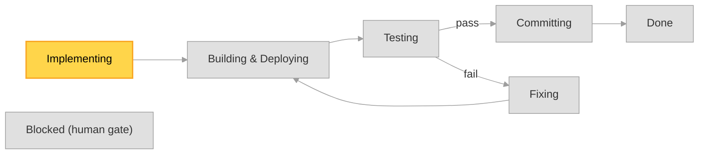

# Implementation Plan — format & lifecycle (canonical)

> Single source of truth for the **implementation plan** artifact that the workflow skills
> create and keep current: `ideable-implement-specs`, `ideable-test-and-fix`,
> `ideable-build-and-deploy`, `ideable-bugfixing-and-changes`, `ideable-commit-changes`.
> Those skills **reference** this file — they must not restate the format or the legend.
> (This is a project-wide workflow convention → a **rule**, per `rules/authoring-guidelines.md`.)

An implementation plan is a **human-readable status artifact**, not a source of truth for
correctness. Correctness is always established by tests (see `rules/testing-guidelines.md`);
the plan only communicates *where the work currently stands* to a human reader at a glance.

## Location & naming

- Plans live in **`implementation-plans/`** at the repo root (a working artifact, like
  `TEST_REPORTS/` and `kanban/`; not force-synced, not git-ignored by convention).
- One file per implementation run. Filename:

  ```
  <date> - <time> - <description>.md
  ```

  - `<date>` is `YYYY-MM-DD` and `<time>` is `HH-MM-SS` (colon-free, same digits as
    `TEST_REPORTS/`), separated by ` - `, captured at plan creation — e.g.
    `2026-08-10 - 16-42-05 - add-audit-column-filtering.md`. This is the same stem the
    `--keep-history` files use, minus the trailing ` (<state>)`.
  - `<description>` is chosen as follows:
    - a **short description of what to implement**, when the whole scope is clearly
      summarizable in a few words (e.g. `add-audit-column-filtering`);
    - otherwise, when only the **main thing** is summarizable but there is more,
      `<main-thing>-and-other` (e.g. `new-items-page-and-other`);
    - otherwise `various`.
  - Keep `<description>` filesystem-safe: lowercase, words joined by `-`, no `/` or `:`.
- **History mode.** By default the plan is overwritten in place as the run advances. Running
  `scripts/dev-cycle.sh` with `--keep-history` instead writes **each state transition to its own
  file** — `<date> - <time> - <description> (<state>).md` (the same base name, with the date and
  time split by ` - ` and the current dev-cycle state appended in parentheses) — so the full run
  history remains in `implementation-plans/`. The most-recent such file is the active plan.

## Active plan resolution (used by every skill that *updates* a plan)

- The **active plan** is the **most-recently-modified `*.md` in `implementation-plans/`**.
- Only `ideable-implement-specs` and `ideable-bugfixing-and-changes` may **create** a plan
  (implement-specs at its dedicated step; bugfixing-and-changes when a standalone
  change/bugfix runs with no active plan). The other skills only **update** the active plan.
- If a skill that only updates a plan finds **no** plan in `implementation-plans/`, it skips
  the plan update silently (do not invent one) and notes this in its report.

## Git integration (branch-per-plan)

The dev-cycle is **branch-per-plan** and **always on** (opt a single run out with the
`DEV_CYCLE_NO_GIT=1` environment variable, or when not inside a git repo):

- **Branch on creation.** A plan owns a dedicated branch named `plan/<description>` — the plan's
  description slug. `ideable-implement-specs` creates and checks out this branch as it creates
  the plan; `scripts/dev-cycle.sh` also **ensures** it exists at the start of every `run`
  (creating it from the current branch when missing), so the branch exists however the plan was
  started.
- **Commit per execution.** Each time `scripts/dev-cycle.sh run` finishes an execution it commits
  the whole working tree (`git add -A`) on the plan branch — a checkpoint of that step's progress
  (the plan plus any code produced). A nothing-to-commit run is skipped. Commits only ever land on
  the `plan/*` branch, never on `main`.
- **Merge at the commit step.** When the `Committing` step runs, the developer is **asked whether
  to merge the plan branch into `main`**, and the router behaves as answered (merge `--no-ff`, or
  leave the branch unmerged). This is a human decision gate (`ideable-commit-changes` owns it): in
  a non-interactive run the merge is **deferred**, never automatic.

## Status legend (canonical symbols — use exactly these)

**`Impl` column** (implementation state of a thing to implement):

| Symbol | Meaning |
|---|---|
| 🔲 | **To do** — not yet started |
| 🔄 | **Doing** — started, in progress |
| ✅ | **Done** — implemented |
| 🛠️ | **Fixing** — already implemented but failed tests; now being fixed |
| ⛔ | **Not fixable** — not implementable (blocked / out of scope); explain in the detail section |

**`BE test` and `FE test` columns** (backend / frontend test state of a thing):

| Symbol | Meaning |
|---|---|
| 🔲 | **To do** — test not yet started |
| 🔄 | **Doing** — test in progress |
| ✅ | **Done** — test executed and passing |
| ❌ | **Error** — test executed and failing |
| ➖ | **N/A** — not applicable (e.g. no backend part for a frontend-only thing, or vice-versa) |

## Required contents

A plan file MUST contain the following sections, in this order.

### 1. Purpose

A short chapter (a few sentences) summarizing **what this plan sets out to implement** — the
goal of the run in plain language, so a reader understands the intent before scanning statuses.
Written once at creation; updated only if the scope materially changes.

### 2. Overall view

A glance-level chapter that answers "where are we now?". It MUST contain:

- **Created at** — the plan creation timestamp (day and hour, `YYYY-MM-DD HH:MM`), equal to the
  timestamp encoded in the filename. Written once at creation, never changed.
- **Last updated** — day and hour (`YYYY-MM-DD HH:MM`) of the most recent change to this plan.
  Every skill that writes any cell refreshes this.
- **Current step** — the dev-cycle node the run is currently at, named after the node in the
  graph below and (in parentheses) the skill/phase acting on it, e.g.
  `Testing (ideable-test-and-fix)`.
- **Dev-cycle graph** — the canonical Mermaid state graph below, embedded verbatim, with the
  **current node highlighted**. The nodes are the dev-cycle states; the arcs are the Ideable
  skills that drive the transitions. Colour convention: the single **current** node is
  **yellow**, every other node is **grey**. This is expressed with exactly **two `class`
  lines** — one listing every node *except* the current (class `idle`), one listing the single
  current node (class `current`). Whenever the run advances (a skill executes or the plan is
  otherwise changed), rewrite those two `class` lines so exactly one node is `current`, and
  update **Current step** + **Last updated** to match.
  The leading `%%{init: …}%%` line pins the `base` theme with explicit line/text colours so the
  graph renders identically in a light or dark Markdown preview (without it, a dark-mode
  renderer paints the edges and edge labels dark-on-dark). Keep it verbatim.

Canonical graph (copy verbatim; only the two `class` lines change per run):

````markdown

````

- **Nodes (dev-cycle states):** `Implementing` (coding, `ideable-implement-specs`),
  `BuildDeploy` (build+deploy+restart, `ideable-build-and-deploy` / `redeploy.sh`), `Testing`
  (`ideable-test-and-fix`, test phase), `Fixing` (`ideable-test-and-fix` fix phase or
  `ideable-bugfixing-and-changes`, both via `ideable-spec-driven-edit`), `Committing`
  (`ideable-commit-changes`), `Done` (all things green **and** committed), `Blocked` (a human
  decision is required — reachable from any node; the run pauses here per the decision-authority
  rule).
- The graph is **fixed** — do not edit its nodes/edges per plan; only move the highlight.
- `scripts/dev-cycle.sh` reads/advances this highlight deterministically (see that script);
  skills also update it when they act. After a `Testing` run the router additionally folds the
  latest `TEST_REPORTS/*-SUMMARY.md` into the plan — setting each thing's `BE test` / `FE test`
  cell (BE ⇐ that module's pytest suite, FE ⇐ its playwright suite) and the Repos `Tests` counts —
  so the columns reflect the results without a separate manual pass. The `ideable-test-and-fix`
  skill remains the authority for finer, per-thing test bookkeeping.

### 3. Main implementation summary table

A flat list of the **things to implement**, one row each, with columns `Impl`, `BE test`,
`FE test` valorized from the legend above:

```markdown
| Thing to implement | Impl | BE test | FE test |
|---|:--:|:--:|:--:|
| <short name of the thing> | 🔲 | ➖ | 🔲 |
```

Immediately **below the table**, embed this compact legend (copy verbatim) so a reader can
decode the icons without leaving the plan — the same symbols defined in **Status legend**
above, restated here at the point of use:

```markdown
> **Legend**
> - **Impl:** 🔲 To do · 🔄 Doing · ✅ Done · 🛠️ Fixing (failed tests) · ⛔ Not fixable
> - **BE/FE test:** 🔲 To do · 🔄 Doing · ✅ Pass · ❌ Fail · ➖ N/A
```

(This is the one place the legend is intentionally restated inside the artifact; sub-task
tables in the Detailed summary reuse the same symbols and need no separate legend.)

### 4. Status summary

One **very short** free-text line stating the overall status so a reader is immediately aware
of where things stand — **no details** (e.g. *"3 of 5 things done; frontend tests failing on
the items page; not yet committed."*).

### 5. Detailed summary

For **each** thing in the Main table, a short paragraph — only when it adds real information
about the true status of that thing. When a thing has sub-tasks, describe them with a
**sub-task table of the same shape** as the Main table (`Impl` / `BE test` / `FE test`), but
scoped to that thing's sub-tasks:

```markdown
#### <thing>

<short paragraph on the real status, if useful>

| Sub-task | Impl | BE test | FE test |
|---|:--:|:--:|:--:|
| <sub-task> | 🔄 | 🔲 | ➖ |
```

### 6. Repos updates summary table

One row per repo/module touched by the run, with the general status:

```markdown
| Repo / module | Implementation | Tests | Commit |
|---|---|---|---|
| host_app | In progress | 4 passed / 1 failed / 2 pending | Committed — "feat(audit): column filtering" |
```

- **Implementation**: `Not started` · `In progress` · `Done` · `In error` · `Fixing`.
- **Tests**: counts as `<n> passed / <n> failed / <n> pending`.
- **Commit**: `Not committed` · `Committed` · `Pushed`, followed by the commit message
  (` — "<message>"`). List multiple commits comma-separated when a repo has several.

## Who writes which part

| Skill | Node it drives | Responsibility on the plan |
|---|---|---|
| `ideable-implement-specs` | `Implementing` | **Creates** the plan (Purpose, Overall view, Main table, Detailed summary); drives the `Impl` column (🔲→🔄→✅) and the Repos `Implementation` cell as it works. |
| `ideable-build-and-deploy` | `BuildDeploy` | Sets the Repos `Implementation` cell to `In error` if build/deploy fails (otherwise leaves it). |
| `ideable-test-and-fix` | `Testing` / `Fixing` | Drives the `BE test` / `FE test` columns (🔲→🔄→✅/❌) and the Repos `Tests` counts. On a failure it re-implements (via `ideable-spec-driven-edit`) and sets the thing's `Impl` to 🛠️ (`Fixing`), back to ✅ when green. |
| `ideable-bugfixing-and-changes` | `Fixing` | For a standalone change/bugfix with no active plan, **creates** one whose things-to-implement are the changes; otherwise appends rows and drives `Impl`. Edits go through `ideable-spec-driven-edit`. |
| `ideable-commit-changes` | `Committing` | Drives the Repos `Commit` cell (`Not committed`→`Committed`→`Pushed`) and records the commit message(s). |

**Every skill above, whenever it acts, MUST also update the Overall view** (§2): set
**Current step** to its node, rewrite the two `class` lines so its node is the only `current`
(yellow) one, and refresh **Last updated**. It also refreshes the **Status summary** line so it
stays truthful. (`scripts/dev-cycle.sh` performs the same Overall-view update deterministically
when it advances the run.) `ideable-spec-driven-edit` is an **atomic capability** invoked inside
the `Implementing`/`Fixing` nodes — it does not own a node of its own and writes no plan cells.
