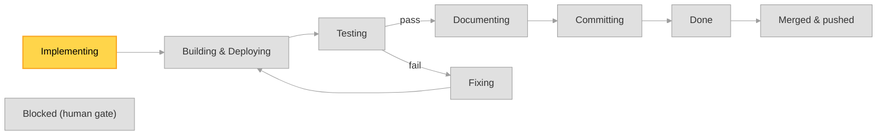

# Implementation Plan — format & lifecycle (canonical)

> Single source of truth for the **implementation plan** artifact that the workflow skills
> create and keep current: `ideable-implement-specs`, `ideable-test-and-fix`,
> `ideable-build-and-deploy`, `ideable-bugfixing-and-changes`, `ideable-commit-changes`.
> Those skills **reference** this file — they must not restate the format or the legend.
> (This is a project-wide workflow convention → a **rule**, per `rules/authoring-guidelines.md`.)

An implementation plan is a **human-readable status artifact**, not a source of truth for
correctness. Correctness is always established by tests (see `rules/testing-guidelines.md`);
the plan only communicates *where the work currently stands* to a human reader at a glance.

## Location & naming

- Plans live in **`implementation-plans/`** at the repo root (a working artifact, like
  `TEST_REPORTS/` and `kanban/`; not force-synced, not git-ignored by convention).
- One file per implementation run. Filename:

  ```
  <date> - <time> - <description> (<state>).md
  ```

  - `<date>` is `YYYY-MM-DD` and `<time>` is `HH-MM-SS` (colon-free, same digits as
    `TEST_REPORTS/`), separated by ` - ` — the timestamp of the **latest execution**, not of the
    plan's creation: e.g. `2026-08-10 - 16-42-05 - add-audit-column-filtering (BuildDeploy).md`
    is the plan as of the 16:42:05 step. At creation that is the creation time; from then on
    `scripts/dev-cycle.sh` re-stamps it at every transition. The creation timestamp is **not**
    lost — it stays in the Overall view's `Created at` line (with `Last updated` matching the
    name), which is exactly why the name is free to carry the more useful "when did this last
    move" instead.
  - `<state>` is the plan's **current dev-cycle node**, so the filename always shows where the
    run stands. `scripts/dev-cycle.sh` maintains both parts: on every transition it **renames**
    the plan file onto the new timestamp and state. A plan created without the suffix picks one
    up at the first transition.
  - `<description>` is chosen as follows:
    - a **short description of what to implement**, when the whole scope is clearly
      summarizable in a few words (e.g. `add-audit-column-filtering`);
    - otherwise, when only the **main thing** is summarizable but there is more,
      `<main-thing>-and-other` (e.g. `new-items-page-and-other`);
    - otherwise `various`.
  - Keep `<description>` filesystem-safe: lowercase, words joined by `-`, no `/` or `:`.
- **History mode.** By default a run keeps **one** plan file, renamed onto the execution
  timestamp and current state at each transition (the previous name is removed). Running
  `scripts/dev-cycle.sh` with `--keep-history` instead **keeps every transition's file** — same
  naming, so the files sort chronologically into a readable trail of the run (a same-second
  collision gets a ` (<state> 2)` suffix). In both modes the most-recent file is the active plan.

## The kanban card moves with the plan (mandatory)

A card in `kanban/` and the plan that implements it are the same piece of work seen from two sides:
the card says what should happen, the plan tracks it happening. They are linked by the
`<description>` slug — `kanban/<column>/<description>.md` alongside
`… - <description> (<state>).md` — so the pairing is visible in the filename and needs no index.

**When an implementation plan is created for a card, move that card `kanban/todo/` →
`kanban/doing/` in the same change.** Creating the plan *is* the start of the work; a card left in
`todo/` after that states the opposite of what is true, and the next person picking up work reads
the column, not the plan directory.

The rest of the lifecycle already exists: at delivery the card moves to `kanban/done/`, which
`rules/version-control.md` § *Delivering a plan* records in the bookkeeping commit as
`Kanban: kanban/done/<card>.md`.

Two things this rule does **not** say. A plan need not have a card — plenty of work starts from a
request rather than a card, and no card is invented for it. And a card need not have a plan — the
fast lane implements a card with no plan at all (`ideable-bugfixing-and-changes` § *First — plan or
fast lane?*), and moves it straight to `kanban/done/` when it lands.

Checked by `scripts/TESTS/test_kanban_card_follows_the_plan.py`: a card in `kanban/todo/` whose slug
matches a plan in `implementation-plans/` fails, because the plan's existence is the evidence that
the card is no longer *to do*. Per § *Enforced, not aspirational* below, that is the artifact this
process rule leaves behind — the card's own location.

## Active plan resolution (used by every skill that *updates* a plan)

- The **active plan** is the **most-recently-modified `*.md` in `implementation-plans/`**.
- Only `ideable-implement-specs` and `ideable-bugfixing-and-changes` may **create** a plan
  (implement-specs at its dedicated step; bugfixing-and-changes when the maintainer answers
  its plan-or-fast-lane gate with *plan*). Whether a change needs a plan is the
  maintainer's decision, never a skill's — a skill recommends and asks. The other skills
  only **update** the active plan.
- If a skill that only updates a plan finds **no** plan in `implementation-plans/`, it skips
  the plan update silently (do not invent one) and notes this in its report.

## Enforced, not aspirational

`scripts/TESTS/test_plan_branch_has_a_plan.py` fails when a `plan/*` branch exists with no plan in
`implementation-plans/`, and `scripts/TESTS/test_process_rules_are_checked.py` fails when a plan or
kanban task marked **Done** still carries blank `____` acceptance values.

Both exist because this rule was skipped seven times in one session on 2026-08-26 while thirty-plus
earlier branches had honoured it. Nothing objected. The rules that were *never* broken that day —
Dockerfile placement, no `build:` in compose, mount paths, `env_file` per compose kind — are exactly
the ones with tests. The difference was not importance; it was **checkability**. Rules about artifacts
live in the tree and had been turned into tests years ago. Rules about process left nothing to check,
so they eroded silently.

So: a process rule here is expected to produce an artifact, and the artifact is expected to be
checked. If you add guidance to this file that cannot be checked, say so explicitly rather than
letting a reader assume it is enforced.

## Git integration (branch-per-plan)

The dev-cycle is **branch-per-plan** and **always on** (opt a single run out with the
`DEV_CYCLE_NO_GIT=1` environment variable, or when not inside a git repo):

- **Branch on creation.** A plan owns a dedicated branch named `plan/<description>` — the plan's
  description slug. `ideable-implement-specs` creates and checks out this branch as it creates
  the plan; `scripts/dev-cycle.sh` also **ensures** it exists at the start of every `run`
  (creating it from the current branch when missing), so the branch exists however the plan was
  started.
- **Commit per execution.** Each time `scripts/dev-cycle.sh run` finishes an execution it commits
  the whole working tree (`git add -A`) on the plan branch — a checkpoint of that step's progress
  (the plan plus any code produced). A nothing-to-commit run is skipped. Commits only ever land on
  the `plan/*` branch, never on `main`.
- **And once more *before* `Testing`.** The suite is the one step whose result is recorded against a
  commit, so the tree is committed first (`chore(dev-cycle): … → before Testing`). Otherwise the
  plan-file rename that advancing into `Testing` performs leaves the tree dirty, and
  `run_enabled_tests.sh` records the *previous* commit — a report naming code that is not what ran.
  Every summary said `Working tree: dirty` until this was fixed, which left `.githooks/pre-push`
  unable to compare trees and refused the first real plan delivery at `git push`.
- **Nothing is asked at `Committing`.** That step commits; it does not prompt. A question there
  would block an unattended run for an answer the developer has no reason to give yet — the work is
  not finished being judged.
- **Merge and push are SUGGESTED when the plan reaches `Done`, and performed by the developer.**
  The final execution prints the commands rather than running them, because two decisions belong to
  the maintainer and neither is visible to the router:
  - **whether to merge at all yet** — a plan can be green and committed and still want a manual
    pass (an exploratory test, a look at the deployed UI) before it joins a shared branch;
  - **what to merge into** — `main` is the common case, not the rule. A release branch, a
    long-running integration branch, or a fork's branch are all legitimate targets, and the router
    cannot know which.

  So `Done` is reached with the plan branch **unmerged**, and that is the normal, expected state —
  not an unfinished one.

## Status legend (canonical symbols — use exactly these)

**`Impl` column** (implementation state of a thing to implement):

| Symbol | Meaning |
|---|---|
| 🔲 | **To do** — not yet started |
| 🔄 | **Doing** — started, in progress |
| ✅ | **Done** — implemented |
| 🛠️ | **Fixing** — already implemented but failed tests; now being fixed |
| ⏭️ | **Deferred by decision** — implementable, deliberately not done in this run; name **who decided and why** in the detail section |
| ⛔ | **Blocked** — cannot be implemented: a missing precondition or an external blocker; explain in the detail section |

⏭️ and ⛔ are not interchangeable, and the distinction is the point: ⛔ says *nobody could do this*,
⏭️ says *someone chose not to, and can choose otherwise*. Marking a scope decision ⛔ turns a
reversible choice into an apparent dead end — a reader stops asking about it. Both are **decisions,
not test outcomes**: `scripts/dev-cycle.sh` never overwrites either from a test run, and it names
their count in the Status summary so a green plan cannot read as "everything asked for was done".

**`Docs` column** (are the specs and docs that describe this thing true?):

| Symbol | Meaning |
|---|---|
| 🔲 | **To do** — not yet looked at |
| 🔄 | **Doing** — being aligned |
| ✅ | **Aligned** — every spec and doc this thing affects describes what is now true |
| ➖ | **N/A** — this thing changes nothing any spec or doc describes |

`➖` is a claim like any other and must be true. A thing that changed a contract, a flag, a path, a
command or an env var **cannot** be `➖` — something documents it. The column is driven by
`ideable-align-docs` at the `Documenting` node, and `scripts/dev-cycle.sh` refuses to leave that
node while any thing in the executing sub-set is still 🔲 or 🔄.

**`BE test` and `FE test` columns** (backend / frontend test state of a thing):

| Symbol | Meaning |
|---|---|
| 🔲 | **To do** — test not yet started |
| 🔄 | **Doing** — test in progress |
| ✅ | **Done** — test executed and passing |
| ❌ | **Error** — test executed and failing |
| ➖ | **N/A** — not applicable (e.g. no backend part for a frontend-only thing, or vice-versa) |

### A failure must be visible, and sticky (mandatory)

A reader must be able to open a plan in the `Fixing` node and see **what** is being fixed, from
the tables alone:

- **A failing suite marks every thing it covers `❌`.** A run that reports failures may never
  leave the whole table green or `🔲` — that hides the failure exactly where a reader looks.
- **A test cell is a measurement, never a forecast.** A thing still `🔲` in `Impl` has not been
  started, so nothing about it has been measured and its test cells stay `🔲` — including when a
  suite that will one day cover it is failing today precisely because the code is not there yet,
  and including a suite that errored in setup before it could exercise anything. `❌` claims the
  thing was executed and found wrong; on an unstarted row that is simply untrue, and it is also
  unrecoverable, because the fold leaves rows whose `Impl` is `🔲` untouched
  (`scripts/common/dev_cycle.py`, `apply_test_results`) — so a later green run cannot clear it.
  That is how a plan comes to read "✅ all tests passing" directly above rows marked `❌`, both
  written by the same tool and neither wrong on its own terms. **Seeding a new plan from a
  baseline run is the same mistake**: a run that predates the work measured the old code, not the
  things the plan is about.
- **`❌` is sticky.** It stays until a run proves that same thing green again. A later step that
  produces no result for it (module absent from the run, a `set`/build transition) must leave the
  `❌` alone; nothing but a passing result may clear it.
- **A thing with a failing test is `🛠️` in the `Impl` column** (Fixing), not `✅` — implemented
  code that fails its tests is not done. It returns to `✅` when its tests pass.
- **The Status summary states the failure** — how many tests fail and in which module/suite —
  for as long as any test fails.

`scripts/dev-cycle.sh` applies all five deterministically when it folds a test run into the plan
(it attributes a row to a module by finding the module name anywhere in the row, in its heading,
or via "both modules"; a row it cannot attribute is left untouched and reported in its log).
`ideable-test-and-fix` owns the finer, per-thing bookkeeping and must honour the same invariants.

### Name the module in every row (mandatory)

The test-result fold matches each row against the enabled module names and updates only the rows
it can attribute. A row naming no module is left exactly as it was — so a fully tested, finished
task can still show `BE test: 🔲` on half its rows, which reads as unstarted work.

So every row must either name its module (`— module_template`, `host_app`, `(both modules)`) or
carry `➖` because no test of that kind applies. The fold deliberately does not guess: attributing
a green run to rows nothing exercised would make ✅ meaningless, which is the same reason a
failure is sticky.

**`framework` is an attributable name**, and it is the one to use for a row whose only test subject
is `scripts/TESTS` — a shell gate, the router, `compose_merge`. `parse_summary` returns it for that
suite exactly as it returns a module name, so a row reading `… — framework` has its `Fw test` cell
maintained like any other. A framework-tooling row that names nothing is the common mistake: its
`BE`/`FE`/`Cfg` cells are honestly `➖`, which looks compliant, while its `Fw` cell is hand-written
and no run will ever correct it.

**This rule applies to the sub-task tables of § *Detailed summary* too**, which is where it is
usually broken: the Main table's rows get module names because that is where a plan author meets
the rule, and the sub-task tables repeat the same shape three sections later. On the plan that
prompted this paragraph, five sub-task rows kept `BE test: 🔲` — *"test not yet started"* — through a
run that passed all 39 tests covering them, directly above a Status summary reading `✅ All tests
passing`. Both cells were written by the same tool and neither was wrong on its own terms.

**Checked, in both directions** (§ *Enforced, not aspirational*):
`scripts/TESTS/test_plan_rows_are_attributable.py` fails when a row of the active plan names nothing
the fold can attribute while claiming any measurement, and when a thing that is `✅`/`🛠️` still
carries `🔲`/`🔄` in a test column at or past `Documenting`. It asks `dev_cycle._row_modules` and
`parse_summary` rather than re-deriving the attributable names, so the checker and the fold cannot
certify different sets. `scripts/common/dev_cycle.py` additionally ends every fold with an
aggregated `⚠` report naming the rows it could not attribute **and** which of them now read as
unstarted work — because the per-row log it printed before was one indistinguishable line among
seventy, which is information that exists and cannot be read.

`➖` is the honest mark for things a backend or frontend suite cannot cover — a developer CLI, a
build-time shell gate — and the Status summary should say so, rather than leaving a reader to
assume the coverage exists.

### Name what measures a row (recommended, and it changes the verdict)

A test cell can be filled from two sources, and they are different claims:

- **A measurement.** The row names the test file(s) that exercise it — `test_migrations.py`, in the
  row text or in the heading above its table — and the fold reads exactly those files' results out
  of that run's per-module report. This is the row's own verdict, and a failure in it marks the
  thing `🛠️` in `Impl`, because the thing really is being fixed.
- **A module roll-up.** The row names no file, so the fold uses the one verdict the SUMMARY carries
  per module per suite. That is an *estimate of coverage*, not a measurement of this row: it says
  "something in this module's backend suite failed", which may or may not have anything to do with
  this thing. The cell still carries `❌` — a failure must stay visible — but **`Impl` is left
  alone**, and the fold reports how many rows were filled this way.

Why the distinction exists. On the run that prompted it, all 36 backend failures were in one
force-synced file the plan already carried as a `⛔` row. The roll-up marked 19 other rows across
four sub-sets as failing and demoted every one of their `Impl` cells `✅ → 🛠️` — rows measured by
files that passed in that same run. The plan then read "four sub-sets failing" while the run said
"one file fails, and the plan knows why". Since a plan cannot reach `Done` while a thing is `🛠️`,
a single accounted-for failure held the whole plan open, and a newly-broken thing was
indistinguishable from a row repainted by an unrelated file.

`scripts/common/dev_cycle.py` reads the per-file results from
`TEST_REPORTS/<run>-<module>/test-report-<suite>.md`, whose `What was tested` table already lists
every test with its `path::Class::test` location — there is no JUnit XML in this framework and none
is needed. A file a row names that no report mentions is reported as unmatched (a rename or a typo)
and that row falls back to the roll-up rather than silently looking measured.

The `Tests` counts in § *Repos updates summary table* are driven by the roll-up, always. That is the
one place a per-module total is exactly the right number.

### The four test columns

| Column | Filled from | Owned by |
|---|---|---|
| `BE test` | `modules/<m>/backend/TESTS` | module developers |
| `FE test` | `modules/<m>/frontend/TESTS` (pytest contracts) + its Playwright suite | module developers |
| `Cfg test` | `modules/<m>/TESTS` and every other sub-module's `TESTS` (`database/`, `authentik/`, `traefik/`) | module developers |
| `Fw test` | `scripts/TESTS` | the Ideable maintainer |

`Cfg test` is the module's own configuration and deployment contracts: its compose file, `.env`
contracts, database and bootstrap contracts, `authorization.yaml`, menu definitions, seed. Every
module has these, remote ones included.

`Fw test` is framework tooling — the dev-cycle router, `compose_merge`, `build_and_deploy`,
`validate_modules`. **In a remote module's plan it is always `➖`**: a remote consumes the
framework and must never modify it, so it has nothing to report there. That is a statement of
ownership, not a gap.

These are separate columns because they have separate owners. Before the split, one pytest run
reported everything as backend — host_app's "237 backend tests" were 75 backend, 13 frontend and
159 configuration — so a row about compose ordering had no column that could describe it, and
`➖` was doing double duty for "not applicable" and "nowhere to put this".

Use `➖` only when a test of that kind genuinely cannot apply. When something *is* testable and
simply untested, leave `🔲` so the gap stays visible: the two costliest defects in the move to Alembic migrations — a
compose merge that dropped a service's environment, and a bind mount resolving outside
`deployment_root` — were both in code that no column then covered.

## Required contents

A plan file MUST contain the following sections, in this order.

### 1. Purpose

A short chapter (a few sentences) summarizing **what this plan sets out to implement** — the
goal of the run in plain language, so a reader understands the intent before scanning statuses.
Written once at creation; updated only if the scope materially changes.

### 2. Overall view

A glance-level chapter that answers "where are we now?". It MUST contain:

- **Created at** — the plan creation timestamp (day and hour, `YYYY-MM-DD HH:MM`), equal to the
  timestamp encoded in the filename. Written once at creation, never changed.
- **Last updated** — day and hour (`YYYY-MM-DD HH:MM`) of the most recent change to this plan.
  Every skill that writes any cell refreshes this.
- **Current step** — the **sub-set** the run is on and the **state** it is in, plus (in
  parentheses) the skill/phase acting on it, e.g.
  `sub-set 3/8 “The seed writes SQL…” — Testing (ideable-test-and-fix)`. The node name alone does
  not say *what* is being tested once a plan is delivered as several sub-sets, which is why the
  sub-set is named here. A plan with no sub-set table falls back to `Testing (…)`.
- **Dev-cycle graph** — placed **immediately after `Current step`**, because it is the picture of
  that line. See the graph bullet below for the colour convention and the verbatim block.
- **Sub-set table** — placed **after the graph**, giving the context around it: which sub-sets came
  before, and which are still to come.

The order of this chapter is fixed, because it is read top-down as the answer to "where are we?":
**Created at → Last updated → Current step → the graph → the sub-set table.**

- **Sub-set table (detail)** — one row per sub-set, in execution order, with columns **Description** and
  **State**. See § *Sub-sets* below for how they are chosen. `State` is `—` before a sub-set
  starts, one of `Implementing` / `Building&Deploying` / `Testing` / `Fixing` / `Documenting` /
  `Committing` while it runs, and `Done` when it is finished. **Exactly one row may hold a running state at
  any time**: the graph says which *step*, this table says which *sub-set* is on it, and
  `scripts/dev-cycle.sh` writes both together so they can never disagree.
- **Dev-cycle graph** — the canonical Mermaid state graph below, embedded verbatim, with the
  **current node highlighted**. The nodes are the dev-cycle states; the arcs are the Ideable
  skills that drive the transitions. Colour convention: the single **current** node is
  **yellow**, every other node is **grey**. This is expressed with exactly **two `class`
  lines** — one listing every node *except* the current (class `idle`), one listing the single
  current node (class `current`). Whenever the run advances (a skill executes or the plan is
  otherwise changed), rewrite those two `class` lines so exactly one node is `current`, and
  update **Current step** + **Last updated** to match.
  The leading `%%{init: …}%%` line pins the `base` theme with explicit line/text colours so the
  graph renders identically in a light or dark Markdown preview (without it, a dark-mode
  renderer paints the edges and edge labels dark-on-dark). Keep it verbatim.

Canonical graph (copy verbatim; only the two `class` lines change per run):

````markdown

````

- **Nodes (dev-cycle states):** `Implementing` (coding, `ideable-implement-specs`),
  `BuildDeploy` (build+deploy+restart, `ideable-build-and-deploy` / `redeploy.sh`), `Testing`
  (`ideable-test-and-fix`, test phase), `Fixing` (`ideable-test-and-fix` fix phase or
  `ideable-bugfixing-and-changes`, both via `ideable-spec-driven-edit`), `Documenting`
  (`ideable-align-docs` — the specs and docs governing what changed are brought into line with what
  is now true; see § *Documenting* below), `Committing` (`ideable-commit-changes`), `Done` (all
  things green, documented **and committed on the plan branch** — the work has not landed anywhere
  yet, and that is a finished state, not a broken one), `Merged` (`scripts/dev-cycle.sh deliver` has landed the
  plan on the target as one squashed commit — directly, or through the pull request `--pr`
  opens), `Blocked` (a human decision is required —
  reachable from any node; the run pauses here per the decision-authority rule).
- **`Done` and `Merged` are different claims, and the filename says which.** `Done` means green and
  committed on `plan/<description>`; `(Merged)` means it is on the target branch. Before the two
  were distinguished, `implementation-plans/` could not answer "did this ship?" — 60 files read
  `(Done)` whether they had landed or not. Those 60 are **not** retrofitted: the distinction works
  from the first plan that uses it.
- The graph is **fixed** — do not edit its nodes/edges per plan; only move the highlight.
- `scripts/dev-cycle.sh` reads/advances this highlight deterministically (see that script);
  skills also update it when they act. After a `Testing` run the router additionally folds the
  latest `TEST_REPORTS/*-SUMMARY.md` into the plan — setting each thing's `BE test` / `FE test`
  cell (BE ⇐ that module's pytest suite, FE ⇐ its playwright suite) and the Repos `Tests` counts —
  so the columns reflect the results without a separate manual pass. The `ideable-test-and-fix`
  skill remains the authority for finer, per-thing test bookkeeping.

### 2b. Sub-sets (mandatory)

A task is delivered as an **ordered sequence of coherent sub-sets**, declared **when the plan is
first written** — not discovered as the work proceeds. Deciding them up front is what makes each
pass through the dev-cycle loop mean something; deciding them as you go is how a plan ends up with
increments that are individually green and jointly incoherent.

A sub-set is correctly sized when all three hold:

1. **Each thing in it can be described in a short sentence.** If a thing cannot be described
   briefly, it is not one thing — split it.
2. **Its acceptance criteria can be tested atomically and independently**, without the sub-sets
   that come after it. A sub-set nothing can exercise on its own is not a sub-set: it will pass its
   tests by being inert, which tells you nothing.
3. **Its commit message can be simple** — close to the sub-set's own description. Needing a long
   message to explain what one sub-set did means it did more than one thing.

**Order follows dependency.** If sub-set X is a prerequisite for sub-set Y, X is implemented first.
The table's row order *is* the execution order.

The dev-cycle then runs the loop once per sub-set: `Implementing → BuildDeploy → Testing →
Documenting → Committing`, and at `Committing` the router checks that sub-set's own sub-table:

- things still 🔲/🔄 in this sub-set → back to **Implementing** on the same sub-set;
- this sub-set complete, a later one pending → mark it `Done`, start the next at **Implementing**;
- every sub-set `Done` → **Done**.

`Done` therefore means the scope was delivered, not that the last test run was green. ⏭️ deferred
and ⛔ blocked are decisions and do not hold a sub-set open — mark the remainder that way, with the
reason in the Detailed summary, to finish a task early.

### 2c. Documenting (mandatory)

Between a green `Testing` and `Committing`, the **specs and docs governing what changed are brought
into line with what is now true**. The node is driven by `ideable-align-docs`, which owns the
procedure; this section states the rule it implements.

- **Scope is the sub-set's own diff**, not the repository. A step that re-reads everything every
  time is a step that gets skipped.
- **Documents describe the present.** No shipped spec, rule or README may describe a superseded
  state as though it were current, and none may narrate its own history — *"used to"*, *"formerly"*,
  *"previously named"*. The narrow exception is a **rationale** where the reasoning is the content
  (a bug-avoider's *why*, a rejected alternative); the test is whether a reader could mistake the
  sentence for a description of current behaviour.
- **Nothing removed is still named as live** — env vars, flags, scripts, functions, paths,
  endpoints, contracts.
- **Reconcile, do not legislate.** Updating a spec to match approved, tested reality is this node's
  job and needs no permission. If aligning would require deciding something the plan never decided,
  or the code contradicts a contract the spec exists to impose, the plan goes to **`Blocked`** with
  the question stated — per the decision-authority rule. In a remote module project, framework-owned
  files are reported and never edited, per `AGENTS.md`.
- **Drift is expected work, not a failure.** `Documenting` fixes in place and advances to
  `Committing`; it never branches to `Fixing`.
- **It leaves an artifact**: the `Docs` column (§3), and it ends on a green **docs gate** — the
  tests that actually read specs and docs — because edits made after `Testing` would otherwise reach
  a commit no test had read.
- **In a remote module project the gate has nothing to run**, and says so. Those tests live in
  `scripts/TESTS/`, which is maintainer-only, so the router reports `docs gate DID NOT RUN` rather
  than `passed` — a check that cannot fail must never report success. There, the step's guarantees
  rest on the skill's judgement and on the `Docs` column being filled honestly.

**Why this is a node.** The plan that made the dev tools container the only supported toolchain was
green, reviewed and delivered, and it left `rules/version-control.md` calling the container
*opt-in* — the opposite of what its own new test enforces. Two further documents were found
describing a retired `datamodel.sql` as a live spec file. Each was a document a reader is told to
trust, describing a reality that no longer existed, and nothing in the cycle had asked.

### 3. Main implementation summary table

**Divided into one sub-table per sub-set**, in the same order as the Overall view's sub-set table,
each under a heading carrying that sub-set's description so the router can find it. Every sub-table
has the same columns. A thing belongs to exactly one sub-set.


A flat list of the **things to implement**, one row each, with the test columns of § *The
four test columns* plus `Impl` and `Docs`, valorized from the legend above:

```markdown
| Thing to implement | Impl | BE test | FE test | Cfg test | Fw test | Docs |
|---|:--:|:--:|:--:|:--:|:--:|:--:|
| <short name of the thing> | 🔲 | ➖ | 🔲 | ➖ | ➖ | 🔲 |
```

`Docs` is the **last** column, because it is the last thing the cycle does to a thing before it is
committed.

Immediately **below the table**, embed this compact legend (copy verbatim) so a reader can
decode the icons without leaving the plan — the same symbols defined in **Status legend**
above, restated here at the point of use:

```markdown
> **Legend**
> - **Impl:** 🔲 To do · 🔄 Doing · ✅ Done · 🛠️ Fixing (failed tests) · ⏭️ Deferred by decision · ⛔ Blocked
> - **BE/FE/Cfg/Fw test:** 🔲 To do · 🔄 Doing · ✅ Pass · ❌ Fail · ➖ N/A — a *measured* result; a row whose `Impl` is 🔲 stays 🔲 here
> - **Docs:** 🔲 To do · 🔄 Doing · ✅ Aligned · ➖ Nothing a spec or doc describes
```

(This is the one place the legend is intentionally restated inside the artifact; sub-task
tables in the Detailed summary reuse the same symbols and need no separate legend.)

### 4. Status summary

One **very short** free-text line stating the overall status so a reader is immediately aware
of where things stand — **no details** (e.g. *"3 of 5 things done; frontend tests failing on
the items page; not yet committed."*).

### 5. Detailed summary

For **each** thing in the Main table, a short paragraph — only when it adds real information
about the true status of that thing. When a thing has sub-tasks, describe them with a
**sub-task table of the same shape** as the Main table (`Impl` / `BE test` / `FE test`), but
scoped to that thing's sub-tasks:

```markdown
#### <thing>

<short paragraph on the real status, if useful>

| Sub-task | Impl | BE test | FE test |
|---|:--:|:--:|:--:|
| <sub-task> | 🔄 | 🔲 | ➖ |
```

### 6. Repos updates summary table

One row per repo/module touched by the run, with the general status:

```markdown
| Repo / module | Implementation | Tests | Commit |
|---|---|---|---|
| host_app | In progress | 4 passed / 1 failed / 2 pending | Committed — "feat(audit): column filtering" |
```

- **Implementation**: `Not started` · `In progress` · `Done` · `In error` · `Fixing`.
- **Tests**: counts as `<n> passed / <n> failed / <n> pending`.
- **Commit**: `Not committed` · `Committed` · `Pushed`, followed by the commit message
  (` — "<message>"`). List multiple commits comma-separated when a repo has several.

**The `Commit` cell must be true when the run reaches `Done`.** `Done` means *all things green
**and committed on the plan branch***, so a plan that reaches it still saying `Not committed` is
stating something false about the repository. `Committed` is the correct value at `Done`; `Pushed`
is written only after the developer has actually merged and pushed, which happens outside the
graph. `scripts/dev-cycle.sh` enforces this deterministically: after the
`Committing` step it reads the plan branch's commits (`main..HEAD`), attributes each to the
modules whose paths it touched, and writes the matching Repos rows itself — the same
git-is-the-authority treatment the `Tests` counts get from `TEST_REPORTS/`. A cell already
reading `Pushed` is left alone (the router cannot verify a push), and
`ideable-commit-changes` still owns the finer bookkeeping.

## Who writes which part

| Skill | Node it drives | Responsibility on the plan |
|---|---|---|
| `ideable-implement-specs` | `Implementing` | **Creates** the plan (Purpose, Overall view, Main table, Detailed summary); drives the `Impl` column (🔲→🔄→✅) and the Repos `Implementation` cell as it works. |
| `ideable-build-and-deploy` | `BuildDeploy` | Sets the Repos `Implementation` cell to `In error` if build/deploy fails (otherwise leaves it). |
| `ideable-test-and-fix` | `Testing` / `Fixing` | Drives the `BE test` / `FE test` columns (🔲→🔄→✅/❌) and the Repos `Tests` counts. On a failure it re-implements (via `ideable-spec-driven-edit`) and sets the thing's `Impl` to 🛠️ (`Fixing`), back to ✅ when green. |
| `ideable-align-docs` | `Documenting` | Drives the `Docs` column (🔲→🔄→✅/➖) for every thing in the sub-set. Updates the specs and docs the change affects so they describe the present; moves the plan to `Blocked` when aligning would require a decision the plan never took. |
| `ideable-bugfixing-and-changes` | `Fixing` | Appends rows and drives `Impl` on the plan route. **Creates** a plan only when the maintainer answers its plan-or-fast-lane gate with *plan*; on the fast lane no plan exists and none is created. Edits go through `ideable-spec-driven-edit`. |
| `ideable-commit-changes` | `Committing` | Drives the Repos `Commit` cell (`Not committed`→`Committed`→`Pushed`) and records the commit message(s). |

**Every skill above, whenever it acts, MUST also update the Overall view** (§2): set
**Current step** to its node, rewrite the two `class` lines so its node is the only `current`
(yellow) one, and refresh **Last updated**. It also refreshes the **Status summary** line so it
stays truthful. (`scripts/dev-cycle.sh` performs the same Overall-view update deterministically
when it advances the run.) `ideable-spec-driven-edit` is an **atomic capability** invoked inside
the `Implementing`/`Fixing`/`Documenting` nodes — it does not own a node of its own and writes no plan cells.
